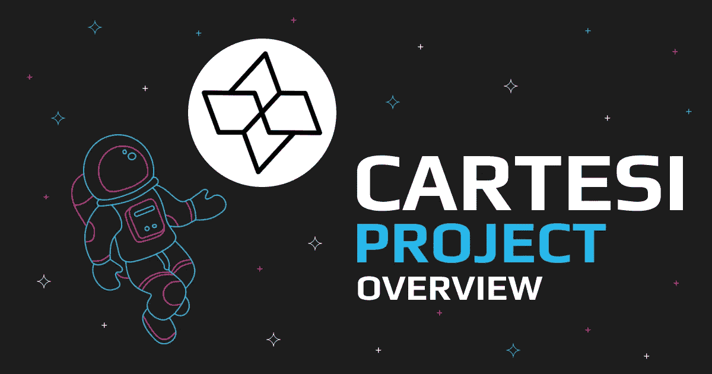

# 为什么要下去？了解 Cartesi (CTSI)加密

> 原文：<https://medium.com/coinmonks/why-going-down-getting-to-know-cartesi-ctsi-crypto-db7cc1a86e39?source=collection_archive---------39----------------------->

虽然许多投资者的兴趣一直与比特币保持一致，但也有人在考虑其他多种机会。例如，卡特西加密或 CTSI 加密就是其中之一。最近，我们看到它大肆宣传反对许多不同的项目。对于那些不知道的人来说，Cartesi 网络是由一个名为 Cartesi 的本地加密令牌驱动的。CTSI 是一个公用事业令牌暴涨到新的水平，这些天。

它由 Erick de Moura、Augusto Teixeira、Diego Nehab 和 Colin Steil 于 2018 年创立。它被放在一起作为第 2 层扩展基础设施，将与 Linux 一起工作。令牌最近获得了很多关注，因为它的三个产品，包括笛卡尔，笛卡尔卷和 Noether。在网络中部署乐观的 rollups 技术是为了解决可扩展性和高费用的问题。

# 什么是[卡特斯](https://swapzone.io/currencies/cartesi)？

Cartesi 是一个分散的离线计算平台，旨在将以太坊智能合约提升到一个新的水平。它允许其开发人员使用主流软件和 Linus OS 资源创建 DApps 和智能合同。该项目的主要目标是使分散式应用程序的开发更容易、更具成本效益。

简单来说，它可以被称为 DApps 的操作系统。通过这个网络，高度复杂和密集的计算在区块链之外的 Linux 生态系统上运行，而不损害主网络的分散性质。如今，我们看到多种生态系统支持分散应用程序的开发，但每个网络都有局限性，这相当令人沮丧。

因此，Cartesi Network 相信，通过允许用户在成熟的软件上构建 DApps，可以为用户提供最大的自由。这些软件选择尤其是那些用户完全熟悉的，并且在它们建立之后，它们在 Linux 环境下运行。

# 关键特征

通过该项目，Cartesi 开发人员正在为区块链网络带来创新。由于其关键的功能，该项目正在成为集中式和分散式网络之间的桥梁。因此，它具有高可用性，并受到消费者的喜爱。该项目的最突出特点是:

# 数千种开源软件可供选择

DApps 的可编程性设计使得用户可以从数以千计的开源网络元件中自由选择。因为 DApp 逻辑是在 Linux 网络上运行和编码的，这提供了如此大量的软件选项。

# 该项目解决了可伸缩性的问题

该项目的主要目的是解决区块链网络的长期问题，即可扩展性。这是通过离线执行大量数据计算来完成的，因此减少了主网络的工作负载。即使是离线网络也能为用户的数据提供相同级别的安全性。

> 交易新手？试试[加密交易机器人](/coinmonks/crypto-trading-bot-c2ffce8acb2a)或者[复制交易](/coinmonks/top-10-crypto-copy-trading-platforms-for-beginners-d0c37c7d698c)

# 自由，没有人为的限制

Cartesi 项目最好的部分是用户没有人为的限制，可以在熟悉的环境中工作。换句话说，网络允许用户使用他们需要的任何工具，这给网络带来了巨大的适应性。

# 完全分散

去中心化和以用户为中心正成为每个 DeFi 项目的核心，Cartesi 也不例外。在这里，数据到达主网络，不需要信誉协议或任何受控制的服务器。这保持了网络急需的分散化。

# 什么是$CTSI？

[CTSI 令牌](https://swapzone.io/currencies/cartesi)为卡特西网络供电。CTSI 网络在节点系统上工作，CTSI 令牌用于激励这些节点运营商保持不信任，并鼓励诚实的工作氛围。CTSI 令牌有以下使用案例，包括使用 CTSI 硬币作为抵押品来鼓励诚实的环境，支付 Dapps 的临时存储费用，向区块生成器支付其应得的报酬，以及参与利益证明(PoS)共识机制的赌注。

根据 CoinMarketCap 的记录，CTSI 的市值排名第 325 位。此外，Cartesi 可广泛用于在各种集中式和分散式加密货币交易所进行购买、出售、交易或交换。它在 BTC、瑞士联邦理工学院或 USDT 支持的交易所成对出售。

# 卡特西实验室

Cartesi Labs 是 Cartesi 主网络的附属项目之一，用于为 Cartesi 分散式生态系统的研究和开发安排必要的资金。它包括赠款、加速器和学术项目，旨在不断升级 Cartesi 网络并带来创新。初始资金由 Cartesi 基金会、众包平台、Cartesi 合作伙伴和可靠的投资者管理。

Cartesi 实验室还负责为定向开发网络提供急需的技术和战略支持。研究分为不同的类别，包括开发子项目的建议，如分散扩展、学术研究、创业和工具。

# 卡特西产品

该网络提供三种主要产品，即笛卡尔、笛卡尔卷和 Noether。首先，笛卡尔是一个为区块链设计的分散式计算神谕。它的任务是在链外执行密集的计算数据操作，以从 smart 契约指定的 Linux 网络上的主链中减轻主要负载。

其次，笛卡尔卷是用主流软件组件构建的可扩展智能契约。这些是乐观汇总的变体。然而，他们在合同编码过程中使用软件组件，而不是使用 solidity。

最后，Noether 是网络上可用的临时存储空间。它旨在允许分散的应用程序以低得多的成本达到高吞吐量和所需的空间。

# 如何以最优惠的汇率将 BTC 兑换成 CTSI？

像 Swapzone 这样的交易平台为那些寻求转换其数字资产的交易者提供了一个可行的解决方案。在这里，用户只需遵循几个步骤，只需点击几下鼠标，就可以快速方便地转换资产。更重要的是，他们可以使用相同的程序将比特币转换为 Cartesi 或将 Cartesi 转换为比特币。

*   前往 [Swapzone.io](https://swapzone.io/currencies/cartesi) 开始工作。
*   在“发送”部分选择 BTC。
*   指定您要转帐的总金额。
*   在“起床”部分选择 CTSI。
*   查看屏幕上的优惠。您会发现多个报价，最优惠的价格列在顶部。你也可以看到你需要多少分钟来完成交换。
*   单击“交换”确认您希望使用的优惠，然后进入钱包接收 CTSI。
*   使用生成的 BTC 地址发送您的 BTC 存款。
*   等待兑换服务处理存款，兑换完成。
*   不要忘记对交换合作伙伴进行评级，这样我们可以为未来的用户收集更多关于交换的信息。

# 结论

总之，凭借强大的基础设施和明智的发展管理模式，Cartesi 网络最近取得了很大成就。该项目旨在提升以太坊智能合约的运行效率和成本效益。其强大的基本面，高度的职业道德和坚实的市场地位也表明，硬币在这里茁壮成长和进步。