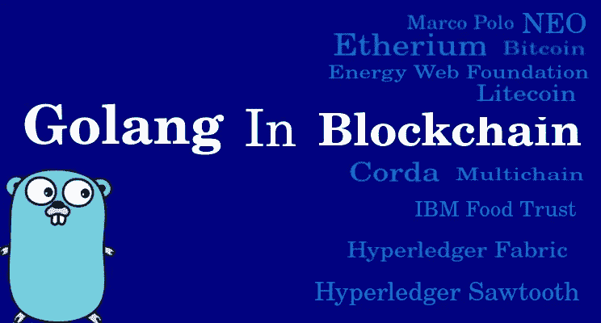

# 开发商为何青睐 Golang 开发区块链

> 原文：<https://medium.com/coinmonks/why-golang-is-preferred-by-developers-for-blockchain-development-e39d2f766329?source=collection_archive---------14----------------------->

Go(也称为 Golang)经常用于区块链开发有几个原因:

1.  **并发:** Go 有一个内置的并发模型，它允许轻松创建可以在多个 CPU 内核上并发运行的并行进程。这对区块链开发很重要，因为它允许同时高效处理多个事务和块。
2.  **简单:** Go 是一种相对简单的编程语言，容易学习和使用。这对刚接触区块链开发的开发人员来说是有益的，因为它缩短了学习曲线，允许他们快速上手。
3.  **效率:** Go 是一种编译语言，也就是说它被转换成计算机的 CPU 可以直接执行的机器代码。这使得它比解释语言更有效，后者在执行之前必须通过解释器运行。
4.  **性能:** Go 被设计得快速高效，经常被用来构建高性能系统。这有利于区块链开发，因为它允许高效处理大量数据和事务。
5.  **可伸缩性:** Go 被设计成可伸缩的，这意味着它可以处理大量并发用户和事务，而不会遇到性能问题。这对区块链开发很重要，因为它允许创建分散式应用程序(DApps ),供大量用户使用而不会遇到性能问题。

> 交易新手？在[最佳加密交易](/coinmonks/crypto-exchange-dd2f9d6f3769)上尝试[加密交易机器人](/coinmonks/crypto-trading-bot-c2ffce8acb2a)或[复制交易](/coinmonks/top-10-crypto-copy-trading-platforms-for-beginners-d0c37c7d698c)

使用 Go 进行区块链开发的一个例子是创建一个分散的应用程序(DApp ),它允许用户安全透明地跟踪产品的供应链。这个 DApp 可以建立在以太坊这样的区块链平台上，它可以使用 Go 来处理实时跟踪产品在供应链中的移动的并发性和可伸缩性需求。

DApp 可以使用 Go 的并发特性来同时处理多个事务和产品供应链状态的更新，还可以使用 Go 的可伸缩特性来处理大量用户同时访问 DApp。这将允许 DApp 有效地实时跟踪产品的供应链，为用户提供一种透明和安全的方式来跟踪产品在供应链中的移动。

以下是使用 Go 进行区块链开发的一些附加示例:

1.  构建**去中心化交易所(DEX)** :去中心化交易所(DEX)是一个平台，允许用户彼此直接买卖加密货币，不需要中央权威机构。Go 可以用来构建 DEX 的后端，处理实时处理大量事务的并发性和可伸缩性需求。
2.  开发一个基于区块链的**投票系统** : Go 可以用来建立一个分散的投票系统，使用区块链安全透明地跟踪投票。Go 的并发性和可伸缩性特性可以用来处理大型选举中可能出现的大量投票。
3.  创建一个**基于区块链的供应链跟踪系统**:类似于我前面提到的例子，Go 可以用来构建一个基于区块链的供应链跟踪系统，允许用户透明地跟踪货物在供应链中的移动。Go 的并发性和可伸缩性特性可以用来处理大量的事务，这些事务可能涉及到跟踪供应链中货物的移动。
4.  建立一个基于区块链的游戏平台 : Go 可以用来建立一个分散的游戏平台，使用区块链来安全地跟踪游戏中的资产和玩家的进度。Go 的并发性和可伸缩性可以用来处理流行游戏平台中可能涉及的大量事务。
5.  开发一个总部位于区块链的拼车平台:Go 可以用来建立一个分散的拼车平台，使用区块链来安全地跟踪乘车和支付。Go 的并发性和可伸缩性可以用来处理流行的拼车平台可能涉及的大量交易。

> 加入 Coinmonks [电报频道](https://t.me/coincodecap)和 [Youtube 频道](https://www.youtube.com/c/coinmonks/videos)了解加密交易和投资

# 另外，阅读

*   [火币加密交易信号](https://coincodecap.com/huobi-crypto-trading-signals) | [HitBTC 审核](/coinmonks/hitbtc-review-c5143c5d53c2)
*   [TraderWagon 回顾](https://coincodecap.com/traderwagon-review) | [北海巨妖 vs 双子 vs 比特亚德](https://coincodecap.com/kraken-vs-gemini-vs-bityard)
*   [如何在 FTX 交易所交易期货](https://coincodecap.com/ftx-futures-trading)
*   [OKEx vs KuCoin](https://coincodecap.com/okex-kucoin) | [摄氏替代度](https://coincodecap.com/celsius-alternatives) | [如何购买 VeChain](https://coincodecap.com/buy-vechain)
*   [ProfitFarmers 回顾](https://coincodecap.com/profitfarmers-review) | [如何使用 Cornix Trading Bot](https://coincodecap.com/cornix-trading-bot)