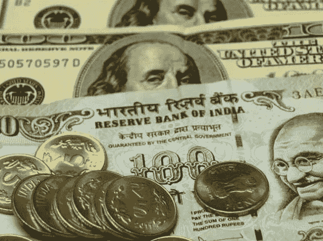
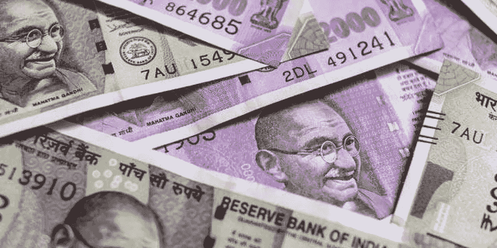

# 为什么印度卢比对美元的汇率一直在走弱——分析

> 原文：<https://medium.com/coinmonks/why-has-indias-inr-currency-been-weakening-against-the-usd-analysis-4adcb1852464?source=collection_archive---------33----------------------->

# 印度卢比对美元大幅贬值

今天，我在看印度货币的可能原因；印度卢比对美元贬值了。

**我们来看看美元/印度卢比图表…**

[Trading view chart >>](https://www.tradingview.com/x/FKK0vtOv/)

*今年 1 月，1 美元等于 73 卢比，此后印度卢比对美元持续贬值。7 月份的新闻显示，印度卢比的价值跌至 80 比 1 美元，这是一个负面的里程碑，因为卢比对美元进一步走软。*

*现在，印度卢比的价值已经停止进一步贬值，印度卢比的价值每分钟升值到 78.6 印度卢比兑 1 美元，现在是 79.5 印度卢比兑 1 美元。*

# 导致印度卢比对美元价格下跌的因素的简要评论

考虑到印度卢比自 2 月份以来对美元的加速贬值。期间对应的是*俄乌战争*这一全球重大事件。

发布此消息后，我们知道*美联储提高了利率*，其结果是新兴或不发达国家的货币对美元贬值。

导致印度卢比对美元贬值的一个主要因素是原油价格的上涨。

# 原油价格上涨

自去年 12 月以来，原油价格一直在上涨，2021 年 12 月 2 日的原油价格为每桶 65 美元，2022 年 3 月达到 130 美元的峰值。现在原油价格已经冷却到 88 美元。然而，由于印度进口其大部分原油供应，这影响了印度卢比对美元的价值。

[Trading view chart >>](https://www.tradingview.com/x/p4OU8zoY/)

在 Covid 封锁期间，原油价格大幅下跌，但随着企业开始运作，原油价格持续上涨。此后，由于俄罗斯对乌克兰的战争引发的问题，原油价格上涨，因为这引起了世界其他国家对俄罗斯实施制裁的敌意，这确实对原油价格产生了影响，原油全球供应受到影响。

印度依赖进口原油供应，这影响了其经常账户，导致经常账户出现贸易逆差。

# 印度进口商、买家和投资者对美元的高需求导致美元升值

## 美元的进口支出多于美元的出口收入导致了印度的经常账户赤字

当一个国家的进口大于出口时，就会出现经常账户赤字。这意味着由于进口增加，美元外汇储备的支出超过了收入。

当进口发生时，从海外进口或购买商品和服务的实体和个人需要购买美元来支付卖方，他们通过出售印度卢比来支付美元。

然而，当印度实体和个人[向海外出口或销售](https://thewire.in/economy/explainer-rupee-falling-dollar-impact-common-man)他们的商品和服务时，海外买方出售美元购买印度卢比支付给卖方。

所以，国际贸易中美元和印度卢比的[需求和供给](https://thewire.in/economy/explainer-rupee-falling-dollar-impact-common-man)决定了货币的价格。因此，随着印度的进口多于出口，更多的印度卢比被卖出兑换成美元，随着对美元的需求增加，美元对印度卢比的价格上升。

根据贸易经济的数据，印度的经常账户赤字为 13400 亿美元，占其 GDP 的 1.7%。

*Economic performance of Indian Economy chart from* [*Trading Economics*](https://tradingeconomics.com/india/indicators)

## 印度贸易逆差证实外汇支出大于收入

由于印度与其他国家的外贸交易中进口多于出口，其国际收支为负 300 亿美元。所有这一切导致印度卢比贬值，并对美元下跌。

# 美联储加息导致美元兑印度卢比升值

[Source](https://thewire.in/economy/explainer-rupee-falling-dollar-impact-common-man)

随着美联储开始采取货币紧缩措施，从经济中抽走美元流动性，外国机构投资者从印度股市撤出投资，从印度股票中取出资金，最终投资于美元债券和美国国债。

在不确定时期，人们通过将财富投资于避险资产来保护其财富的典型行为以及美元作为世界储备货币被视为避险资产，印度投资者可能已将其印度卢比兑换成美元，以对冲印度卢比货币贬值。

这些是我所理解的导致印度卢比对美元贬值或走软的一些因素。

# 为了让印度卢比成为更强势的货币，印度应该通过国际贸易获得出口盈余

[Source](https://thewire.in/economy/rupee-closes-below-80-dollar-july-20-2022)

几个月前，人们担心原油价格的上涨，因为它正在耗尽印度的美元外汇储备。现在，结合印度的贸易账户赤字和国际收支负平衡状况，有理由担心所有这些将对印度卢比的价值产生负面影响，削弱它。

幸运的是，印度保持了足够的外汇储备，所以印度卢比不太可能像斯里兰卡那样贬值，但是，印度必须注意通过出口赚取盈余外汇储备，因为这将使印度卢比成为更强大的全球货币。

强劲的印度卢比很好地反映了印度经济的全球表现，由于良好的出口，印度卢比的价值因对法定货币的更多需求而升值或增加。这将丰富印度的国库，有更多的外汇储备盈余，这总是好的，因为美元是世界储备货币，也是世界上最强大的法定货币。

# 印度错过了从网络 3 产品和服务出口中获利的机会

Permitted Free image from [Pixabay](https://pixabay.com/users/geralt-9301)

在这里，我结束了我的文章，但我忍不住要提到，印度错过了一个通过出口 Web3 服务赚取更多的机会，因为印度政府对加密技术的苛刻和不容忍。

因此，对于基于加密的公司来说，存在一个负面的环境，涉及高税收和其他限制性措施的严厉立法，区块链和 Web3 公司将不会在印度建立，并将涌向其他加密友好的国家。

因此，印度不会在网络 3 服务出口方面领先，以丰富其经济，加强其印度卢比货币等。这是一个耻辱，因为印度拥有世界上最多的可就业青年，他们可以接受培训并受雇于迎合 Web3 行业的工作，但印度正在非常可悲地放弃其人口红利。耸耸肩…

***感谢阅读！！***

> 交易新手？试试[密码交易机器人](/coinmonks/crypto-trading-bot-c2ffce8acb2a)或[复制交易](/coinmonks/top-10-crypto-copy-trading-platforms-for-beginners-d0c37c7d698c)