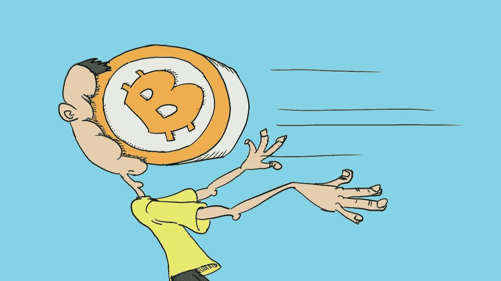

# 为什么高度比特币化是坏事

> 原文：<https://medium.com/coinmonks/why-hyperbitcoinization-could-be-bad-d45c781443a?source=collection_archive---------12----------------------->

在比特币的最大信徒中，长期以来一直有一种关于未来世界将会是什么样子的理论。在未来，比特币已经实现了它的全部潜力，并席卷了整个世界。在这里，比特币不仅飙升至难以理解的价格，还成为了几乎所有人的首选货币。这被称为超比特币化。对我们许多人来说，这是一个结果，我们不仅…