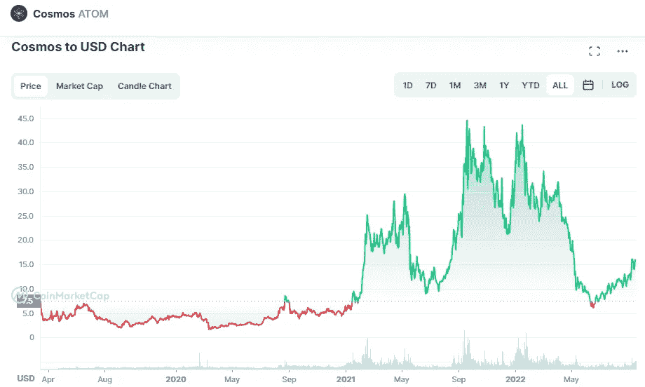

# 为什么我认为宇宙(原子)是一个好的投资

> 原文：<https://medium.com/coinmonks/why-i-consider-that-cosmos-atom-is-a-good-investment-9b30ea68a137?source=collection_archive---------16----------------------->

Source photo [Cosmos price today, ATOM to USD live, marketcap and chart | CoinMarketCap](https://coinmarketcap.com/currencies/cosmos/)

在 2021 年 9 月达到 44.70 美元的峰值后，ATOM 获得了许多交易者和加密爱好者的关注。由于该协议强调简化不同网络间的数据交换，许多行业观察家认为 Cosmos 在未来几年有光明的前景。宇宙称自己为“区块链的互联网”,并打算通过其…