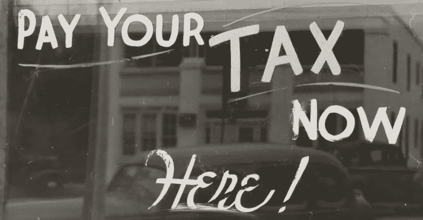
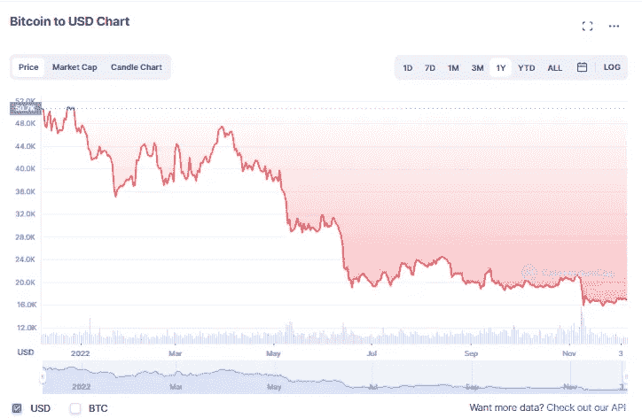
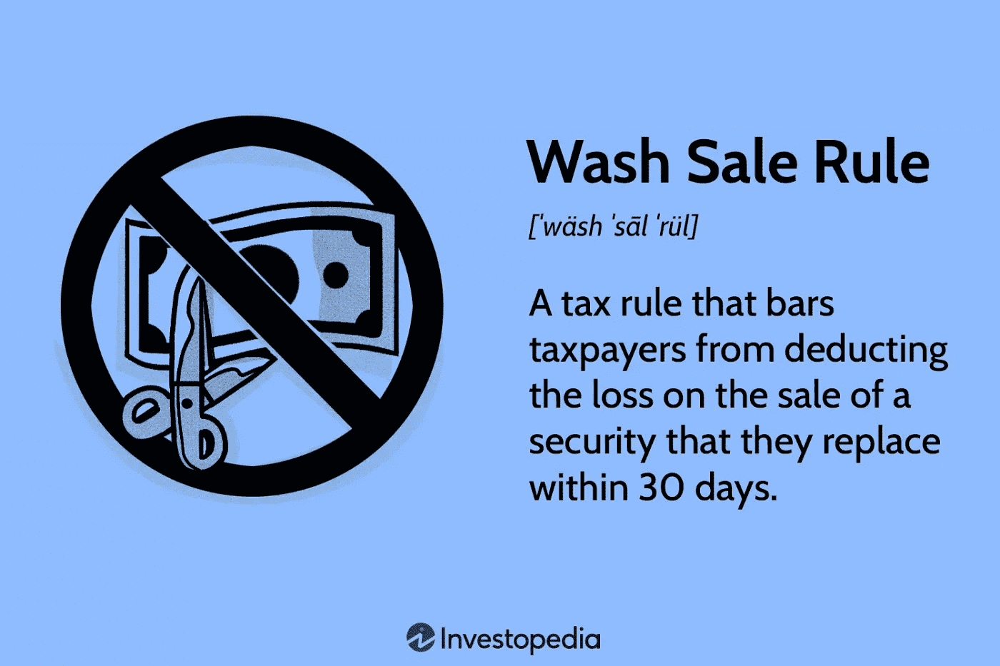
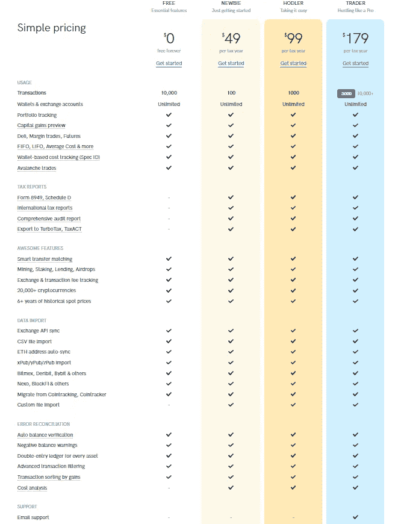

# 为什么我要卖掉(并重新购买)我的密码

> 原文：<https://medium.com/coinmonks/why-im-selling-off-and-re-buying-my-crypto-562a02931998?source=collection_archive---------4----------------------->

嘿，伙计们，我想在这一点上每个人都会同意，这是一个非常艰难的一年。如果你在 9-12 个月前买了东西，现在还在持有，我猜你可能和我一样，至少亏损了 50-70%(甚至 90%)。即使你有一袋去年买入的蓝筹股(如 BTC、瑞士联邦理工学院)，你的投资组合也可能看起来有点像这样:

出于同样的原因，我认为在顶部卖出以获取一些利润很重要，我认为在一年中的这个时候，现在卖出以实现一些损失也同样重要。

在此，我完全不是注册会计师，所以这些都不是财务或税务建议，尤其是考虑到你的税务管辖区可能会因你的居住地而有所不同。就本文的目的而言，我将要谈论的投机行为是以美国为中心的，所以请联系你所在司法管辖区的税务顾问或财务顾问，他们可以对你的财务状况进行说明。

随着 2022 年接近尾声，你也有机会尝试游戏你可能欠了多少税。这就是洗售规则的用武之地。

# [洗售规则](https://www.investopedia.com/terms/w/washsalerule.asp)

当我们谈论证券和税收时，比如股票，无论何时你卖出某样东西，你实质上都是在实现该股票的资本收益(或损失)。在一种被称为税收损失收获(TLH)的策略中，投资者可以通过抛售他们已经贬值的股票来抵消你全年可能获得的资本收益，或者换句话说，你可以抛售你的股票，这些股票相对于你买入时的价格已经亏损了。

一般来说，为了真正实现损失，你至少在 30 天内不能回购股票或证券。这就是众所周知的清洗销售规则:

因此，如果我在周一以 50 美元的价格卖出一股比特币基地股票，然后在下一周重新买入，你的损失就不会实现。因为比特币基地股票是一种证券，为了实现我的损失，我需要推迟至少 30 天再买入比特币基地。

请再次记住，这是针对证券的——谢天谢地，尽管加里·詹斯勒可能有不同的看法，但加密货币在国税局眼中还没有被正式视为证券……至少现在还没有。

# 国税局如何看待加密

由于加密货币相关立法的“进展”仍在国会缓慢推进，迄今为止，美国国税局仍将加密货币视为“虚拟货币”，而不是一种证券。这当然可能会发生变化，但大多数税务软件仍然将 2014–21 通知作为指南，从中您会注意到，一次也没有提到“安全”一词。

对加密货币持有者来说，好消息是洗盘规则在技术上并不适用，相反，你可以通过购买和转售你的密码来立即实现你的损失，以便在几秒钟内实现你的损失。如果你在今年早些时候出售了其他加密产品并获利，或者即使你试图抵消你在实际证券(如股票或债券)中获得的收益，这种规避清洗销售规则的行为也是非常有利可图的。

# 追踪你的损失

我们都知道，在 cryptospace 的一周感觉就像在 IRL 的一个月，所以如果你在过去一年里进行了 1000 笔交易，并且不知道你的损益利润在哪里，那么我强烈建议你开设一个 [Koinly](https://koinly.io/?via=9412B5B5) 账户——它是免费的，至少对我来说，它有助于在一个地方跟踪你所有的钱包/兑换交易。

[去年四月，我写了一篇关于使用 ko only](https://www.publish0x.com/jaik83/things-to-consider-before-using-koinly-to-figure-out-your-cr-xnxrnqp)报税的文章，但是即使你不打算使用 ko only 来撰写令人生畏的 8949 表格，我仍然建议你开一个免费账户，目的很简单，就是能看到你的立场。

# 那么为什么[ko only](https://koinly.io/?via=9412B5B5)？

如果你在过去的一年里做了几百笔交易，看在上帝的份上，我希望你不是手工计算和输入所有的东西。你可以说我懒，但是税收已经比它们应该有的更复杂了，就我个人而言，当我做我的工作时，如果没有必要，我不想打开额外的 excel 表格。从我与其他平台的比较来看，Koinly 是免费使用的，但当需要编译器报税时，Koinly 提供了一些非常有竞争力的定价计划，尤其是针对那些有大量交易的人:

为了正确归档，你需要报告你的每笔交易/销售/收益/损失。例如，如果我将 1 BTC 从 Blockfi 转移到我的 Metamask，然后转移到 Kucoin，将我的 BTC 换成 ETH，这意味着所有这些交易数据都应该报告给 Koinly，以便他们准确跟踪您的损益。

对于每次钱包交换，您通常有多个报告数据的选项——要么通过 syncing/API 读取数据，要么从文件(通常是 csv 文件)导入数据。我很快发现这是一个问题，因为一些钱包(如 Voyager，R.I.P .)没有一个简单的方法来加载你的交易数据，你实际上必须通过应用程序获得电子邮件请求。但对我来说，我认为这是真正让 Koinly 领先的原因——对于你试图连接到 Koinly 的每个钱包/交易所，他们都有一个深入的教学视频，告诉你如何使用每个钱包/交易所。 这是我认为非常有用的东西，因为对于每个钱包/交易，可能有一些完全不同的方式来获得你的交易的 csv 或你的 API 密钥。

另外，最后一点，**只支持一大堆国家。**事实上超过 100。如果您需要查找特定的一个，请查看最受欢迎的[列表](https://help.koinly.io/en/articles/3663358-which-countries-does-koinly-calculate-taxes-for)，或者您可以直接发送电子邮件到 [support@koinly.io](mailto:support@koinly.io) 来查找。

# 结论:

对我来说，这已经是艰难的一年了，我最不想做的事情就是发现明年春天我需要缴纳更多的税，这让我大吃一惊。战略性地利用税收流失收获可以帮助减轻这一负担，或者至少，我认为这至少会让人们对税收负担有更好的了解。

在完全透明的情况下，我只从我最喜欢的一个 YouTube[invest answers](https://www.youtube.com/@InvestAnswers)上了解到税收流失的情况，但这只是在 2021 年结束之后，因此试图在事后意识到我的损失是没有意义的。2022 年，我不打算犯两次同样的错误。如果你自己在税收流失方面有过成功(或失败)的经历，我很乐意在下面的评论中听到。如果你有兴趣亲自查看 Koinly，请考虑支持这个博客并使用我的推荐链接:[https://koinly.io/?via=9412B5B5&UTM _ source = affiliate](https://koinly.io/?via=9412B5B5&utm_source=affiliate)

感谢阅读，请一如既往地在 twitter 上关注我，阅读我的最新发现和更新:[https://twitter.com/CryptosWith](https://twitter.com/CryptosWith)

声明:这些信息都不是财务建议或税务建议，只是我在网上随便找的一个人的推测。请考虑这纯粹是教育和娱乐的目的。像往常一样，请做自己的研究或联系注册会计师或财务顾问，找到什么投资可能最适合你。

> 交易新手？试试[加密交易机器人](/coinmonks/crypto-trading-bot-c2ffce8acb2a)或者[复制交易](/coinmonks/top-10-crypto-copy-trading-platforms-for-beginners-d0c37c7d698c)