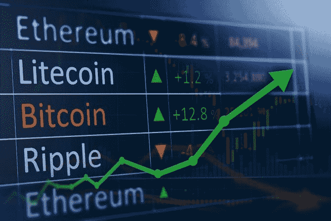

# 以太坊为什么在主宰比特币？

> 原文：<https://medium.com/coinmonks/why-is-ethereum-dominating-bitcoin-437b8deda730?source=collection_archive---------11----------------------->

Photo by [Traxer](https://unsplash.com/@traxer?utm_source=medium&utm_medium=referral) on [Unsplash](https://unsplash.com?utm_source=medium&utm_medium=referral)

每当我们谈论加密货币时，以太坊总是在我们的脑海中。尽管它很受欢迎，但就受欢迎程度而言，它仅次于比特币。然而，人们似乎并没有像关注它的对应物一样关注这个密码。

> 你了解中间孩子综合症吗？
> 
> 这个术语用来描述这种情况，中间的孩子受到的关注较少，父母忽视了他们所有的成就。

以太无疑是 crypto 家族的老二，如果 crypto 像一个大家庭的话。为什么？在顶级加密货币比特币和 Ripple 中，以太坊在 2020 年至 2021 年间增长了近 750%。即便如此，它也很少受到关注。

它通常被称为区块链加密货币或以太坊区块链，因为它运行在区块链平台上。由于过量的资金流动和对加密货币的投资，数据分析师分析了这一显著的价值跃升。

以太坊 2.0 更新已经提示第二次运行！

## 想着投资以太坊？

## 以太坊投资是否让你感到困惑？

我将回答你所有关于以太坊的问题。我们开始吧！抓住你的腰带，放松，顺其自然！

**以太坊为什么会上涨？**

2021 年 5 月将被铭记为以太坊打破所有记录并设定 3000 美元左右基准的月份，在加密货币史上创造了历史。正如一些加密货币分析师预测的那样，它继续上涨。以 4000 美元创下新纪录。

一段时间后，其交易价值再次飙升 10%，这是自 5 月份以来的一次大幅上涨。

Picture Credit: Arab News

## 但是，它涨价背后的原因是什么？

继续读下去！

其上涨背后的一个主要因素是以太坊 2.0 将于 2022 年底推出。它将使交易更快，费用更低，等等。这推动了加密市场中以太坊价格的上涨。

DeFi(去中心化金融)越来越受欢迎，这是以太坊价格上涨的部分原因。DeFi(去中心化金融)越来越受欢迎，这是以太坊价格上涨的部分原因。包括 DeFi 在内的大多数活动都在以太坊的区块链网络上进行，该网络托管了许多 DeFi 项目。以太坊的潜在增长受此影响很大。

写这篇文章的时候，以太坊站在 1，23815.14 印度卢比。

其崛起的主要原因之一是以太坊相对于比特币和 Ripple 等其他加密货币的技术进步。

1.  首先，以太坊的行为更像是一个平台代币，而不是硬币。
2.  另外，在比特币的参数上远远优于比特币。比特币需要 15 分钟才能完成一笔交易，而以太坊只需几秒钟就能完成。
3.  最后但同样重要的是…它有无限的供应，不像比特币，有 2100 万个硬币的限制。比特币和其他替代币最终可能会被以太坊取代。

## **结论**

毫无疑问，以太坊是当今世界上最流行、最大的加密货币生态系统。此外，随着使用 DeFi 服务的人数迅速增长，机构投资者开始为自己的投资组合收购以太坊。从以太网的角度来看，期待已久的 2.0 版本越早出来越好。以太坊的开发者数量和市值都超过了目前的竞争对手。尽管以太坊面临挑战，但它似乎有一个非常有前途的未来。

> 交易新手？试试[密码交易机器人](/coinmonks/crypto-trading-bot-c2ffce8acb2a)或者[复制交易](/coinmonks/top-10-crypto-copy-trading-platforms-for-beginners-d0c37c7d698c)