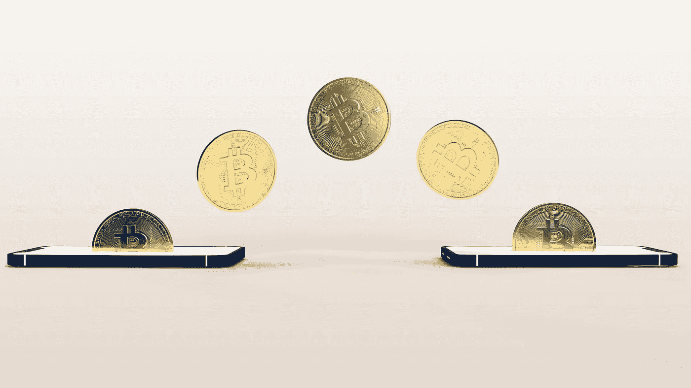
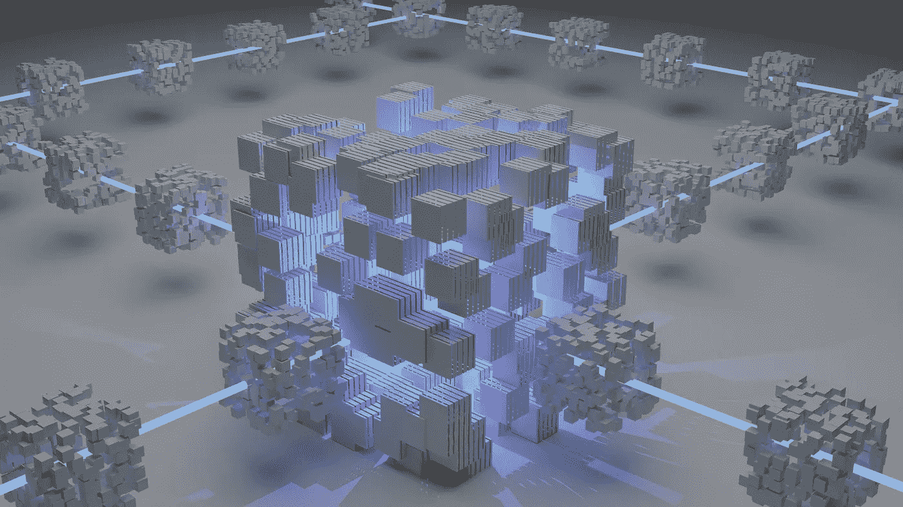
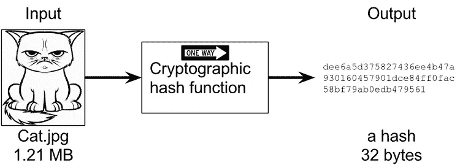

# 为什么黑比特币网络几乎不可能？

> 原文：<https://medium.com/coinmonks/why-is-it-almost-impossible-to-hack-the-bitcoin-network-8c496f546385?source=collection_archive---------30----------------------->

Bitcoin Cryptocurrency — Figure by [Bastian Riccardi](https://unsplash.com/@shutter_speed_)

比特币是第一种也是最广泛使用的加密货币。它是在 2009 年由一个不知名的人或一群人用笔名*中本聪*发明的。与其他数字货币一样，比特币使用加密技术来保护交易安全，防止未经授权的访问。使用比特币进行的交易被记录在一个名为*区块链*的公共账本上，这使得用户可以验证每笔交易的真实性。

> 交易新手？在[最佳加密交易](/coinmonks/crypto-exchange-dd2f9d6f3769)上尝试[加密交易机器人](/coinmonks/crypto-trading-bot-c2ffce8acb2a)或[复制交易](/coinmonks/top-10-crypto-copy-trading-platforms-for-beginners-d0c37c7d698c)

Schematic of a blockchain — Figure by [Shubham Dhage](https://unsplash.com/@theshubhamdhage)

区块链由一系列块组成，每个块包含一个事务列表。这些块以链的形式链接在一起，每个块都包含前一个块的唯一加密哈希。哈希函数是一种数学算法，它接受输入(或“消息”)并产生固定长度的输出(或“哈希”)。散列函数的输出对于输入是唯一的，实际上不可能从两个不同的输入生成相同的散列。在比特币网络中，哈希函数用于保护区块链上的交易和区块。它们为比特币网络上的所有交易创建了安全且不可更改的记录。因此，攻击者很难在不被发现的情况下更改或撤销交易。

Hash function in cryptography — Figure courtesy of [*Kalle Rosenbaum*](https://freecontent.manning.com/cryptographic-hashes-and-bitcoin/)

比特币安全性的另一个方面是它的去中心化特性。比特币不受任何一个政府、组织或个人的控制，而是由世界各地的用户网络维护，他们共同努力验证交易并保护网络。这种分散的结构使得任何人都很难控制网络或破坏其运行。为了成功入侵比特币网络，攻击者需要同时入侵网络的相当一部分节点，这是非常困难的。即使攻击者能够控制网络的大部分采矿力量，也很难使用这种力量以网络其余部分可以接受的方式改变区块链

总之，虽然比特币网络理论上有可能被黑客攻击，但现有的安全措施使得这种攻击极难成功。因此，比特币被认为是一种非常安全的价值存储和转移方式。

在 [Github](https://github.com/rekalantar?tab=repositories) 、 [Linkedin](https://www.linkedin.com/in/reza-kalantar/) 和[谷歌学术](https://scholar.google.com/citations?user=d2zZmXMAAAAJ&hl=en)上找我。

# 其他资源:

 [## 加密哈希和比特币管理

### 本文从卡勒·罗森鲍姆的《探索比特币》开始，讨论了加密哈希的基础知识，它被广泛应用于…

freecontent.manning.com](https://freecontent.manning.com/cryptographic-hashes-and-bitcoin/)  [## 解释:区块链中的哈希是什么？

### 理解散列(散列率)在区块链上的工作原理是挖掘的基础。了解哈希的工作原理并应用…

learn.bybit.com](https://learn.bybit.com/blockchain/what-is-hashing-in-blockchain/) 

> 加入 Coinmonks [电报频道](https://t.me/coincodecap)和 [Youtube 频道](https://www.youtube.com/c/coinmonks/videos)了解加密交易和投资

# 另外，阅读

*   [火币加密交易信号](https://coincodecap.com/huobi-crypto-trading-signals) | [HitBTC 审核](/coinmonks/hitbtc-review-c5143c5d53c2)
*   [TraderWagon 回顾](https://coincodecap.com/traderwagon-review) | [北海巨妖 vs 双子 vs 比特亚德](https://coincodecap.com/kraken-vs-gemini-vs-bityard)
*   [如何在 FTX 交易所交易期货](https://coincodecap.com/ftx-futures-trading)
*   [OKEx vs KuCoin](https://coincodecap.com/okex-kucoin) | [摄氏替代品](https://coincodecap.com/celsius-alternatives) | [如何购买 VeChain](https://coincodecap.com/buy-vechain)
*   [ProfitFarmers 回顾](https://coincodecap.com/profitfarmers-review) | [如何使用 Cornix Trading Bot](https://coincodecap.com/cornix-trading-bot)