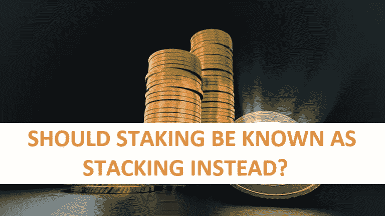

# 为什么叫跑马圈地，为什么不像我想的那样起作用？

> 原文：<https://medium.com/coinmonks/why-is-it-called-staking-and-why-does-it-not-work-as-i-think-58bd6f33ccc0?source=collection_archive---------16----------------------->

今天，我将谈谈赌注，以及为什么至少在大多数情况下，赌注并不像你认为的那样起作用。如果这听起来很有趣，那么请跟随这个赌注之旅。

# 记录历史上它是如何运作的

如果我们回顾过去，我们可以看到赌注已经存在了相当长的一段时间，其中一个最著名的人可能是弗拉德·特佩斯或弗拉德三世。但他更为人所知的名字可能是刺穿者弗拉德。等一下…那是完全不同类型的赌注。我的错，很抱歉。谷歌自担风险可能是应该在这里加上的。

*Vlad Tepes, more commonly known as Vlad the Impaler. Bram Stoker’s inspiration for Dracula.*

我所指的这种类型的赌注也已经存在了一段时间，但可能没有 Vlad 类型的赌注时间长。当你对某人投资时，意味着你给了他们所需的钱，让他们参与商业冒险。典型地，这主要用于流行文化和电影中的马或扑克。但是这种做法实际上可以应用于任何事情。

来弄清楚它到底是为了什么。如果你想进行一项商业冒险。我可以用木桩钉死你。意思是我给你你需要的钱。但是在你拿到钱之前，我们必须就如何分配利润达成一致。通常，这是一个标准的 50/50 分割。但也可以是我们同意的任何分割。

值得注意的是，下注的人要承担所有的财务风险。这可能是这种类型的实践不经常使用的主要原因。也可能是大多数人不熟悉它的原因。因此，贷款进行商业冒险和获得股份之间的区别是非常不同的。关键在于谁来承担风险。

# 让我们看看今天的赌注

在 crypto 中，你可以看到到处都是赌注。许多 DEX-和 CEXes，如果不是所有的，都提供它。还有很多其他的 DApps 也提供这种服务。他们通常提供两种类型的赌注。第一种类型要求您将令牌“锁定”一段时间。然而，与其他版本相比，这通常会带来更高的回报。这就是通常所说的“柔性”桩。这是你放置代币的地方，但你不要锁住它们。所以你可以自由移动和交换它们。但是这样做显然会导致你从那一点开始失去回报。然而，这需要你立即拥有这些代币。

甚至有一些 DApps 有他们所谓的“自动赌注”,这意味着你不需要做任何事情，除了把代币放在你的钱包里。

# 风险有多大？

这种新型的桩似乎只是和它的前身同名。因为这种类型的立桩似乎没有任何风险。不像它的前身。唯一的风险似乎是当你把你的代币拿去下注的时候。他们正在离开你的领地。所以如果你押他们的地方被毁了。那你拿回代币的几率就很小了。

> 我们代表客户保管的加密资产可能会面临破产程序，这些客户可能会被视为我们的一般无担保债权人。

这是比特币基地不久前说得很清楚的一件事，而且成了头条新闻。并且符合美国法律。这可能意味着，如果你下注的地方位于其他任何地方，那么他们的破产法将适用。但我认为，这种意外发生的几率几乎等于零。

这种新型的桩除了名字之外，实际上与其前身没有任何共同之处。女巫是我觉得应该叫别的名字的原因。因为它与标桩无关。你所要做的就是把你的代币堆起来，过一段时间后，你会得到比以前更多的代币。

那它应该叫什么呢，我真的没有名字。但是，在我的脑海中，囤积或堆积似乎比打桩更合适。或者堆叠是一个更好更合适的名字？

# 极端值

然而，也有一些例外。你可能听说过以太坊 2.0 或“合并”。这是以太坊从工作证明，或权力，转变为利益证明，或简称为 PoS。

这里我们又开始下注了。这是同一类型的打桩吗？不，这在所有帐户上似乎更符合原来的赌注。为什么为了能够在 ETH 区块链中铸造一个新的区块，你首先必须在最少 32 个 ETH 上下注。是的，我知道很多。如果你被随机选中成为铸造新积木的人。然后你必须做这项工作。如果做得正确，你会得到更多的报酬。但区别就在这里。

在这里你可能会失去你的股份。有可能吗，希望没有？但它是作为区块链的质量和安全措施来完成的。如果你想知道你是如何失去你的股份的，有很多帖子详细介绍了 PoS 如何为 ETH 2.0 工作。然而，我不会在这里讨论这个问题。

可能还有其他 PoS 区块链以类似的方式工作。只是我不知道他们。但是如果你知道一些，请在下面的评论区与我分享。这个我觉得还是应该叫跑马圈地。我认为这是另一种误导。在这里，你实际上投入了你的钱或资本，以 ETH 的形式。你有一个与金融风险相关的风险。你会得到回报。

我希望你会对这篇文章感兴趣。你同意还是不同意我的观点？请在下面的评论中分享你对这整个赌注的想法。也请分享任何名字的建议。

如果你想支持我和我制作的内容，请考虑关注我，阅读我的其他帖子，或者为什么不两者都做。

网络上见！

图片提供:弗拉德特普斯的图片；匿名作者，公共领域，通过维基共享，[https://pixabay.com/](https://pixabay.com/)

资源

1.  [https://d 18 rn 0 p 25 nwr 6d . cloudfront . net/CIK-0001679788/89 c60d 81-41 a2-4a 3c-86fb-b 4067 ab 1016 c . pdf](https://d18rn0p25nwr6d.cloudfront.net/CIK-0001679788/89c60d81-41a2-4a3c-86fb-b4067ab1016c.pdf)
2.  [https://coin telegraph . com/ether eum-for-初学者/ether eum-2-0-staking-a-初学者指南-如何去 stake-eth](https://cointelegraph.com/ethereum-for-beginners/ethereum-2-0-staking-a-beginners-guide-on-how-to-stake-eth#:~:text=After%20you've%20installed%20the,another%20for%20withdrawing%20your%20cash.)

> 交易新手？尝试[加密交易机器人](/coinmonks/crypto-trading-bot-c2ffce8acb2a)或[复制交易](/coinmonks/top-10-crypto-copy-trading-platforms-for-beginners-d0c37c7d698c)