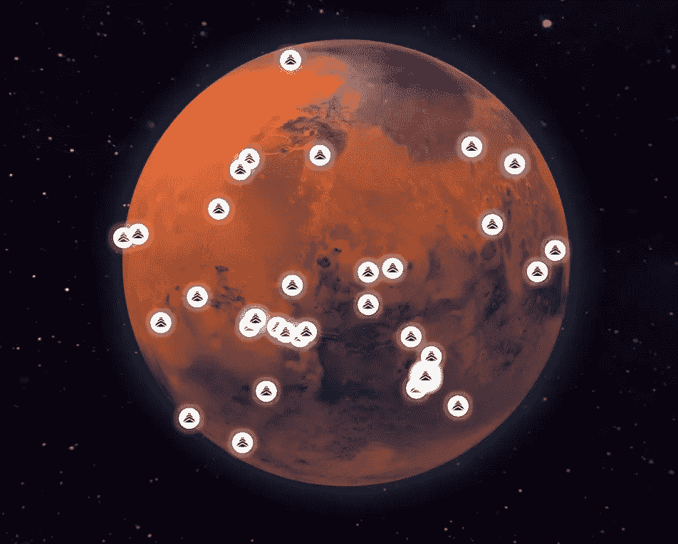
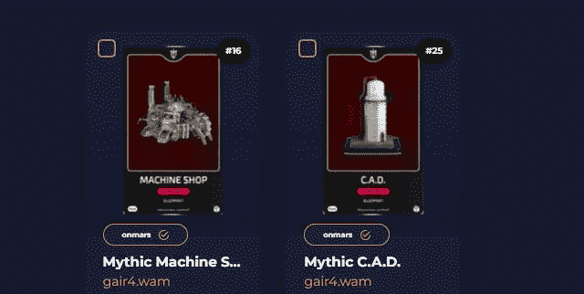

# 为什么《百万火星》是一款真正的赚钱游戏？

> 原文：<https://medium.com/coinmonks/why-is-million-on-mars-a-true-play-to-earn-game-b49bd6873bde?source=collection_archive---------17----------------------->

加密领域的许多人都知道 NFTs，知道它们可以用来做什么，或者是可交易的数字图片。如果您需要了解 NFT 的完整用例，他们可以使用智能合约，根据不同的编码参数执行不同的任务。

有了这些小知识，现在的问题是为什么[***火星上的百万人***](https://milliononmars.io/register?recruiter=gair4.wam) 是一个完美的玩赚游戏？

[***百万火星上***](https://milliononmars.io/register?recruiter=gair4.wam) 有一吨的隐藏价值随着不同的任务你可以做！现在复杂的工艺和技能系统允许人们专注于专业化。现在随着人们专注于一条道路，你可以平衡一切，做一切。随着时间的推移，投入的时间和精力会越来越多。但是你投入游戏的时间会为你赢得资产和黄昏。

现在，等等。玩家通过玩游戏获得土地和蓝图？是的，是的，是的，我的推荐人能够赢得黄昏，并随着时间的推移购买和赢得土地和蓝图！他们中的一个很幸运，在一次比赛中获得了一个神话和多个史诗和一个传奇！这些都是太阳能电池板，游戏中最有价值的建筑/蓝图之一。他们给电池充电，为所有建筑供电。

这些活动开始后，我发现他们开始在游戏中投入更多！这可能是心理上的，由于运气的原因…但我发现他们已经看到，由于他们投入游戏的工作和时间得到了回报，他们在比赛前赢得了土地赢得的蓝图！这使他们能够在锦标赛期间推动拾荒。在比赛期间，他们可以通过购买食物和水来补充体力，或者购买更多的拾荒工具来自我维持。变得自力更生是我敦促他们做的第一件事，结果令人惊讶。这些事件让我相信这是一个游戏，我觉得你真的可以成长，赚取/拥有新的资产，做一些事情。

我发现的问题是，人们没有给足够的时间来积累，以开始赚取你需要玩一段时间的钱。1-3 个月后，你会看到你的进步！社区成员制作了电子表格和计算器，所以数学很简单。我发现只是生产东西和部落，直到他们的价格膨胀。

游戏很容易被动地玩，并赢得/拥有黄昏或 NFTs。此外，你可以赚取跨链资产薄荷跨链蜡和索拉纳。我也可以将蓝图/建筑从我的蜡像铸造地转移到我的索拉纳铸造地！！许多游戏都在努力实现多链互操作性。为数不多的游戏之一，它是如此无缝和容易移动链之间和游戏中。

今天就加入其中一个最好的即玩即赚或自己拥有的游戏！要么继续赚取和生产更多的资产，要么卖掉它们！下面的链接直接带你到游戏的开始页和教程。

> [***百万火星链接点击我***](https://milliononmars.io/register?recruiter=gair4.wam)

[***蜡钱包链接***](https://wallet.wax.io/dashboard)

[***索拉纳钱包链接***](https://phantom.app/)

[***【索拉纳】***](https://www.fractal.is/milliononmars)

[***NeftyBlocks(蜡) (滴/销售/市场/开包)***](https://neftyblocks.com/c/onmars)

[***【原子枢纽市场】(蜡)***](https://wax.atomichub.io/market?collection_name=onmars&order=desc&sort=created&symbol=WAX)

[***火星上百万不和谐***](https://discord.gg/aaAJM764g9)

[***【我的不和谐链接(清算)***](https://discord.gg/xkpV8Yfjyy)

> ❤，试试吧，如果你有 questions❤就告诉我

> 交易新手？尝试[加密交易机器人](/coinmonks/crypto-trading-bot-c2ffce8acb2a)或[复制交易](/coinmonks/top-10-crypto-copy-trading-platforms-for-beginners-d0c37c7d698c)