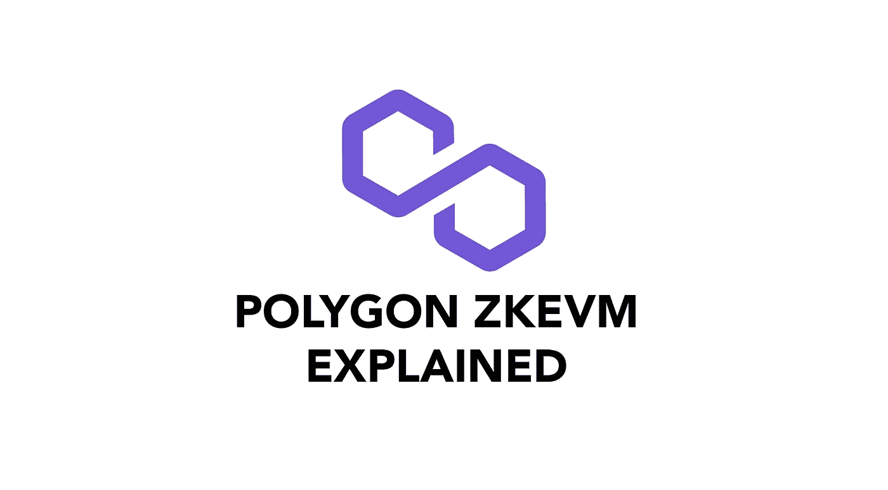
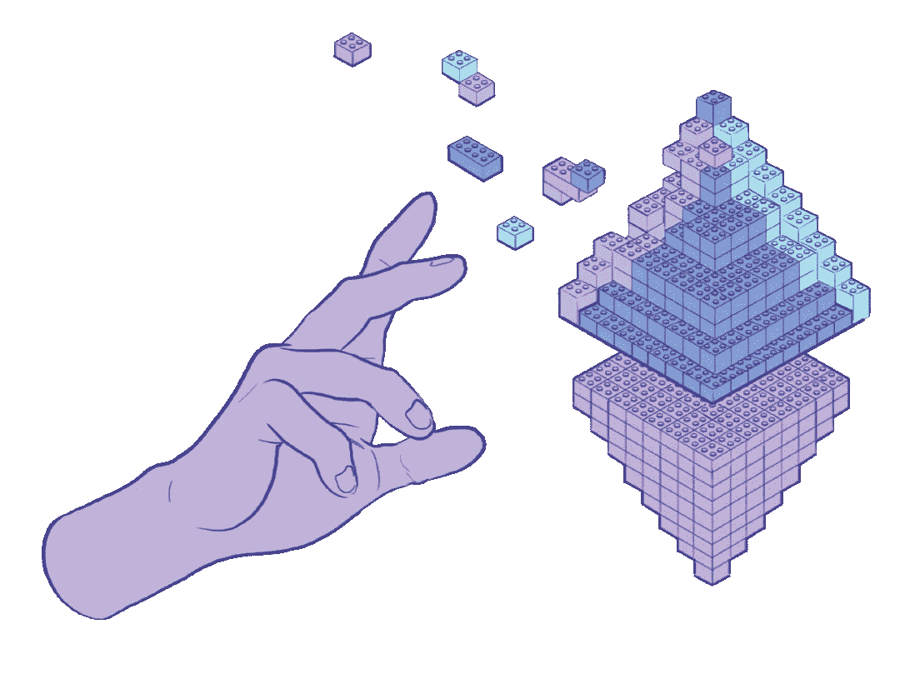
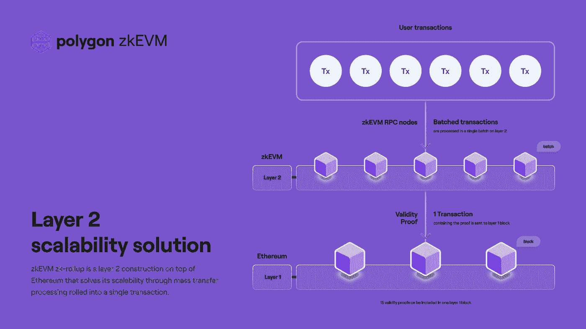
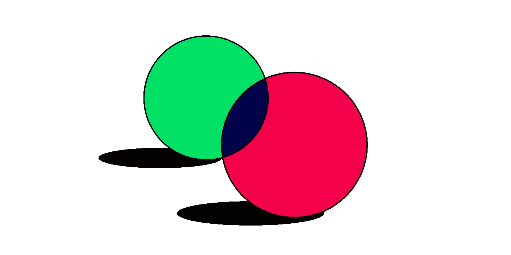
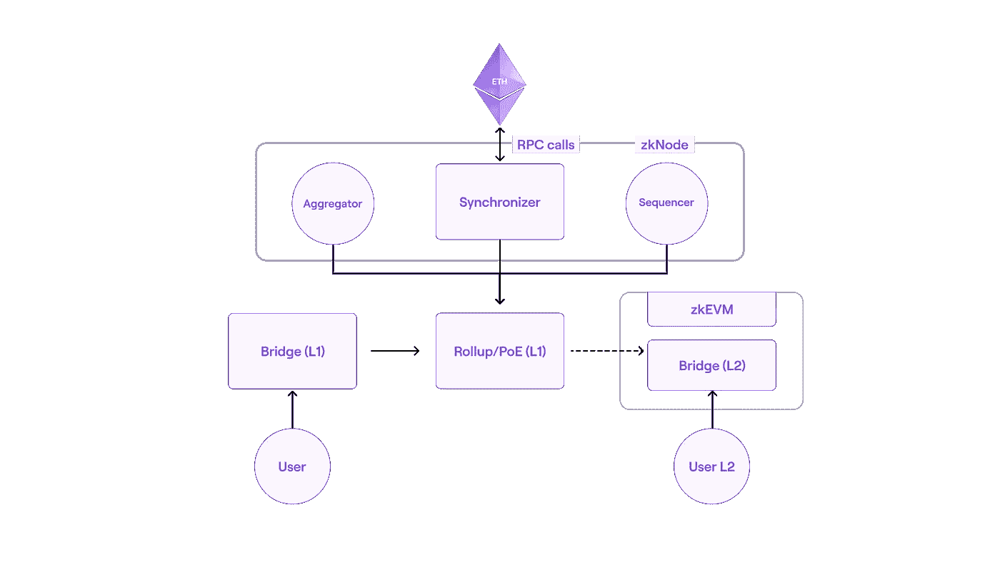

# Polygon 的新 zkEVM 为什么这么惊艳？

> 原文：<https://medium.com/coinmonks/why-is-polygons-new-zkevm-so-amazing-7e189841da4e?source=collection_archive---------1----------------------->

## 了解多边形 zkEVM

Polygon 是当今以太坊上最受智能合约开发者欢迎的缩放解决方案之一。第 2 层解决方案提供了开发人员所期望的所有去中心化和安全性，但降低了成本，因为 Polygon 将事务汇总起来，并将它们批处理到以太坊主网。

今天，Polygon 宣布他们的新 zkEVM 应该会让整个 Web3 生态系统的开发人员兴奋不已，因为 zkEVM 实现了第 2 层汇总的承诺，但却是在一个完全不同的层面上。

为了理解为什么 [Polygon 的 zkEVM 如此重要](#271f)，我们需要[理解以太坊的 EVM](#d722) 、[为什么智能合约使用 L2 汇总](#6ffb)、[零知识证明如何工作](#eb5b)、[当前 L2 解决方案的状态](#296d)，然后才能找到 Polygon 的 ZK 团队发现的圣杯。

*(上面提供的浏览文章的快速链接)*

## 以太坊上的 EVM 是什么？

以太坊虚拟机是以太坊的特制酱料，补充了全区块链共享的分布式账本技术。EVM 可以被描述为分布式状态机——它促进了智能合同状态的散列，创建了与合同账户相关联的值，与以太坊网络的共识机制一致。

> 您可以将 EVM 视为在区块链上运行智能合约代码的分布式计算机。

由于 EVM 是分布式的，这意味着网络上的每个人都可以访问所有智能合约。此功能支持智能合约功能的可组合性—一个智能合约可以作为另一个智能合约中的函数来调用。

## 为什么智能合同使用 L2 累计？

以太坊主网贵。当收费最高时，可能会被频繁调用或进行小额交易的智能合约会被定价出局。

> Polygon 之类的第 2 层协议非常适合这些类型的合同，因为它们可以在以太坊主网上批量分组进行单次验证，从而降低成本并保持智能合同的可行性。

这些批次被称为“卷”，它们是用零知识证明完成的。这种方法通常被称为 ZK 汇总。

## ZK 校样是如何工作的？

零知识证明是一种验证信息的数学方法，不需要知道信息本身。

> 有趣的是，ZK 证明应用于问题的次数越多，准确性就越高，但实际上从未达到 100%。

这是因为 ZK 证明使用双边知识不对称进行验证。这是一种奇特的说法，即双方都不知道对方的情况，但他们各自知道的情况被用来增加相信对方所说的是真的可能性。

说明 ZK 证明方法的一个流行方法是:

假设有两个人试图证明一个红色的球和一个绿色的球是不同的颜色。

*其中一个人(验证者)是红绿色盲，所以对球是否是不同颜色一无所知。*

*他们不相信对方的话，所以做了一个实验:*

*   他们一手拿着一个球，给另一方看。
*   把它们放在背后，他们选择是否交换它们。
*   然后他们再次把它们拿出来，问对方它们是否被调换了。因为对方能看到颜色，所以能正确回答问题。
*   因为另一方有 50%的机会猜对，色盲者在他们进行实验的次数越多，就越能断言另一方是否在说实话——尽管他们永远不可能 100%肯定，因为有可能猜出正确的答案(尽管几率很小)。

## 当前第 2 层解决方案中 ZK 证明的状态

第 2 层链以 1 ZK 证明批量智能合约交易，并将其推送到以太坊链上进行验证，从而节省了汽油。一次交易代替多次交易意味着以太坊的负载减少，允许以更低的成本处理更多的交易。

> 理论上这是个好主意，但很难付诸实施。

因为它们的准确性随着运行时间的增加而提高，ZK 校样在历史上一直是缓慢而昂贵的。更不用说 L2 解决方案为开发人员带来了额外的工作，比如全面的语言不兼容，或者意味着在能够在 ZK 解决方案上运行合同之前扫描整个代码的小差异。

节省下来的钱还没有超过使用它们的工作量。

## Polygon 的 zkEVM 是一个很大的改进

Polygon 的 ZK 团队已经取得了重大的性能突破，减少了证明生成时间，这是零知识证明的圣杯。

更棒的是 Polygon 的 zkEVM 1:1 兼容以太坊智能合约；它使用相同的语言，开发者可以使用他们喜欢的所有相同的工具。

> 这将允许复制粘贴传输到 Polygon 的 zkEVM——这对于节省成本和速度来说是显而易见的。

Polygon zkEVM testnet 将很快与文档一起部署，以便独立开发人员和 Polygon 团队可以探索新工具的可能性以及需要改进的地方。

要阅读更多内容，请访问链接[的 Polygon 博客。](https://blog.polygon.technology/the-future-is-now-for-ethereum-scaling-introducing-polygon-zkevm/)