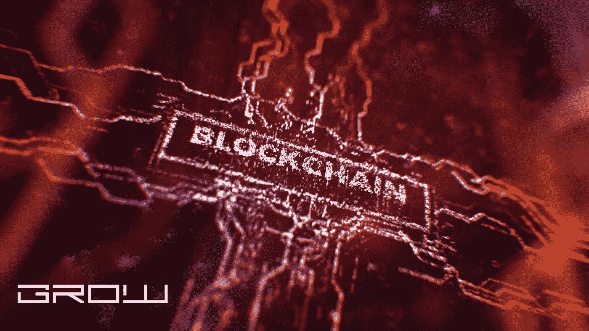

# 为什么区块链需要工作证明？

> 原文：<https://medium.com/coinmonks/why-is-proof-of-work-needed-for-blockchain-461a463dc94c?source=collection_archive---------32----------------------->

blockchain

区块链是分散的分类账，记录着曾经发生的每一笔交易。这是通过要求每个用户做某种工作来添加一个块到区块链，然后广播这个新的块，以便它被添加到现有的链。

有时，这项工作可能包括挖掘，这是一项需要运行计算密集型计算的操作。当这些任务成功时，它们会产生所谓的“工作证明”或“利益证明”这些证明充当块的验证，否则这些块将不会被网络的其他成员接受，直到通过一致认可和验证。

# 为什么验证新块很重要？

之所以需要工作证明，主要是为了确保只有有效的交易被添加到区块链中。

如果没有工作证明，理论上用户可以创建一个块并将其添加到区块链中，而无需任何检查或平衡。因为没有其他方法知道交易是否被网络上的其他人批准——没有工作证明——那么该区块将被接受为现有区块链的一部分。这可能导致重复消费，即一个人花了很多次钱，却没有任何硬币。

例如，比特币具有工作证明功能，矿工通过验证交易并将其添加到区块链中而获得报酬。据估计，2015 年为开采比特币支付了约 700 万美元，其中约 10%目前仍在流通。

> 交易新手？试试[加密交易机器人](/coinmonks/crypto-trading-bot-c2ffce8acb2a)或者[复制交易](/coinmonks/top-10-crypto-copy-trading-platforms-for-beginners-d0c37c7d698c)

有趣的是，比特币的创造者中本聪创造了 50 BTC 的集体奖励，作为对矿工的奖励。这意味着，虽然矿工目前每年开采约 400 万 BTC，但由于时间的推移，采矿创造的新硬币的总供应量是这个数量的一半。

# 其他加密货币是做什么的？

在包括以太坊在内的大多数密码上有两种方法来保护密码块。第一种是使用“工作证明”,用户必须运行复杂的计算来向区块链添加新块。第二种方法被称为“赌注证明”，这是用户锁定硬币的一种方式。每个拥有硬币的用户可以提出一个区块，如果它成为区块链的一部分，它将获得更多的令牌。

以太坊使用一种称为 Casper 的方法，它将工作证明和利益证明结合到一个共识算法中，而 Zcash 使用一种称为“零知识证明”的东西，它不需要用户向区块链添加块，但仍然需要他们保持自己的私钥安全。

# 区块链可以改变自己的规则

因为区块链是分散的，一旦他们达到一定的规模，他们也可以改变自己的规则。这意味着，一旦有足够多的人开始使用比特币，它背后的协议可能会自我更新，将区块奖励降至 12.5 BTC，或增加至 2100 万 BTC。这是因为给予矿工的激励会根据网络中有多少用户和有多少活动而变化，这两者都会影响投入采矿的时间和资源。由于协议的这种变化，这可能会造成比特币完全去中心化的局面。

# 结论

虽然在一些加密中使用了利益证明，但这可能会给加密货币领域带来许多挑战。通过使用这种方法来确保网络共识的难度和风险是许多人所关心的。由于风险如此之高，这也可能导致集中化的增加，因为只有少数人能够为整个网络做出这样的决策。

正如大多数新技术和新概念一样，从现在到它们出现的时候，我们很可能会看到更多的发展。