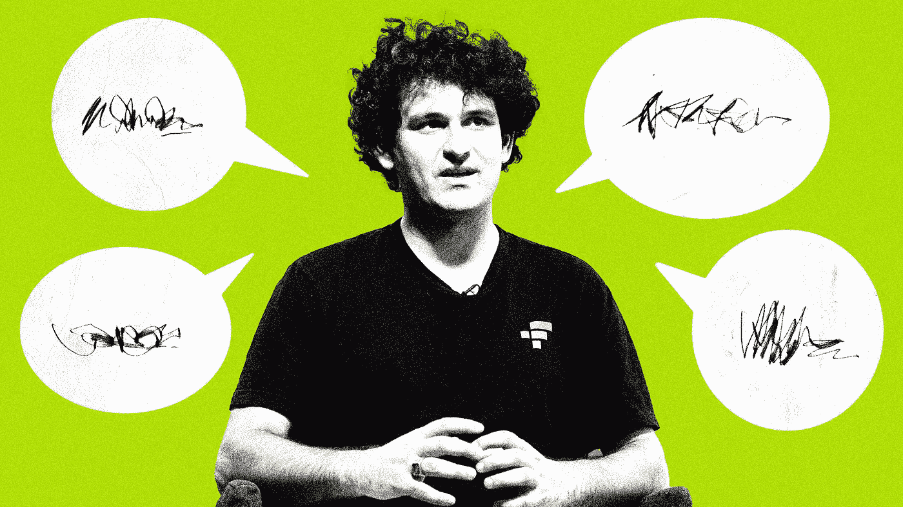
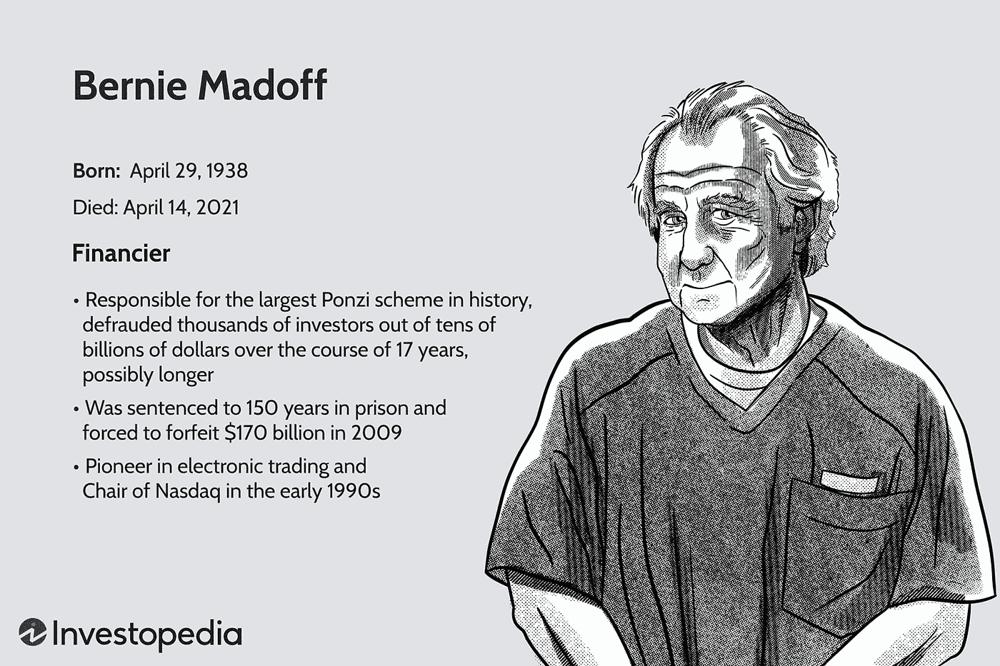

# 为什么 SBF 要进行一场疯狂、精神错乱的媒体之旅？

> 原文：<https://medium.com/coinmonks/why-is-sbf-going-on-a-crazy-unhinged-media-tour-ccf09341894b?source=collection_archive---------35----------------------->

Was SBF smart to go on a frenzy of media tours and live interviews right after the FTX implosion?

因此，FTX 崩溃了，损失了 320 亿美元。

FTT，FTX 的象征，现在一文不值了。

数百万客户损失了数十亿美元。

大投资者损失了金钱、自尊和面子。

Sam Bankman-Fried 在创纪录的时间内从 160 万美元变成了 0 美元。

> 从顶级交易者那里复制交易机器人。免费试用。

不知何故，他仍然有钱支付一些厉害的律师，他们设法让他离开巴哈马的地狱般的监狱，及时回家与家人共度圣诞节。

在这一切发生的同时，SBF 不知何故仍然设法进行了一次世界巡演，与每一个可能的媒体交谈。

从小播客到大型新闻媒体，他抓住了每一个可能的采访机会。

让你不禁好奇。

为什么 SBF 要进行一场疯狂、精神错乱的媒体之旅？

纽约时报。

早安美国。

纽约杂志。

Axios。

独家新闻。

为什么他要接受这么多媒体的采访和采访？

Theranos founder **Elizabeth Holmes** has been sentenced to over 11 years in prison for defrauding investors in her blood testing start-up. It took authorities years to get to her, but just days to get SBF in custody.

一般来说，在你被抓到或者犯了如此公开的严重错误后，教科书上要做的事情就是蹲下并闭嘴。

没有人会像开幕之夜红地毯上的名人一样，迎着媒体的目光接受采访。

你可能会自相矛盾或者更糟，提供为自己做伪证所需的弹药。

你知道吗，我开始觉得 SBF 的媒体之旅比道歉更有战略意义。

也许他正试图用媒体来重构事物。

他试图在他的案件中散布合理的怀疑。

他所有的采访背后都有一个想法，那就是他真的不知道 FTX 发生的坏事。

他不知道有混合资金。

他没有做任何适当的风险管理。

他没有花更多的时间关注正在发生的事情。

也许他是在为无知或疏忽而不是故意欺诈投资者立案，这是刑事指控的核弹。

可悲的是，作为阿拉米达研究公司的首席执行官，卡罗琳可能会受到相当严重的惩罚，如果证明他们使用 FTX 客户的存款进行疯狂的赌博。

Bernard Lawrence Madoff was an **American fraudster and financier** who ran the largest Ponzi scheme in history, worth about $64.8 billion. He was at one time chairman of the NASDAQ stock exchange.

SBF 是想让她间接成为替罪羊吗？

SBF 邪恶吗？

还是纯粹的疏忽？

也许他受了某种强效药物的影响，做出了一些奇怪的事情？

也许他一开始是个圣人，但名声冲昏了他的头脑？

也许媒体和其他所有人都走了极端，开始不停地支持他，把他视为加密领域的金童？

他花了数年时间策划和实施的这场大规模欺诈和骗局背后的真实意图是什么？

有多少责任应该归咎于他的一群鼓励和扶持他的联合创始人和投资者？

-

FTX 崩溃后，SBF 应该对媒体发表讲话吗？

-

# startups # business # startupx # growth # success # social media # culture # entrepreneur # strategy # eth # BTC # crypto # sbf # sambankmanfried # hated person 2022 # ftx # scam # ftt # berniemadoff # Elizabeth Holmes # ther anos # year 2022

> 加入 Coinmonks [电报频道](https://t.me/coincodecap)和 [Youtube 频道](https://www.youtube.com/c/coinmonks/videos)了解加密交易和投资

# 另外，阅读

*   [加拿大最佳加密交易机器人](https://coincodecap.com/5-best-crypto-trading-bots-in-canada) | [库币评论](https://coincodecap.com/kucoin-review)
*   [用于 Huobi 的加密交易信号](https://coincodecap.com/huobi-crypto-trading-signals) | [HitBTC 审查](/coinmonks/hitbtc-review-c5143c5d53c2)
*   [TraderWagon 回顾](https://coincodecap.com/traderwagon-review) | [北海巨妖 vs 双子 vs 比特亚德](https://coincodecap.com/kraken-vs-gemini-vs-bityard)
*   [如何在 FTX 交易所交易期货](https://coincodecap.com/ftx-futures-trading)
*   [OKEx vs KuCoin](https://coincodecap.com/okex-kucoin) | [摄氏替代品](https://coincodecap.com/celsius-alternatives) | [如何购买 VeChain](https://coincodecap.com/buy-vechain)