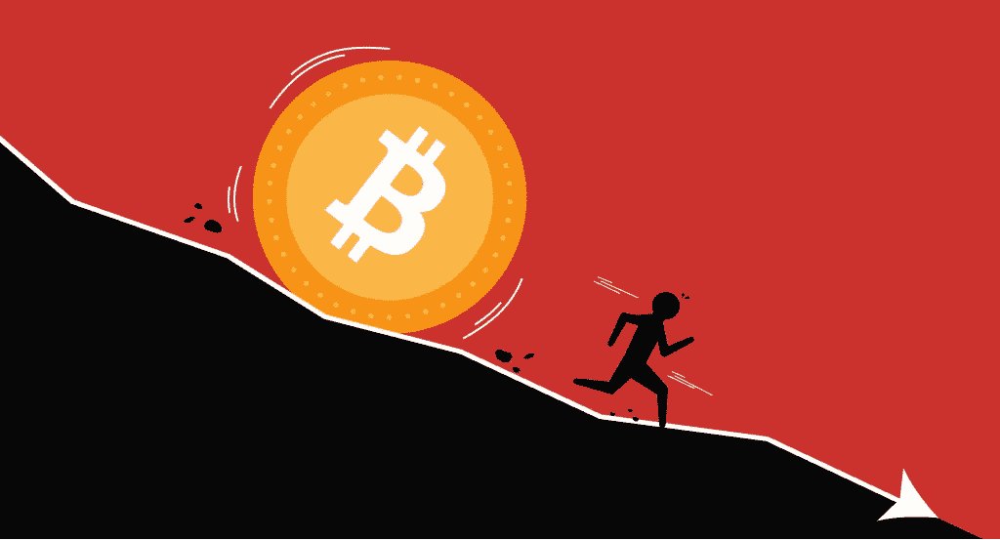
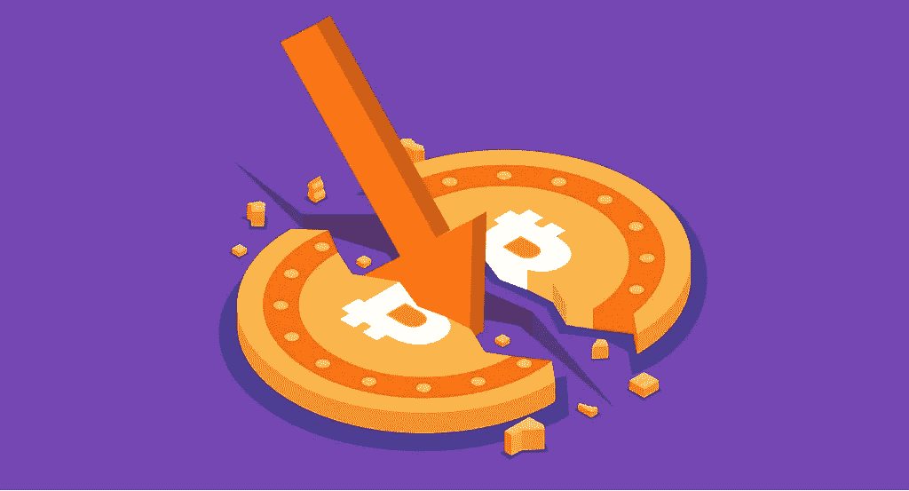

# 为什么加密市场现在崩溃了？

> 原文：<https://medium.com/coinmonks/why-is-the-crypto-market-crashing-right-now-478fe8174e44?source=collection_archive---------9----------------------->

不久前，2021 年 11 月，密码市场达到顶峰。自那以后，情况发生了巨大变化。市场经历了一场崩盘，导致比特币的交易价格比其 ATH 低 70%，大多数替代币的情况看起来甚至更糟。许多专家认为，熊市或加密货币的冬天已经开始。奇怪，因为正如我们所见，熊还没有进入冬眠。首先，夏天才刚刚开始，其次，市场还在流血。

无可否认，市场已经停滞了好几天。BTC 正试图回到 25，000 美元的关口上方，但没有适当的动力——其价格在 23，300 美元至 23，550 美元之间波动(截至 2022 年 8 月 18 日)。到目前为止，还没有太多复苏和趋势改变的迹象。投资者情绪非常消极。恐惧和贪婪指数处于“极度恐惧”水平已近一个月。那么是什么导致了加密崩溃呢？为什么 crypto 现在崩溃了？

# 为什么密码市场崩溃了？

加密崩溃有很多可能的原因。然而，下降背后的主要因素是当前的全球经济状况、Terra 生态系统的崩溃以及加密贷款平台的问题。让我们更仔细地看看所有这些问题:宏观经济因素、土地崩溃和一连串的清算

# 宏观经济因素

许多人投资了 BTC T2 银行来对冲他们的储蓄以抵御通货膨胀。被许多人称为“数字黄金”的主要加密货币应该像实物贵金属一样防止这种现象。支持者指出它独立于银行系统。

然而，美国的通胀率在 6 月份达到了 40 多年来的最高水平——9.1%，随后在 7 月份略微放缓至 8.7%。这样的同比增幅超出了分析师的预期。此外，也不能保证这就是加息的终点。

价格飙升引发了人们对美国中央银行美联储将继续加息的担忧。这就是已经发生的事情。美联储最近将利率提高到了自 1994 年以来的 28 年来的最高水平。这一次他们上升了 0 . 75 个百分点。此前，它们在 3 月份和 5 月份分别上调了 0.25 个百分点和 0.5 个百分点。

更高的利率通常会让投资者望而却步，因为这会让借贷成本更高。

隐冬会持续多久？例如，银河数码(TSE: GLXY)负责人 Mike Novogratz 认为，只有美联储重新考虑其行动，比特币才能开始另一轮反弹。在最近接受美国消费者新闻与商业频道采访时，他说:

> 比特币将引领市场走出美联储的加息……美联储退缩的那一刻……因为经济真的开始翻转了……他们将看到比特币在北方爆炸。“与我交谈过的许多人都认为，他们下一次要参与的时候，是他们开始感觉到美联储将暂停行动的时候。
> 
> 迈克·诺沃格拉茨

# Terra 的崩溃

影响 crypto 崩溃的另一个重大事件是 [Terra 生态系统](https://stealthex.io/coin/terra-2/) (stablecoin UST 及其相关的 LUNA token)的崩溃。

不可否认，TerraUSD 被证明太小，不足以永久破坏整个生态系统。然而，UST 已经永远失去了与美元挂钩的汇率，而卢纳汇率也几乎跌至零。由于该网络的创始人试图为其稳定的货币挽回流动性，其供应量已经极度膨胀。结果，Luna Foundation Guard (LFG)用其 80，394 BTC 的储备捍卫了钉住汇率制。然而，这没有任何效果。

[彭博建议](https://www.bloomberg.com/news/articles/2022-05-15/terra-ust-luna-hasn-t-killed-crypto-but-it-was-a-narrow-escape)如果不稳定发生在几个月后，结果是稳定的 UST 币已经高得多(因为它自今年年初以来一直在快速增长)，那么对整个加密货币生态系统的负面影响可能会严重得多。该通讯社甚至将这一潜在事件与 2008 年雷曼兄弟(Lehman Brothers)崩溃的加密货币版本相提并论。

由于 stablecoins 市场的不确定性，以及 LFG 出售的价值 32.75 亿美元的 BTC 的影响，2022 年 6 月底，主要加密货币跌至 2020 年 12 月以来的最低水平。

# 摄氏和三箭资本(3AC)问题

导致加密崩溃的另一个因素是加密货币公司 Clesius 和三箭资本(3AC)的问题越来越多。

[根据专家的说法](https://blog.huobi.com/wp-content/uploads/HRI-sETH-depegging.pdf)，这些公司使用高风险的投资策略，将客户的资金放在高利率的 DeFi 协议中。然而，加密崩溃导致他们开始经历流动性问题。

最初，Celsius 暂停用户账户之间的提款、互换和转账。为什么？因为它持有的大部分资产都是合成资产——斯特斯和 WBTC。当他们的投资面临风险时，投资者开始大规模赎回他们的头寸，每周赎回 50，000 ETH。

该项目的原生令牌——CEL——一度跌至 0.2 美元。然而，自那以来，人民币汇率已经上涨了几倍。事实上，Celsius 将这些问题放在心上，并开始寻找解决方案，比如聘请 Akin Gump Strauss Hauer & Feld 的律师进行可能的财务重组。

据报道，它还向花旗集团寻求帮助。据我们所知，这家金融集团只会“就可能的融资方案向公司提供建议。”然而，它不会从其资产负债表中提供资金。

另一方面，三箭资本(3AC)因为 Terra 生态系统陷入困境。在倒闭前几个月，道权的公司 Luna Foundation Guard 从投资者那里筹集了 10 亿美元。事实证明，3AC 也为该项目拨款。

更有甚者，6 月初，3AC 开始在 DeFi 协议中做出很多不同的、可疑的举动。一些密码社区成员开始猜测，该公司可能会发现自己处于类似于 Celsius 的情况。事实证明，他们是对的。

不久之后，3AC 遭遇了一连串的清算和监管问题，最终不得不申请破产。

3AC 的危机影响了整个行业，因为许多大型项目都与该对冲基金有关。

# 比特币死了吗？

在下跌过程中，媒体再次开始报道比特币的死亡。但是，这只是动荡的加密货币市场的又一次崩溃，还是这是这种替代资产类别结束的开始？

根据 99 比特币的数据，自推出以来，BTC 已经被称为“死亡”至少 461 次。仅 2022 年就有 21 起此类案件。

然而，这是比特币的末日吗？从历史上看，根本不是。事实上，比特币在其职业生涯中已经经历了至少六次 50%的下跌(或者更显著)。

事实上，这就是历史上每个周期的样子。先是减半，然后比特币的牛市开始了。接下来，实现利润的投资者开始投资替代硬币，引发了所谓的“替代硬币季”到达 ATH 后，股市大幅下跌，主要原因是散户投资者的恐慌。

现在的情况显然不同了。市场上出现了许多机构投资者，他们共同持有很大比例的供应，并且杠杆比率很高。尽管如此，有两件事表明了比特币将会继续存在的事实——飙升的采用率和加密爱好者的乐观情绪。

# 越来越多的采用

加密货币市场的现状与几年前不同——主要是在采用方面。以前谁会想到直接消费比特币，或者把它存在支付巨头的钱包里？在之前的牛市中，大公司也没有在资产负债表上持有它。

总的来说，加密货币的[采用可以说是一种现象，即数字货币被“吸收”到经济或日常生活的其他领域。举例来说，这个过程变得越强，越多的投资者和普通消费者将会知道什么是比特币、区块链或以太坊，以及如何使用这类技术。](https://stealthex.io/blog/who-accepts-bitcoin-as-payment-in-2022/)

如今的加密货币可以比作 20 世纪 90 年代的网站。那时候很多人都知道什么是网站，只知道不是常识。今天，每个人，甚至更老的人，都知道互联网是什么。类似的命运可能正在等待加密货币。但是我们如何检查采用的水平呢？你在哪里能看得最清楚？

# 比特币自动取款机

分析[比特币 ATM](https://stealthex.io/blog/what-is-a-bitcoin-atm/) 市场是研究加密货币采用如何发展的一种方式。比特币自动取款机是一种允许你买卖比特币和其他硬币的设备。从外观上看，它们类似于传统的自动取款机。当然，比特币自动取款机的数量比传统的要少得多。今天全世界安装了多少？

根据 BTC 自动取款机全球注册机构 Coinatmradar 的数据，今天，我们可以在 77 个国家找到 38599 台这样的设备。其中大多数安装在美国(34，344)、加拿大(2，523)、西班牙(256)、萨尔瓦多(212)和波兰(191)。

# 大公司甚至国家对加密货币开放

从越来越多的大公司投资数字资产，甚至将其作为支付手段的事实中，也可以看出比特币和加密货币迄今为止在[取得的巨大成功。](https://stealthex.io/blog/who-accepts-bitcoin-as-payment-in-2022/)

特斯拉就是一个例子。这家公司已经接受比特币作为其汽车的一种支付方式。此外，它还向市场投入了部分资本。如今，该公司不再接受 BTC 的产品，但其首席执行官埃隆·马斯克(Elon Musk)宣布，一旦比特币通过更绿色的方法被开采出来，它将恢复这样做。

然而，特斯拉并没有穷尽这个主题。其他主要参与者，如 [MicroStrategy](https://cryptodaily.co.uk/2022/04/is-microstrategy-secretly-selling-bitcoin) ，也在投资加密货币。支付市场巨头 PayPal 也向其客户提供数字资产。“大鱼”将资金配置为加密货币的事实意味着，在投资者眼中，数字资产变得越来越可靠。

然而，它并不止于此。甚至整个国家都开始承认 BTC 为法定货币。例如，萨尔瓦多在 2021 年 9 月这样做了，中非共和国几个月前也加入了这一趋势。

# 链条分析报告

我们还可以在 Chainalysis 最近的一份报告中找到有趣的数据。据该公司称，全球采用率在过去一年中增长了 880%。原因？使用加密货币的交易活动，以及比特币越来越被视为有助于在高通胀时期保值的价值储存手段。

有趣的是，根据全球加密采用指数，越南、印度和巴基斯坦等国家的加密货币采用率最高。这些是发展中国家。在印度，当局对数字货币完全敌视，但尽管如此，印度公民仍对 BTC 很感兴趣。

新兴市场的投资者正在投资 BTC，因为它允许没有银行账户的人进行转账。

# 加密爱好者和公司的乐观态度

尽管市场上普遍存在焦虑，但加密货币的支持者和爱好者仍然看到了这种资产的光明前景。诚然，“华尔街”已经陷入恐慌，但对于长期考虑这一资产类别的人来说，这是一个“逢低买入”的机会。

坚持不懈的霍德尔总能在连锁数据或技术分析中找到积极的信号。另一方面，他们经常寻找确认他们信仰的迹象。

相反，其他人相信市场周期。虽然加密货币经常被比作 2000 年的网络泡沫，但热衷者认为网络股票的基本前提是正确的。互联网已经成为未来，他们相信它对比特币也是有效的。

加密货币公司似乎也有类似的观点。例如， [StealthEX](https://stealthex.io/) 交易所的 CMO 对该行业的未来持乐观态度，她说:

> 当市场下跌时感到焦虑是非常自然的——我们都有这种感觉。然而，从事 crypto 已经有一段时间的人已经看到了这一切。2019 年比特币交易 3500 的时候我们也在，当时好像是世界末日。看看整体情况，看看旧的数据。我说的可能听起来很夸张，但这是真的——我们没有整个政府都投入到加密中，也没有如此大规模的普及。
> 
> 市场波动会再次发生，许多项目会变得不稳定并消失，但这是必须发生的。我们能做的就是坚持下去，像以前一样继续工作。尽管条件如此，许多用户还是想交换。此外，相当多的人正在寻找购买 dip 的机会——作为一个具有菲亚特采购功能的平台，我们是第一个见证这一趋势的人。
> 
> 总结一下，#WAGMI。如果收养率增加 80%，我们的情况真的不算糟糕。
> 
> 玛丽亚·卡洛拉

诚然，一些公司正在裁员。然而，这主要是由于缺乏现金储备。例如，拥有充足储备资金的币安，已经决定利用 crypto crash 来雇佣更多员工和发展业务。

一些人表示，数字资产在能源使用方面也面临挑战。然而，研究显示，比特币，特别是其采矿业，推动人类从可再生资源中获取比特币。

加密市场仍然是一个不稳定的领域，继续遵循其自身的规则和趋势，使加密货币成为一种风险很大且往往不可预测的投资。然而，随着围绕加密货币的[炒作逐渐消退，这可能会给](https://stealthex.io/blog/what-is-hidden-behind-crypto-hype-and-whats-coming-next/)[的加密爱好者带来另一个购买加密货币的机会](https://stealthex.io/how-it-works/)。StealthEX 在这里帮助您以适中的价格购买超过 450 种数字资产。你可以私下做这件事，不需要注册服务。

# 如何购买 Crypto？

只需进入 [StealthEX](https://stealthex.io/) 并遵循这些简单的步骤:

1.  选择要兑换的货币对和金额。例如，BTC 到瑞士联邦理工学院。
2.  按下“开始交换”按钮。
3.  提供收件人地址。
4.  处理交易。
5.  接收您的加密硬币。

在 [Medium](https://stealthex-io.medium.com/) 、 [Twitter](https://twitter.com/Stealthex_io) 、 [Telegram](https://t.me/StealthEX) 、 [YouTube](https://www.youtube.com/channel/UCeES_XBesX76ge7xf1meuSw) 和 [Reddit](https://www.reddit.com/user/Stealthex_io) 上关注我们，了解关于 [StealthEX.io](https://stealthex.io/) 和其他加密世界的最新消息。

在购买任何密码之前，不要忘记做自己的研究。本文表达的观点和意见仅代表作者个人。

*原载于 2022 年 8 月 18 日*[*https://stealthex . io*](https://stealthex.io/blog/why-is-the-crypto-market-crashing-right-now/)*。*

> 交易新手？尝试[加密交易机器人](/coinmonks/crypto-trading-bot-c2ffce8acb2a)或[复制交易](/coinmonks/top-10-crypto-copy-trading-platforms-for-beginners-d0c37c7d698c)