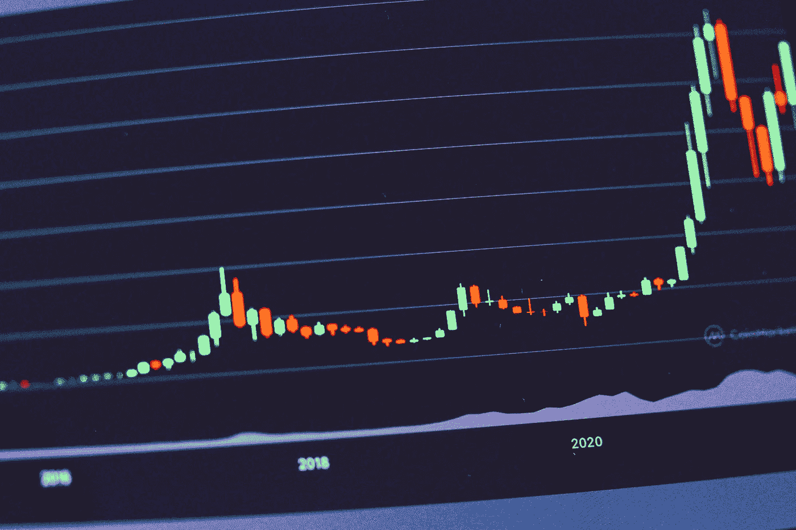

# 为什么比特币的价格波动这么大？

> 原文：<https://medium.com/coinmonks/why-is-the-price-of-bitcoin-so-volatile-c2a59366f089?source=collection_archive---------21----------------------->

Source photo Unsplash.com

由于其内在价值和未来价值缺乏明确性，比特币是一种高度不稳定的资产。

由于比特币的供应有限，每天产生的新 BTC 数量越来越少。为了保持价格稳定，需求必须等于通货膨胀率。与其他行业相比，比特币行业非常小，光是媒体的关注就可能影响其价格。对于…