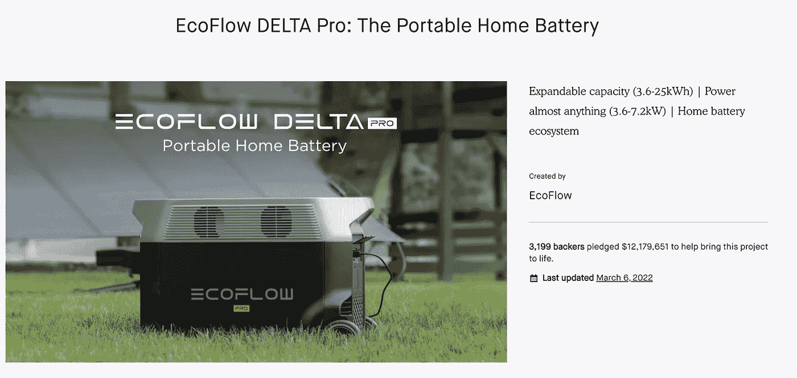
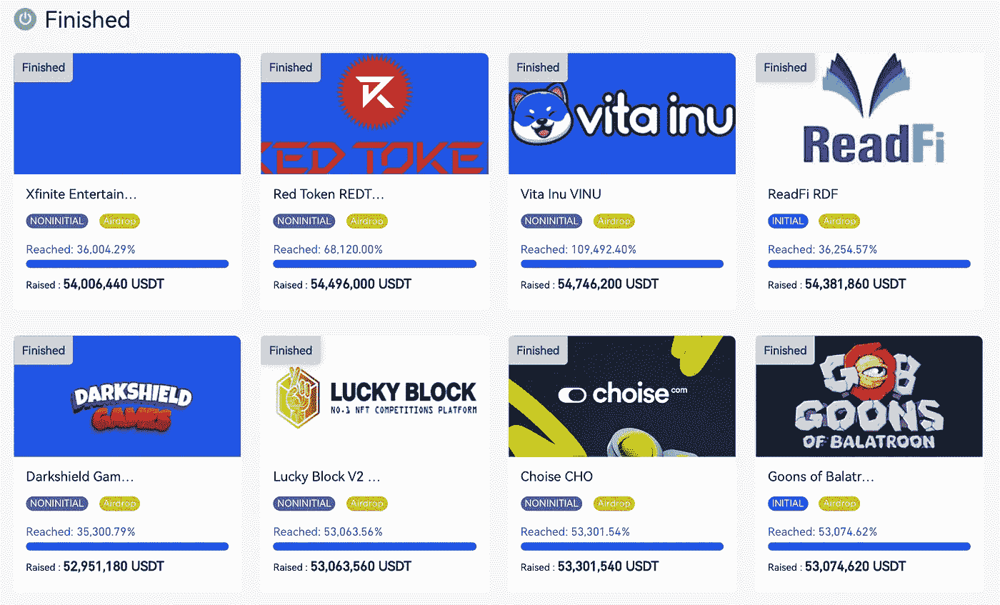

# 为什么 Web3 和 NFTs 在融资业务上胜过 Kickstarter？

> 原文：<https://medium.com/coinmonks/why-is-web3-and-nfts-overcoming-kickstarter-for-funding-businesses-1af2cf6bb116?source=collection_archive---------16----------------------->

如果你有一个需要资金来实现的商业想法，你应该密切关注 Web3 正在发生的事情。

没有多少企业家注意到这种转变，早起的鸟儿有虫吃。此外，如果你正在寻找分散另类投资的方法，Web3 众筹可能适合你。

今天，当我们想到众筹时，我们会想到 Kickstarter。Kickstarter 是一个为尚未获得投资的项目提供资金的平台。它们可以从电影、游戏、音乐到艺术、设计和技术。

该网站已经运行了大约 12 年，超过 6B 被分配给超过 10 万个想法。它的一个趋势项目最近筹集了 1200 万美元，这对该网站来说是一笔巨款。

随着区块链和 Web3 的出现，这种情况即将改变。以 Gate.io 交易所为例:他们有一个名为“ [Startup](https://gate.io/startup/) 的板块，在这里，通过了初步尽职调查流程的新项目向大众投资开放。

大约有 500 个与密码相关的项目得到了资助，其中很多最近获得了 4500 万美元。

这是一个交易所独有的场景，但可以指出一个巨大的空间:

(1)创业者通过 Web3 平台获得所需资金；

(2)投资者分散投资组合中的另类资产。

**Web3 vs. Web2 众筹**

比较 Kickstarter 和 Web3 平台等传统平台的众筹有几个优势:

*   **完全透明**:所有数据都存储在区块链上，可追溯、开源；
*   **信任和安全**:当达到里程碑时，协议可以分阶段将资金转移给项目开发者，而不是创造者一次收到所有资金。这种协议不是在传统的众筹中达成的；
*   **DAOs 和成本效益**:通过 Web3 令牌化，公司在初始阶段可以由持有者和员工拥有和管理，通过去中心化自治组织(DAOs)消除损失；
*   **更广泛的受众和可访问性**:在 Web3 中，对于那些想要备份项目的人来说，限制和规定更少。

**Web3 众筹实例**

Web3 中有几十个众筹用例，因为我们刚刚看到在交易所中有大约 5000 万的项目得到了资助。但是还有更多，它不仅仅局限于与密码相关的想法。以下是一些例子:

*   **电影制作**:米盖尔·福斯的[卡拉迪塔](https://decrypt.co/93858/indie-feature-film-calladita-to-raise-funds-using-nfts)是第一部由 NFTs 资助的电影，已经通过出售 NFTs 获得了超过 65 万美元。支持者可以收到独家剧照，视频&其他地方没有的其他内容。
*   **音乐**:一个叫 Pip [的音乐家在 NFTs](https://nftnow.com/music/an-independent-artist-just-made-20000-in-one-day-selling-nfts/) 中卖了大约 2 万美元，这是给歌迷的后台通行证。这个值将用于他的首张专辑。
*   写作:艾米丽·西格尔通过一个秘密资助平台资助了她的第二部小说。

一些个人和公司能够比预期更早地获得资金并启动他们的项目，而投资者能够投资于他们以前不能投资的领域:想象一下通过投资一部电影获得利润的可能性？还是一本书？如果你想了解现有的 Web3 融资平台，看看这些:

*   [果汁盒](https://juicebox.money/)
*   [Mirror.xyz](https://mirror.xyz/)

这不再仅仅是一种推测。有了这种创新的模式，奖励制度最终使支持者和创造者的利益更加一致。甚至 [Kickstarter 宣布](https://techcrunch.com/2021/12/08/kickstarter-plans-to-move-its-crowdfunding-platform-to-the-blockchain/)计划将其众筹平台搬到区块链。

做生意的方式每十年都在不断演变，下一次变革将在区块链发生(实际上正在发生)。

[*乔罗伯特*](https://joerobert.com/)现任罗伯特风险投资公司首席执行官，拥有超过 20 年的资产管理经验。自创办以来，乔已经为投资者创造了可预见的两位数回报。Joe 已经投资了股权和代币的种子轮，以及比特币、以太坊和其他顶级加密货币的投资组合。

*如果您是合格投资者，并想了解更多关于我们产品的信息，请联系我们。*

> 交易新手？试试[加密交易机器人](/coinmonks/crypto-trading-bot-c2ffce8acb2a)或者[复制交易](/coinmonks/top-10-crypto-copy-trading-platforms-for-beginners-d0c37c7d698c)