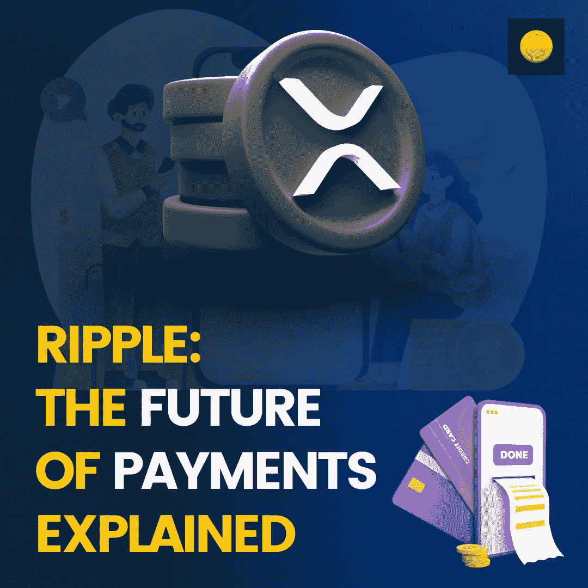

# 为什么 XRP 被迅速采用？

> 原文：<https://medium.com/coinmonks/why-is-xrp-being-adopted-rapidly-6271ca7aba9f?source=collection_archive---------52----------------------->

比特币作为一种高效的支付网络被引入，以挑战银行并赶走中介机构；然而，随着时间的推移，比特币失去了确立其作为支付媒介的目的。相反，它已经将自己转变为一个价值储存库，而不是一个支付网络。也就是说，一方的损失是另一方的收获。Ripple Network 的推出是为了控制支付系统，因为 BTC 不可能留下太多痕迹。以下是 Ripple 如何设法以比比特币更快的速度成为支付网络的！

# Ripple 比比特币得到了更多的采用？

# 强烈支持

而比特币的产生是为了挑战金融体系；Ripple 的角色是简化中央金融系统的运作。无论如何，比特币是一种值得持有的高贵资产，但由于其低稳定性和低频率，它不能被视为一种有效的货币。然而，Ripple 的资金流动速度更快，这使得它能够以很低的成本进行微交易。除此之外，由于 Ripple 与银行机构在简化财务方面的密切合作，它还得到了银行机构的支持。

> 交易新手？试试[密码交易机器人](/coinmonks/crypto-trading-bot-c2ffce8acb2a)或者[复制交易](/coinmonks/top-10-crypto-copy-trading-platforms-for-beginners-d0c37c7d698c)

# 共识；一致

[Ripple](https://www.coindhan.com/trading/xrpinr) 使用与比特币不同的共识机制，以加快采用速度。在比特币区块链上，区块通过挖掘进行验证。当这种情况发生时，它使得该过程非常耗时并且在经济上不可持续。挖掘一笔比特币交易需要花费高达 200 美元。这是一些发展中国家的平均用电量。另一方面，Ripple 有特定的节点来验证事务。这使得该过程高效且耗时更少。因此，Ripple 更适合作为支付生态系统。

# 矿工依赖

比特币的可持续性极度依赖于矿商。如果在任何时候，矿工能够控制 51%的网络活动，他们可以轻松地控制网络。因为，BTC 是分散的和匿名的，要战胜困难是极其困难的。唯一可行的办法就是破坏生态系统。但即使这样也无法挽回损失的资产。另一方面，Ripple 由可信的验证器节点运行。这不仅提高了生态系统的速度，因为 Ripple 每秒可以轻松处理 1500 个事务，而且还具有可审计性，因为众所周知，集中式节点会公正地履行职责。

# 最后的想法

比较通常是为了让一个在另一个面前相形见绌。然而，当我们在采用方面比较 Ripple 和比特币时，我们需要看一个更大的图片。由于其通货紧缩的性质，BTC 是一个储存价值的完美例子。另一方面，Ripple 更像是一个支付系统，它简化了一直使用古老的 SWIFT 系统的银行业务。

