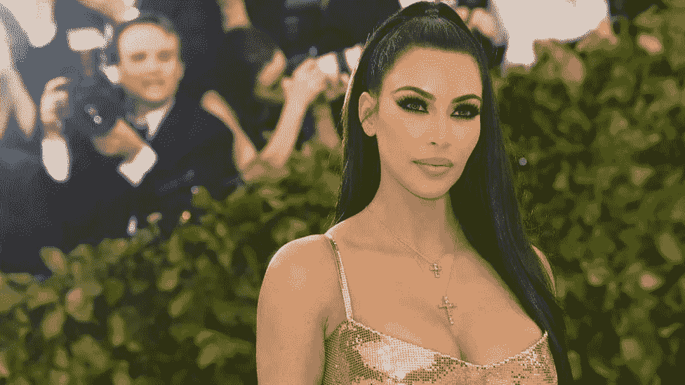

# 为什么金·卡戴珊因为一个加密货币帖子被罚款 100 万美元？

> 原文：<https://medium.com/coinmonks/why-kim-kardashian-has-been-fined-1-million-over-a-cryptocurrency-post-8a41d3a0a0d9?source=collection_archive---------46----------------------->

美国证券交易委员会(SEC)周一宣布，金·卡戴珊(Kim Kardashian)同意支付 126 万美元的罚款，因为她在 Instagram 上推广了一种加密货币——但没有透露她为此获得了报酬。

该机构指控卡戴珊，她拥有 3.31 亿粉丝，是该平台上最受欢迎的 10 个人之一，没有披露她在发布关于 EMAX 令牌的帖子时获得报酬，这是 EthereumMax 提供的加密资产。

SEC 在一份声明中表示，罚款包括 100 万美元的罚金，以及卡戴珊收取的 26 万美元的利息。

这位美国影响者还同意在三年内不推广任何类型的加密资产。“这个案例提醒我们，当名人或有影响力的人认可包括加密货币资产在内的投资机会时，并不意味着这些投资产品适合所有投资者，”SEC 主席加里·詹斯勒(Gary Gensler)在报告中表示。

“我们鼓励投资者根据自己的财务目标来考虑投资的潜在风险和机会，”他补充道。

> 另请参阅:[加密量子飞跃评论(2022)](/coinmonks/crypto-quantum-leap-review-april-2022-is-it-scam-or-legit-and-worth-buying-966597cae7b2)

“卡戴珊很高兴与证交会解决了这件事，”她的一名律师告诉法新社，并指出她的客户“从一开始就与证交会充分合作。”

金的律师说，她“希望将此案抛诸脑后，以避免旷日持久的冲突。与 SEC 达成的协议允许她这样做，并推进她的许多商业项目。

9 月，卡戴珊宣布推出投资公司 SKKY Partners 的新业务。

> 交易新手？试试[密码交易机器人](/coinmonks/crypto-trading-bot-c2ffce8acb2a)或者[复制交易](/coinmonks/top-10-crypto-copy-trading-platforms-for-beginners-d0c37c7d698c)