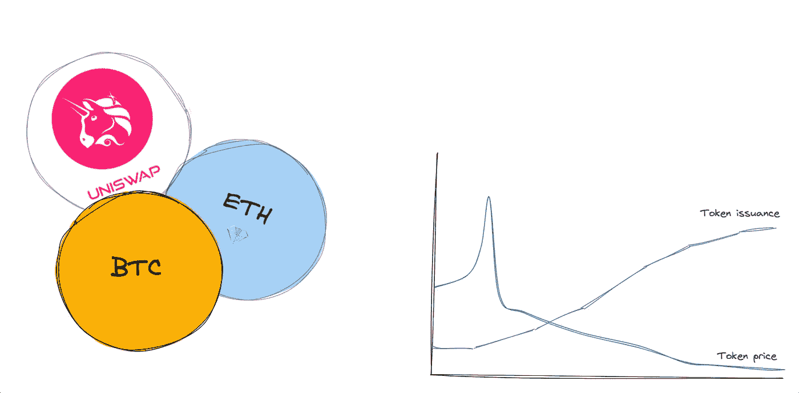
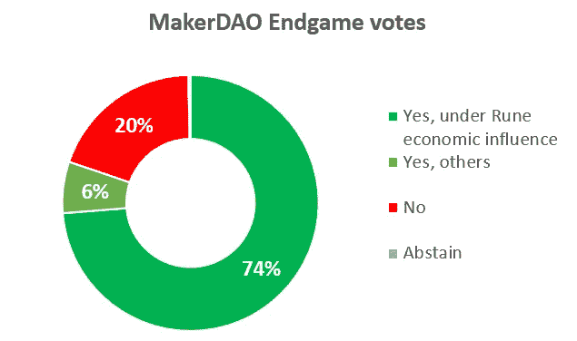

# 推出代币的 7 个理由？

> 原文：<https://medium.com/coinmonks/why-launch-a-token-25d4d2de9993?source=collection_archive---------4----------------------->

## 为什么要推出代币？

Tokens 是 web3 中最大的创新之一，它能够为社区、协议、公司或 DAO 添加商业的、可互换的资产。令牌有许多用例以及为什么要启动令牌并向 web3 项目添加令牌的原因。核心前提是它们支持某种链上的数据交换。这些数据可以是财务数据(谁*拥有*什么)、公共数据(谁*对*什么感兴趣)或信息数据(谁*做了*什么)。

在本文中，我将介绍推出令牌的七个核心原因。即使在这七个理由中，也不是所有的理由都是平等的。有些用例比其他用例更强大。理想的用例是[一组分散的参与者](https://designingtokenomics.com/the-complete-tokenomics-course-primer/articles/when-token-the-core-thesis-behind-tokenomics)之间的协调。启动一个令牌并不简单，对一个 web3 项目既有好处也有坏处。

Why launch a token? Designing Tokenomics

推出令牌的七个原因可分为三类:

1.  融资:启动和筹集风险资本
2.  治理:主动令牌治理和去中心化
3.  效用:协调、气体和通路。

# **资助**

令牌化赋予流动性，流动性带来金融利益。只要有交易的能力，人们就会赋予事物价值，并乐于购买、拥有和投机。代币也不例外。用代币资助项目是 web3 带来的最有趣和独特的方面之一。一种简单、灵活和新颖的方式来创造流动性和金融生态系统，而这在以前是没有的。

除了创造一种新的获得资金的技术途径，在更基本的层面上，代币打开了创造价值的大门。只要让人们相信你正在建造的东西，你现在就可以凭空创造代币，积累真正的金融价值。这就是为什么融资是代币的主要用例。用代币筹款可以分为两种:

1.  拔靴带
2.  向投资者筹集资金

每个人都有不同的筹资方式和真正的筹资原因。

## 拔靴带

推广任何新想法都很难。时间就是金钱，通常项目需要的不仅仅是时间:他们需要开发人员、设计师、服务器等等。自举需要你自掏腰包，这可能是昂贵的！发行代币是为你的项目筹集资金的一种方式。

为什么要推出代币呢？为什么不直接从投资者那里筹集资金呢？几个简单的原因:

1.  **大多数项目都不太适合财务投资者**。投资创业公司是一件艰难的事情。大多数创业公司都会失败，这就是为什么投资者知道他们只能投资有巨大上升潜力的项目(想想下一个脸书或 Airbnb)。但大多数公司和项目不可能也不应该成为下一个脸书或 Airbnb。有许多中小型企业很棒——它们根本不适合大多数创业投资者的关注领域。在 web3 中，这类项目甚至更多，尤其是在公共产品领域。
2.  **从投资者那里筹集资金非常困难！** [你能从谁那里筹集资金？你如何接近他们？](https://www.alpeaudio.com/post/how-we-raised-our-first-round-of-venture-capital-263-meetings-12-months-128700/)他们对什么材料感兴趣？你需要向多少人推销才能成功？募捐有哪些法律术语？从投资者那里筹集资金并不容易，如果你不在正确的地理区域，这几乎是不可能的。有时这根本不是一个可行的选择。
3.  **你要保持分权**。web3 精神的一部分包括最小可行的治理和最大化的去中心化。如果你向早期投资者出售很大一部分代币，你可能会在这方面妥协——这可能是你对自己的项目不感兴趣的东西。

这就是为什么许多人认为推出一个令牌来帮助启动他们的项目([甚至网络效果](https://designingtokenomics.com/the-complete-tokenomics-course-primer/articles/are-tokens-good-for-bootstrapping-network-effects))可能是一个很好的解决方案。你可以从那些与你正在建造的东西和你作为建造者的身份可能更加一致的人那里筹集你所需要的资金。

Lots of investment capital in web3?

## 从投资者处筹资

风险投资(VC)是一个发展良好的大型生态系统，而 web3 是投资者关注的新领域。在一个代币产生价值而不一定是建造者和建造它们的公司的生态系统中，投资者已经广泛采用投资代币而不仅仅是公司。⁴

如果你正在建设一个项目，承诺有巨大的收益，但需要大量的前期投资，从风险投资中融资可能是有意义的。出售代币(未来或现在)被视为一个很好的选择，可以让投资者感兴趣，以更高的公司估值筹集资本，并简单地筹集更多资本。投资者也可以帮助公司建设，有些人还拥有 web3 基础设施专业，这非常有帮助。

对于一个令牌来说，这是否是正确的举动完全取决于正在构建的 web3 项目的类型。一些代币因为在早期卖给投资者而遭受巨大损失(链接到即将发布的帖子**“反对投资者二次探底:为什么你不应该从风投那里为你的代币筹资”**)。这可能会导致集中化，分裂你的社区，投资者早期进入，没有像后来的“常规”用户一样的激励。这也会导致你的令牌出现大量[持续供应过剩。然而，这仍然是项目推出令牌的真正原因，或者考虑一下。](https://designingtokenomics.com/the-complete-tokenomics-course-primer/articles/why-token-prices-drop)

## **关于使用代币筹款的警告**

虽然筹款是建筑商真实而重要的需求，但这不应该是你推出代币的主要原因。出于这些原因而发行的大多数代币，仅仅是这些原因，就类似于证券，不能通过豪威测试。豪威测试表明，如果某样东西是“对一个普通企业的投资，并合理期望从他人的努力中获得利润”，那么它就是一种证券。如果你的代币仅仅是一种筹资机制，某人带着对未来利润的期望进行投资，而你在做所有的工作，那么在我看来这听起来像是一种保障。

[The Howey Test on Ethereum Audible podcast](https://open.spotify.com/episode/5W4vGW6HOAcnjT3DIQeu4R?si=Luky9tUWTGurrrTSVW9H3Q)

其次，你可能会从一群不认同你和你所建立的东西的人那里筹集资金。这是从风投那里融资的经典问题:他们的兴趣纯粹是财务上的，激励你尽可能多、尽可能快地增长。如果你从你的社区中汲取经验，并承诺你无法兑现的奖励，这也可能是激励的错位。筹集资本会让大多数项目远离公益事业，走上利润最大化的道路。这与*和*的情况不同，你可以选择[最小提取思维方式](https://designingtokenomics.com/the-complete-tokenomics-course-primer/articles/how-to-build-a-moat-in-web3)，但通常都是这样。

代币需要具有效用，而不仅仅是投资合同，这导致了“代币作为治理机制”的激增。这是为什么要推出令牌的第二个主要用例。

我为加密协议设计了令牌组学(所有这些都还在启动阶段),并且正在将我所学的一切投入到一个超级深入的令牌组学课程中。如果你对我的免费电子邮件令牌学课程感兴趣， [*在这里报名*](https://designingtokenomics.com/) *！*

# **治理**

治理，或者说缺乏治理，是 web3 项目的一个有趣而重要的方面。类似于筹款，这是 web3 对 web2 概念的新表述。Web2 公司治理是围绕股东发挥最小作用和委托董事会成员选择合适的高管而建立的。这是一种基本上不活跃的治理机制，尽管不活跃，但却管理着公司的一切——股东事实上可以解雇、雇佣或出售公司。Web3 治理是围绕两个可供选择的范例构建的:一方面是最小可行的治理，另一方面是最大限度的分布式决策。这些形式的治理是否有效是另一个 article⁵.的讨论这仍然是一个嘲笑象征的理由。

Maker DAOs recent vote shows the challenge in active governance. [Source](https://sports.yahoo.com/makerdao-splits-two-over-founder-210714238.html?guccounter=1&guce_referrer=aHR0cHM6Ly93d3cuZ29vZ2xlLmNvbS8&guce_referrer_sig=AQAAAIdsrzMTPWSrR2Q_1ZW8ffFPvQm5DHKIUYkEJFtIC40WldC-T3pTK4nliBD5jx4yqwzTHU2um-NfyCDJ5FcY8pJCVpUxRm99hMkVB1J04p96lxmCb7UxSE9mJLhaNXVOfSK5cUgmCUzAa35xaCYnF-zazDVy3yBXRGv6jXn_sHUl)

## 主动令牌治理

民主化和将权力放回个人手中是支撑许多 web3 项目的精神。最初，这样做的方法被认为是通过令牌。代币作为一种投票机制已经流行多年。2016 年的以太坊 DAO hack 投票是一个早期的例子，随着 [Compound 的治理令牌](https://www.coindesk.com/markets/2020/06/19/first-mover-compounds-comp-token-more-than-doubles-in-price-amid-defi-mania/)的推出，它在 2020 年的 DeFi 夏季变得非常受欢迎。从那以后，很明显“一个象征一票”的机制对皇家 democratization⁶.不太适用

然而，在 web3 项目中，令牌仍然是民主化决策的最佳方式。为此，拥有一个令牌至关重要，而且新的方法正在出现。乐观主义又回到了美国传统的民主方式，采用双议院结构:象征性议院和公民议院。 [Gitcoin](https://gov.gitcoin.co/) 已经引领了一些治理和协调概念，尤其是在二次投资和投票方面。

将代币作为主动治理投票机制赋予代币真正的效用，只要它们不与 Howie 测试的其他部分重叠(主要是从他人的利益中获取利润)，它们就不会与被视为证券相冲突。于是，它们的问题就变成了，除了治理之外，它们没有任何效用，因此对投资者没有吸引力。这本身不是问题。当项目以筹资为目的推出代币，但却披上治理工具的外衣以规避监管时，这是一个问题。

## 分散

当一个庞大的、多样化的和分散的行动者团体为了一个共同的目标而合作时，权力下放就出现了。它需要足够大，能够抵抗影响它的少数行动者。群体的多样性导致不同的动机、激励、思维过程和时间范围。分散，物理和电子，防止任何单一事件影响每个人。

一个分散的治理系统旨在将令牌分发到像这样大的群体。这使得治理扩散能够保持项目的分散化。虽然这一原则也适用于主动令牌治理，但一些项目主要为此使用令牌。这些项目倾向于协议:第 1 层和其他可信的中立协议。[可信中立性](https://messari.io/report/credible-neutrality-as-a-guiding-principle)可以成为许多 web3 项目和协议的核心构建块，实现它的唯一方法是通过广泛分发的令牌发布。

像这样的协议令牌往往与协议中的实际效用高度重叠。这是为什么要推出令牌的下一个类别。

# **效用**

使用令牌作为协议的核心部分是 web3 的亮点。它将代币的金融部分与其实用部分联系起来。想象一下使用亚马逊共享来使用 AWS——这相当于 web2。并非所有的 web3 项目都以这种方式使用令牌，将 web3 的基本用例结合在一起，但最好的项目是这样做的。效用可以分三个阶段来考察:

1.  协调:为了一个共同的目标，调整利益并协调各方
2.  Gas:使用协议需要令牌
3.  访问:令牌用于解锁某些活动或社区

## 协调

引用“[文令牌:令牌组学](https://designingtokenomics.com/the-complete-tokenomics-course-primer/articles/when-token-the-core-thesis-behind-tokenomics)背后的核心命题”；

> “Web3 是围绕分散系统构建的。这意味着核心问题在于协调:让参与者和利益相关者围绕一个共同的目标进行协调，尽管他们有不同的个人动机。这就是代币要解决的目的。令牌组学用于解决分散系统中的协调问题。

令牌和令牌组学用于解决分散系统中的协调问题。比特币就是最好的例子。比特币(Bitcoin)是一种比特币网络令牌，有助于协调分散的系统，实现点对点支付系统和没有任何集中方的价值存储。矿工因用比特币向网络添加数据而获得奖励，用户必须拥有比特币才能通过付费使用网络。每个人都被激励使用相同的链，因为这是唯一一个其他人都在使用的链，并且由于网络效应，最大的数据库具有最大的价值。

令牌解决协调问题的另一种方式是证明利益协调系统。 [Tendermint 白皮书](https://open.spotify.com/episode/4DslehxWc959XrDHWWELTJ?si=dTFrCXAORquoykEzbOq3KQ)中解决的“无利害关系”问题为不依赖工作证明和网络费用的新协调方式打开了大门。在比特币中，矿工被激励去开采合适的区块链，因为如果他们不这样做，他们现实世界的电力将被浪费。在利害关系的证明中，可以依赖行为者以“正确”的方式行事，因为他们有作为抵押品的利害关系标志。 [Tellor](https://tellor.io/) ，一个分散式 oracle 协议为此目的使用了 staking。要成为一名先知，你必须赌上 100 美元 TRB .如果一个甲骨文发布错误的数据，他们可能会失去他们的$TRB。

没有令牌，就没有协调机制，在我看来，分散系统的协调问题是[为什么要使用令牌](http://www.apple.com)的最好理由。

## 气体

Gas 可能是令牌最直接的用例。要使用该系统，您需要使用令牌。没有令牌就没有系统。就像使用内燃机需要汽油一样，使用协议也需要令牌形式的“气体”。以太坊就是最好的例子。没有以以太网费用的形式支付天然气，就不能使用以太网。一些 dApps 也采用了这种格式。

## 接近

某些活动需要令牌。这可以是 web3 游戏中的游戏性，也可以是对线上和/或线下社区的访问。在传统的游戏生态系统中，游戏币长期以来一直是参与和货币化的流行机制。web3 游戏也是如此。这使得任何严肃的游戏玩家都必须以这种方式使用令牌，如果没有让玩家做某些事情的令牌，一个项目根本无法运行。通过让持有者获得对特殊事件或社区的访问权来利用社区的访问权标。这是“严肃性的证明”。

访问效用可以来自持有代币或消费代币。例如，艺术家可以删除特殊邀请，或者让持有超过一定数量代币的钱包可以看到不和谐频道。或者，花费一定数量的代币，而不是持有代币，可以用来获得相同的特权。

# **为什么要推出代币**

Web3 令牌是一项引人入胜的创新，它改变了网络的许多核心基础设施。通过将公用事业和财务激励捆绑在一起，突破了传统商业世界的核心范式。推出令牌背后的原因与推出令牌的原因和方式的每个其他方面一样重要。在这篇文章中，我们研究了为什么推出代币的三个核心类别:筹款、治理和效用。

其中每一个都有有效的用例(尽管我坚信[协调](https://designingtokenomics.com/the-complete-tokenomics-course-primer/articles/when-token-the-core-thesis-behind-tokenomics)是最好的一个)，以及陷阱。尽管令牌可以解锁，但是请仔细考虑您的项目是否需要令牌！

*我为加密协议设计令牌组学(所有这些都还在启动阶段),我正在把我所学的一切放入一个关于令牌组学的超级深入的课程中。如果你对我的关于记号学的免费电子邮件课程感兴趣，* [*在这里注册*](https://designingtokenomics.com/) *！*

脚注:

1.  在本文中，我使用这个术语主要指可替换的令牌。NFT 可以有不同的用例，不一定与本文的前提重叠。
2.  就像运行在云上的老式代码，云位于物理服务器上，而物理服务器需要消耗电能才能运行。
3.  “真实”是人与人之间的主观判断。如果其他人重视你的代币，并愿意与你交换，它与任何其他法定货币具有相同的实际价值。
4.  大多数投资者都明智(且贪婪)地投资于二次探底和二次探底。
5.  这是目前在 DAOs 中激烈争论的一个领域。[本期播客采访哈苏是一个很好的开始](https://anchor.fm/i-pledge-allegiance/episodes/Hasu---The-Current-State-of-DAO-Governance-e1k7h68/a-a8519av)点探索。
6.  Vitalik 在几篇博客中涵盖了这些问题:[区块链治理笔记](https://vitalik.ca/general/2017/12/17/voting.html) ( [音频版](https://open.spotify.com/episode/1sQfysbDRiJtVdIlEorAIk?si=tzUj9uVIRP2X_widZol3TA))，[超越链投票](https://vitalik.ca/general/2021/08/16/voting3.html) ( [音频版](https://open.spotify.com/episode/3p7z8ZMjsKo8J2EhIkyQ9P?si=xKhdCHhOTQqEyvE-XNDRag))。

> 交易新手？尝试[加密交易机器人](/coinmonks/crypto-trading-bot-c2ffce8acb2a)或[复制交易](/coinmonks/top-10-crypto-copy-trading-platforms-for-beginners-d0c37c7d698c)