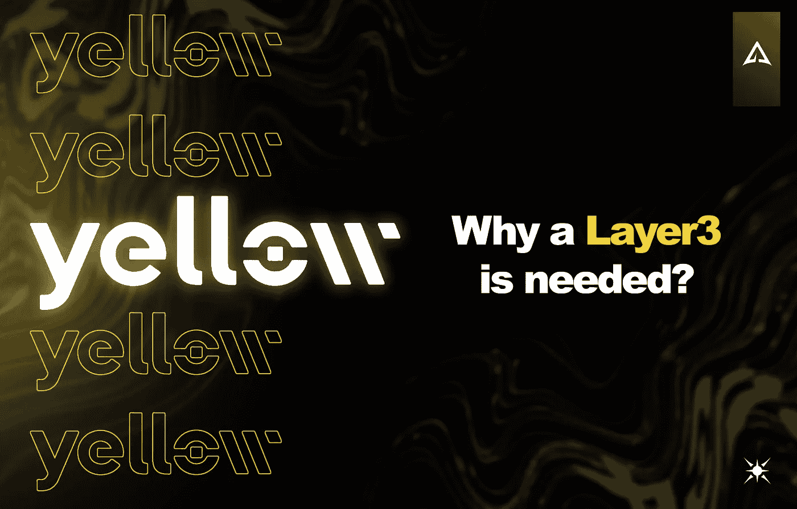
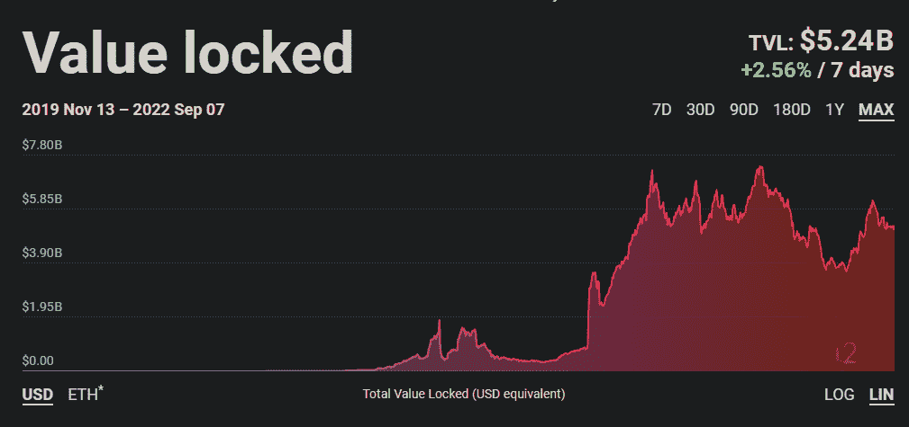
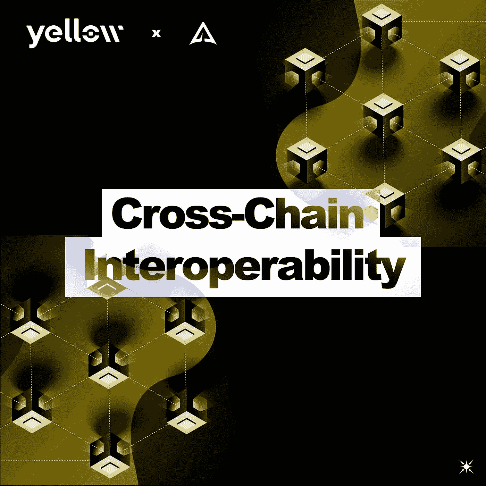
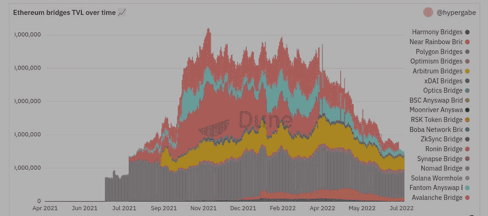
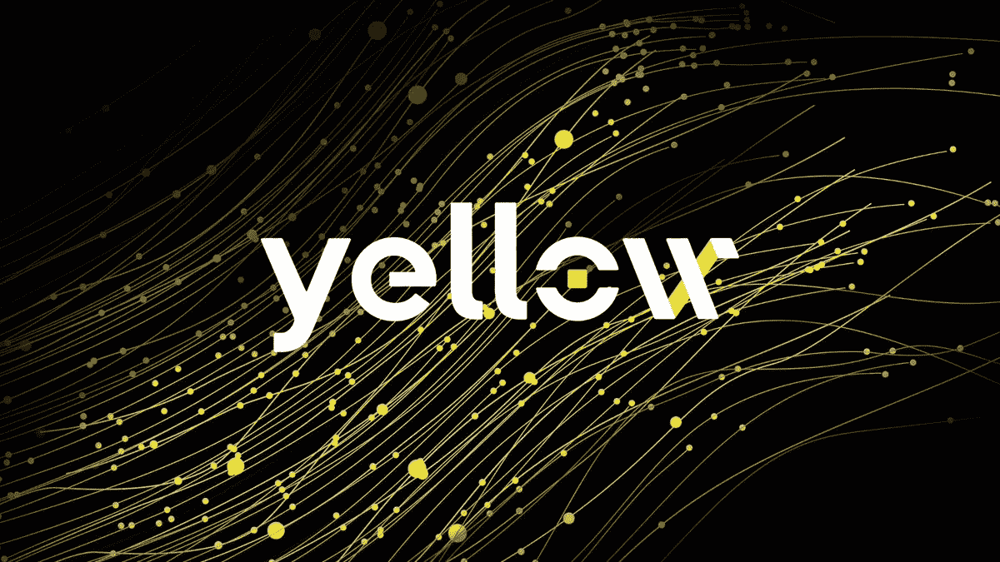
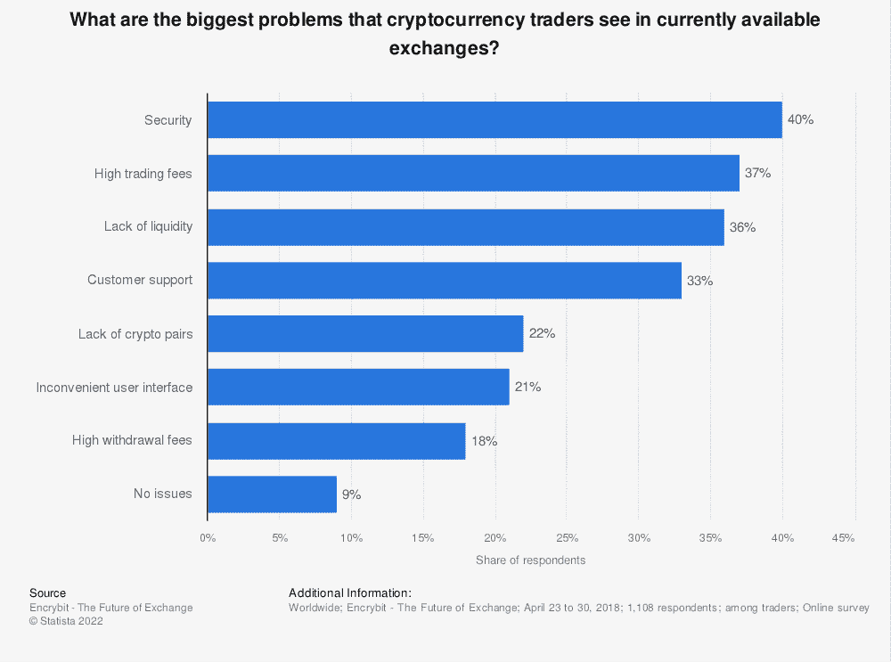
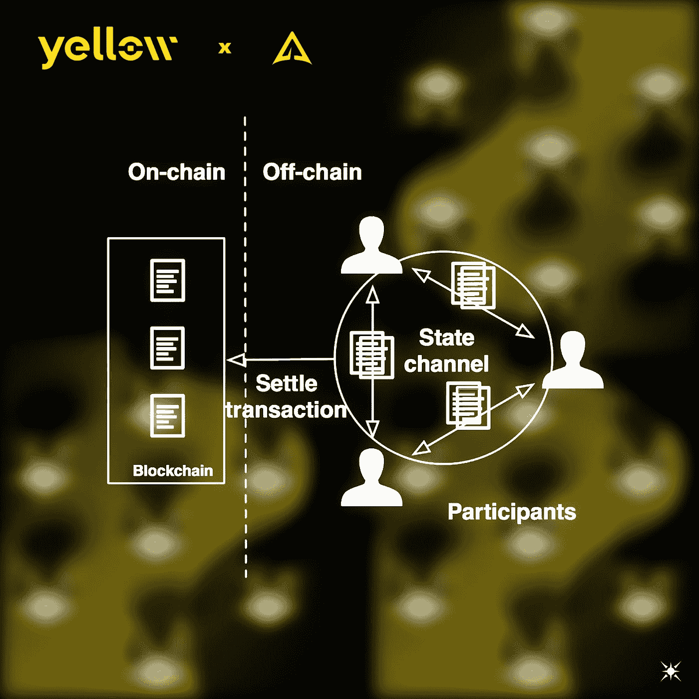
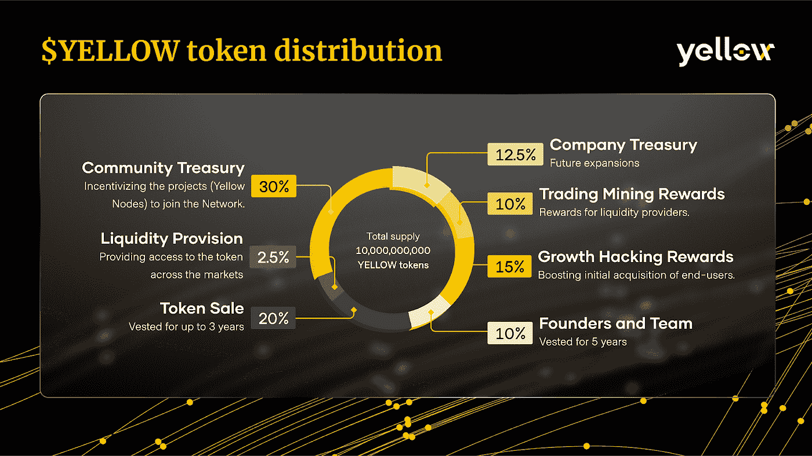

# 为什么需要第 3 层:黄色网络

> 原文：<https://medium.com/coinmonks/why-layer-3-is-required-yellow-network-449e2fd46d32?source=collection_archive---------4----------------------->

# 介绍

很可能最近你已经被诸如“ZkEVM”、“可伸缩性”、“Tx 吞吐量”等词汇所满足。虽然 Polygon 增强了这些叙事的媒体爆炸(也要感谢迪士尼加速器公告和 Twitter 上的 ZkEVM 炒作带来的媒体优势)，但这些不是一夜之间出现的。多年的研发有助于以太坊缩放解决方案的融合项目的实验和进展。

人们承认以太坊需要扩大规模，因为越来越多的用户开始使用连锁店。这也是因为以太坊上有大量的开发者。最后一条是大多数区块链和 Web3 开发者在这条特定的链上构建的。

这种巨大的人力资本投入导致越来越多的 dApps(分散应用)吸引越来越多的用户，因此，网络拥塞的可能性更高；很明显，需要对可伸缩性进行一些改进。

虽然有许多改进可伸缩性的尝试，但是 L2 最近才引起人们的注意。

它们是包含侧链、等离子体、validium 和状态通道的链外可伸缩性解决方案的一部分。值得注意的是，您可以并行开发这些解决方案；换句话说，如果发展和进步能够带来巨大的成果，专注于一个特定的解决方案是很重要的，但同样重要的是不要忘记其他的技术提案，它们都可以在整个生态系统中和谐地工作，带来差异化和多样性。

在这里，我们给出了刚才提到的证据，并探讨了状态通道和 L3 之间非常合适和有效的关系。

# 为什么选择第三层？

L1 热导致了一个解决区块链三难困境的垂直承诺；最重要的是，最大的努力和承诺花在可伸缩性上。

因此 L2s 开始被认为是 2022 年被命名为 L222(第二层 2022)的可能解决方案。事实上，L2 带来了一个功能问题，它们主要关注可伸缩性，但缺乏互操作性。L2 正开始用于特定的应用，并且在未来大规模采用的一件必不可少的事情是在系统中连接这些协议的能力，该系统允许“联系”、交互以及链之间的导航和翻译的简易性。

所以这就是需要 L3 的原因。它支持聚合、连接优化以及服务之间的通信。我们可以说，通过设计，L3s 改善了跨链体验。这个话题非常有趣，因为它结合了虚拟生态系统和技术，这可能会产生许多新的机会和创造。

今天仍然存在的另一个问题是所谓的“流动性碎片化”。越来越多的交易所被创造出来，因此市场也越来越多，但这些交易所缺乏流动性，难以维持流动性。

此外，所有这些市场都没有相互沟通，因此用户体验也错过了一个潜在的改善。

然后，您可以将流动性碎片化的概念扩展到区块链和层，这将通过增强和解决这一方面而受益匪浅。因此，他们形成了一个生态系统，正因如此，机会是巨大的。

最后，L3s，由于其跨链的性质，确保更多的安全，从“独特的故障点”，如可能是桥梁。

最新的是攻击和黑客攻击的目标越来越多；因此，以太坊桥 TVL 是不断减少随着时间的推移。

2022 年也发生了非常大的黑客攻击——Nomad bridge、Ronin bridge 等，因此在这种情况下，利用第 3 层解决方案来避免它们会更加有效和高效，还因为这种类型的解决方案节省了评估桥梁是否安全的时间，从而提高了机会/成本比。

黄色网络

黄色网络是通过利用 L3 和增强的性能、效率和保密性而构建的，这要归功于状态通道(将在后面讨论)。

# 什么是黄色网络，L3 基础设施如何增值？

黄色网络是一个分散的跨链 P2P 覆盖网络，它允许高吞吐量和高交易速度，使用户能够金融访问分散在隔离网络中的许多数字资产、代币和加密货币。

换句话说，黄色建立了一个一体化的地方，通过利用第三层技术，可以从几个不同的生态系统中汇集来自几个不同经纪人(经纪人是指非托管业务)的流动性，增加与深度流动性相关的好处，如减少滑点和向市场提供更多。关于流动性，DEXes 和 CEXes 的一个常见短缺是正确的，因此很清楚黄色如何通过提供一个内部和跨连接市场来解决这种情况。

现在，交叉经纪交易和连接主要由三个系统和技术驱动:

*   FIX: FIX，或金融信息交换，是一个基于状态通道(链外可伸缩性和隐私解决方案)的通信系统，它使经纪人、交易所和交易公司之间的通信能够优化市场，使市场更加分散和容易进入。
*   ECN: ECN 或电子通信网络是一个优化证券买卖订单匹配的系统，特别关注没有中间实体或中介的分散结构。
*   State Channels: State Channels 是一个非链式扩展解决方案，Yellow 利用它来提高性能和效率。由于它们代表了 Yellow 基础架构中的一个基本支柱，我们现在来探究一下:

# 国家频道

如前所述，该解决方案实现了更快、更高效的交易。但是这种结果是如何实现的呢？

状态信道是由信道组成的多签署智能契约。信道是 P2P 协议，顾名思义，改变它们的状态。状态主要是 2:

*   通道开口
*   通道关闭

这两个状态由于多重签名合同而达成共识，这使得利益匹配更容易，并且最重要的是，需要双方签名才能进行状态更改通信和验证，因此这样一来，恶意实体就无法完成攻击，因为另一方也应该同意该状态。

此外，智能合约推出时有一套尚未定义的规则，这进一步有助于改善同行之间的匹配。

现在，由于主要的状态变化是通道的打开和关闭，并且达成协议并不困难，所以没有必要用通道内进行的所有交易来使区块链网络过载；因此，状态通道可以减少执行层的网络负载和拥塞。链上的相互作用是最小的。仅有的两个链上交易将显示和记录通道的初始打开和最近关闭。

一旦渠道开放，这在成本/机会方面是有利的。节点不会验证所有的事务，因为执行和验证共识是在双方签署合同时达成的。因此，支付的唯一气费与打开和关闭通道有关，而“内部”交易是无气的。因此，对等体可以以高 tx 速度和吞吐量进行交易。

最后，由于与执行层的最小链上交互，所有执行的事务(如资金转移)不会显示在链上。通过这种方式，隐私得到了增强，资金将按照商定的最新状态简单地分配给正确的对等方，因此链上资金将在钱包地址中可见。尽管如此，导致这一结果的所有交易都不会(请注意，这仅指国家渠道交易计划)。只有渠道成员知道同一渠道内的交易历史。

# 网络参与者

在黄色生态系统中，若干参与者、经纪人和利益相关者是网络的一部分。让我们看看他们:

*   零售经纪人:这一类别被定义为非托管业务。
*   交易所:企业可以加入黄色网络，并通过获得深度流动性、跨链零售用户和高扩展性性能来启动交易所。
*   做市商:他们可以收取交易费用，并在市场上实现高流动性。
*   保管人:这些实体为用户提供保管服务，以保护他们的资金。

网络参与者真正有用的是维护健康的网络，和黄色一起建立双赢。因此，他们可以通过 Yellow 提供的跨链和互操作性优势获得高水平的市场深度。此外，还有一个不与其他网络参与者过度竞争的激励，这意味着黄色遵循面向合作的博弈论。

# $黄色代币

黄色网络将于 2022 年 9 月推出其代币$YELLOW。令牌提供了对网络所能提供的所有尖端服务和好处的访问。

以下是令牌的特征和分布:

# 黄色令牌的效用:

*   允许与其他经纪人进行公开交易，并成为交易所或网络参与者(见^^^网络参与者一节)

1.  锁定至少 250，000 美元黄色代币(4 个点对点交易渠道)
2.  在经纪人之间交换抵押品

*   降低交易费用
*   $黄色赌注→奖励
*   $黄色委托给经纪人→交易费收入分成

# 结论

黄色网络似乎在增强多链生态系统的互操作性方面非常有前途。状态通道对于构建协议的用例来说是最佳的。与 Layer3 的结合将使 Yellow 更加精确和高效，使其成为分散式 B2B 跨链经纪和 P2P 交易市场的领导者。

有趣且值得关注的还有$YELLOW token 的未来实现，它已经有了很好的 tokenomics。随着采用规模的扩大，这将使黄色网络变得越来越大。

最终，该协议可以达到，支持和激励一个合作的生态系统，使黄色完全加密市场的支持者和助手在其增长和道德。

> 交易新手？试试[加密交易机器人](/coinmonks/crypto-trading-bot-c2ffce8acb2a)或者[复制交易](/coinmonks/top-10-crypto-copy-trading-platforms-for-beginners-d0c37c7d698c)