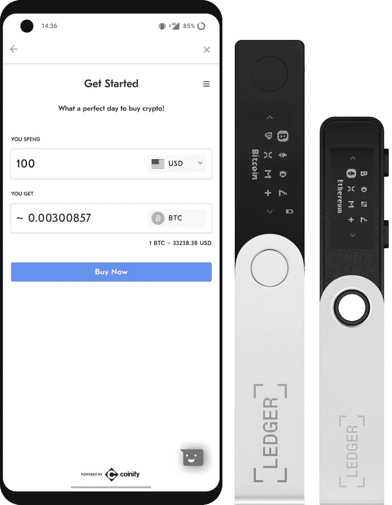

# 为什么将您的密码留在交易所可能会让您失去一切！

> 原文：<https://medium.com/coinmonks/why-leaving-your-crypto-on-an-exchange-might-make-you-lose-everything-7abc00bb8cc2?source=collection_archive---------32----------------------->

简单回顾一下比特币和密码货币的历史，就会明白为什么把密码资金留在交易所是危险的。自 2011 年以来，价值超过 16.5 亿美元的加密资产被盗，而且这个数字还在加速增长。

将您的数字资产保存在 exchange 钱包中会带来额外的风险，因此将密码货币长期存储在那里不是一个好主意。

原因如下。

除了黑客攻击之外，交易所内部可能会出现问题，最近航行者数码暂停了交易所内所有因 3 箭资本欠他们的债务而产生的提款、存款和交易，3 箭资本最近被清算，无法偿还债务。

你有 FTX 的首席执行官，山姆-班克曼弗雷德警告说，有几个非流动性的交易所离开，任何人有他们的密码在这些交易所将失去一切！随着最近摄氏和露娜的下降，你为什么要冒这个险呢？

只有一个地方您的硬币是安全的，那就是一个冷藏钱包。

这些设备允许您将您的密码存储在 exchange 之外，没有黑客可以访问，或者 exchange 决定随时获取您的所有密码。

# 总帐钱包是如何工作的

莱杰的硬件钱包是多货币钱包，用于离线存储[密码货币](https://www.investopedia.com/terms/c/cryptocurrency.asp)的私钥。使用密码货币进行交易需要使用加密私钥。但是这些通常存储在网上的钥匙很容易被盗和黑客攻击。密码货币用户已经开发了替代存储系统。其中包括热门钱包(在线)、移动钱包(智能手机中的钱包)和纸质钱包(存储在纸上)。

硬件钱包是离线存储的一种形式。硬件钱包是一种密码钱包，它将用户的私钥(用于授权区块链网络上传出交易的关键信息)存储在安全的硬件设备中。

莱杰的硬件钱包是基于设备的，这意味着他们使用存储机制——USB 驱动器——来存储私钥，因此黑客很难从在线位置获取密钥。莱杰提供两种硬件钱包:莱杰纳米 S 和莱杰纳米 X 钱包。

这两个钱包都是 USB 存储钱包，使用户能够执行各种功能，包括发送和接收来自区块链的比特币，或者在设备上运行第三方应用程序。例如，用户可以使用钱包在谷歌和 Dropbox 等热门网站上运行通用的双因素认证。所有的总帐产品都结合了安全元素和专门为保护用户的密码货币资产而设计的专有操作系统。

这些钱包还使用 24 个字的备份恢复短语，如果包含私钥的设备被盗，该短语可用于访问用户的加密货币。对于特别谨慎的人来说，这个 24 个词的短语可以被蚀刻在一个 [Billfodl](https://privacypros.io/) 的钢铁上，这是一个旨在以物理形式永远保存你的种子和钥匙的设备。

查看总账产品[此处](https://shop.ledger.com?r=c60d7f09fca8)

正如大多数聪明的密码专家所说，“不是你的钥匙，不是你的密码。”