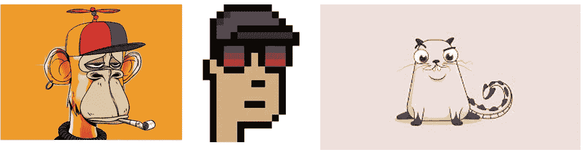

# 为什么 NFTs 如此有价值

> 原文：<https://medium.com/coinmonks/why-nfts-is-so-valuable-177c69af5c22?source=collection_archive---------49----------------------->

我想你听说过 NFT，也可能听说过很多人花高价购买它。例如，拥有 cytpokitty 或 boring ape 的人是百万富翁。杰克·多西以 NFT 的身份以 290 万美元的价格出售了他的第一条推文。那么，NFT 是什么，为什么它如此受欢迎？

**NFT 不仅仅是一张随机图片或 jpg**；它们的作用类似于我们在现实世界中对稀有钻石和艺术品等昂贵商品的估价。让我们以卢浮宫博物馆的一幅蒙娜丽莎为例来更好地理解这个概念。不知道花了几十亿甚至更多。另一方面，你可以在网上花不到 5 美元买到一本，印在更好的画布上。

Monalisa painting in Louvre museum and copy sold on aliexpress

那么，为什么同一幅画在卢浮宫被估价为 10 亿美元呢？答案在于我们人类**如何看待事物**。

卢浮宫博物馆里的蒙娜丽莎是:

1.罕见——世界上只有一个

2.独一无二的

3.所有权证书——由莱昂纳多·达芬奇创作

4.排他性的象征

像这样，NFT 的 [**无聊猿**](https://boredapeyachtclub.com/#/) ，属于[隐朋克](https://opensea.io/collection/cryptopunks)流派的一部分，不仅仅是 jpg，是可以复制的。谷歌允许你下载图片并以一美元的价格出售，但它从来都不是真正独一无二的。原始 Cryptopunk 的所有者可以将它比作拥有一只限量版的劳力士手表，因为它是独一无二的，不寻常的，并且附有所有权证书。

Bored Ape, Cryptopunk, and Cryptokitty (illustration)

正如我们已经知道的，NFT 是不常见的，不会是无限的，所以它们增加了很多价值。但它仍然是存储在区块链智能合同中的数字 JPEG 文件，而不是真正的绘画、珠宝或艺术品。导致 NFTs 价格飙升的另一个因素是区块链和 NFT 是人们热衷于并认为将改变世界的*技术。人们相信区块链、元宇宙和 NFT，他们的信念是使 NFTs 有价值的另一个因素。*

*我希望你现在明白了非功能性测试的重要性。因为它是不可替代的。可替代性是指被替换或互换使用的能力。例如，我给你一张 100 美元的钞票，你找给我两张 50 美元的钞票。总量保持不变，这就是可替代性。然而，就 NFT 而言，即 [crytpokitty](https://www.cryptokitties.co/) ，它是不可替代的，很难估计它的真实价值，因为它是独一无二的。*

*不可替代的资产是独特的，也是**与众不同的** **，因为**它们**在**价格**和属性**上发生问题。不可替代资产的单位不能作为同一资产的另一个单位来估价，即它们不能互换。NFT 通常是稀有和稀少的，**因此** **它们往往**被收藏家**极度**珍视。正因为如此，不可替代的项目比可替代的项目更有价值。*

> *交易新手？尝试[加密交易机器人](/coinmonks/crypto-trading-bot-c2ffce8acb2a)或[复制交易](/coinmonks/top-10-crypto-copy-trading-platforms-for-beginners-d0c37c7d698c)*