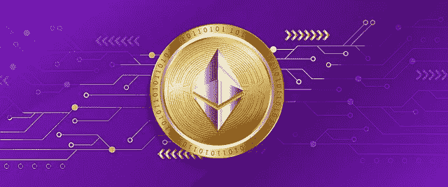
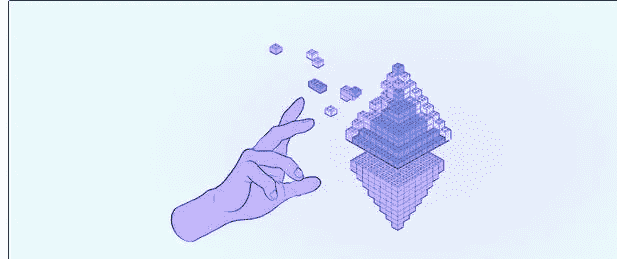
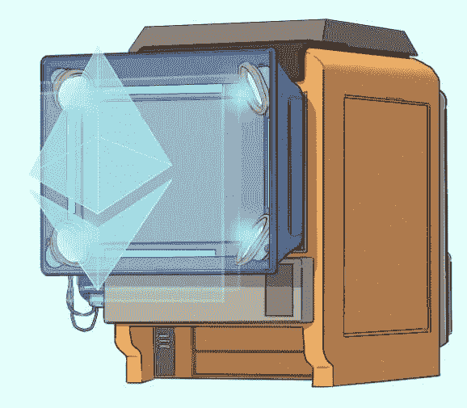
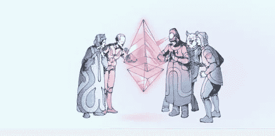
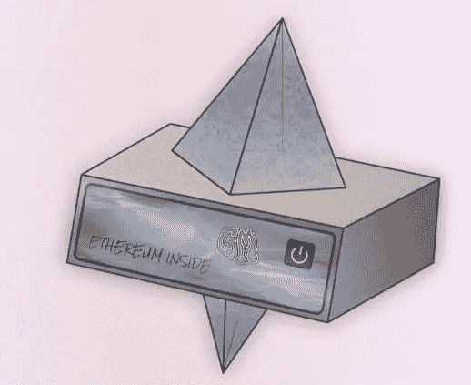
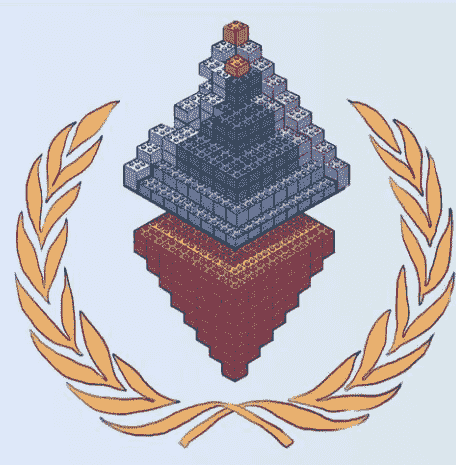

# 为什么没有验证者会发现在以太网上进行 51%的攻击是值得的

> 原文：<https://medium.com/coinmonks/why-no-validator-will-find-it-worthwhile-to-conduct-a-51-attack-on-the-ethereum-network-113b81086778?source=collection_archive---------29----------------------->

# 以太坊区块链被 51%攻击的验证者接管的可能性

加密社区对以太坊的股权证明区块链的最大问题或担忧是 51%攻击的[可能性](https://cryptobriefing.com/what-prevents-large-validators-from-taking-over-ethereum/)。

这是因为以太坊信标链的大部分[(几乎 60%)验证权被](https://dune.com/hildobby/ETH2-Deposits) [4 家实体](/coinmonks/analyzing-ethereum-beacon-chains-level-of-decentralization-in-its-current-form-e162e80924e)——丽都(30.02%)、比特币基地(14.55%)、北海巨妖(8.27%)和币安(6.6%)掌握在一起。

那么，如果这些实体联合起来试图[接管以太坊网络](https://cryptobriefing.com/what-prevents-large-validators-from-taking-over-ethereum/)发起 51%的攻击会怎样。

(*啊……这次以太坊网络的接管让我想起了这首歌，Brain 要接管世界——*

[https://youtu.be/qzZmU0aGmcc](https://youtu.be/qzZmU0aGmcc)*)

无论如何，当攻击者设法接管网络时，他们可以重写和重新组织以太坊区块链中的交易，因为他们可以完全控制区块链来进行恶意活动，如回调已处理的交易和窃取资金或谴责特定交易。

[Source](https://ethereum.org/en/)

是的，这和实验室老鼠大脑接管世界的前景一样可怕，不是吗？).

# 拥有验证权力的 CEXs 对以太坊区块链的审查阻力构成威胁

[Source](https://ethereum.org/en/)

此外，由于以太坊区块链的很大一部分验证权力掌握在比特币基地和北海巨妖等交易所手中，它们有可能按照政府的命令行事。例如，他们可以受到美国财政部的压力，以审查特定用户、实体等的地址和交易。

这发生在 8 月 8 日，当时美国财政部批准了加密混合隐私协议 Tornado Cash。北海巨妖和比特币基地遵守这些制裁命令，将那些与 Tornado Cash Protocol 有交易的地址列入黑名单。

因此，密码社区一直担心以太坊证明国家链的能力是审查阻力。

[Source](https://ethereum.org/en/run-a-node/)

# UASFs 防止恶意验证者接管以太网的安全机制

现在，当然，以太坊已经过渡到了一个股权证明状态，在 9 月 15 日成功完成了“合并”。

好消息是以太坊股份证明区块链有一个[ [机制来防止验证实体接管以太坊网络](https://cryptobriefing.com/what-prevents-large-validators-from-taking-over-ethereum/)。

*哦…是的，让我们听听这个机制，好吗？？*

如果验证器试图接管以太网，那么任何节点都可以触发 UASFs，这是一个用户激活的软分叉。

[Source](https://ethereum.org/en/run-a-node/)

以太坊社区(规模庞大)中运行节点的任何一个人都可以在这种紧急情况下触发软分叉，这将暂时从块生产者手中夺走以太坊块链的控制权，并将它们移交给节点。

## 激活 UASFs 可以烧掉恶意验证器的所有 ETH 部分

[Source](https://ethereum.org/en/)

因此，以太坊社区掌握着[激活 UASF](https://cryptobriefing.com/what-prevents-large-validators-from-taking-over-ethereum/) 的权力，触发以太坊网络的网络升级，然后砍掉或烧毁恶意验证者的整个 ETH 股份，这将有效地耗尽验证者的验证能力。

让我们用一个例子来理解这个，好吗？

根据 Dune Analytics 的[数据，比特币基地目前是信标链中的第二大有效运营商，持有](https://dune.com/hildobby/ETH2-Deposits)[第二大 ETH](https://dune.com/hildobby/ETH2-Deposits) 市场份额，达到 2,050,272 ETH。

按当前价格计算，比特币基地的股份价值约为 26.7 亿美元。因此，如果比特币基地指责某些交易听从美国财政部的指令，那么任何一个运行[以太坊节点的人都可能引发 UASF](https://cryptobriefing.com/what-prevents-large-validators-from-taking-over-ethereum/) ，比特币基地的全部以太坊股份都可能被以太坊社区烧毁！！！

[Source](https://ethereum.org/en/run-a-node/)

因此，这些赌注实体中的任何一个变得恶意并接管以太坊网络，都将让他们付出高昂的代价，因为他们的全部 ETH 股份都将被烧毁。

所以现在我们可以松一口气了，以太坊网络已经通过 UASF 机制防范了 51%的攻击。基本上，UASF 机制允许少数派反对多数派(拥有大量 ETH 股份的强大验证者)接管以太网！！

[Source](https://ethereum.org/en/)

# 丽都金融不控制托管的 ETH 存款，因为这是一个分散的协议

此外，丽都的确在 Beacon Chain 持有 30.02%的 ETH 保证金市场份额，但丽都实际上并没有控制这 4，229，584 份 ETH 保证金。这是因为 Lido 使用 29 个标桩服务提供商的服务，所以 29 个不同的验证者实体已经对标桩 ETH 进行了分布式控制。

因此，Lido 是一个分散的标记协议，对于 Lido 来说，要控制以太坊网络并不容易，因为 Lido 中的所有标记 ETH 都是由 29 个不同的验证者分发和持有的。

因此，值得庆幸的是，我们不需要担心验证器接管以太网，即使某个验证器实体持有大部分托管以太网，因此比其他实体拥有更大的块处理能力。

***当以太坊网络由于 UASFs 机制而可以被阻止时，试图接管以太坊网络又有什么用呢，那也会让社区烧掉恶意验证器的全部股份？***

我在那篇笔记中结束了我的文章。

***感谢各位可爱的阅读观众。***

> 交易新手？尝试[加密交易机器人](/coinmonks/crypto-trading-bot-c2ffce8acb2a)或[复制交易](/coinmonks/top-10-crypto-copy-trading-platforms-for-beginners-d0c37c7d698c)