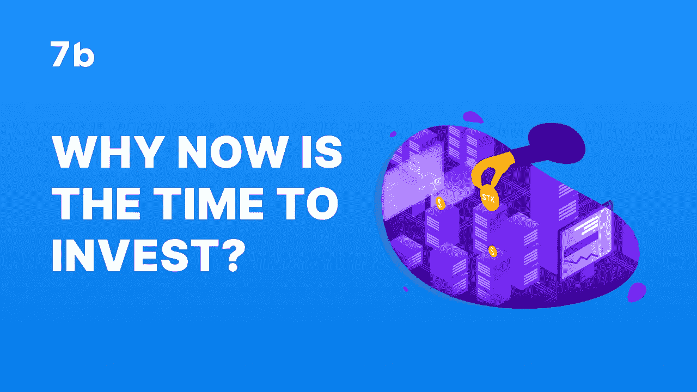
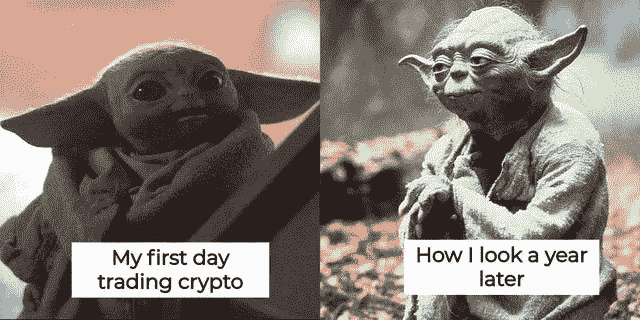

# 为什么现在是投资的时候？表明密码市场将增长的趋势

> 原文：<https://medium.com/coinmonks/why-now-is-the-time-to-invest-trends-that-suggest-crypto-market-will-grow-1a3195e6519e?source=collection_archive---------31----------------------->

# 介绍

十多年来，密码市场已经证明它不是一种时尚。就像互联网一样，加密货币不断将反对者转化为相信者。然而，全球人口中的很大一部分人仍然对此持怀疑态度。这一部分人仍然需要更多的证据来确信他们需要将加密货币添加到他们的投资组合中。

# 加密货币的未来

# 首先，回顾一下…

加密市场的现状似乎表明加密货币的前景黯淡。但事实并非如此。市场的价格历史表明，它是有弹性的，能够从衰退中反弹回来。例如，在 2017 年 12 月创下 19783 美元的历史新高后，比特币开始暴跌。市场变得动荡不安:韩国有禁止加密的传言。日本最大的场外加密市场 Coincheck 被黑。受损的币安 API 密钥。脸书、谷歌和推特禁止了首次发行硬币和代币的广告。这些事件导致比特币到 2018 年 11 月跌至 5500 美元。

2018 年至 2019 年期间，加密市场主要横向交易，偶尔出现价格飙升。到 2019 年年中，它的交易价格超过 1 万美元，到 2019 年底跌至 6，635 美元。到 2020 年 3 月初，比特币的交易价格超过 8000 美元，但随着 2020 年新冠肺炎疫情的到来，市场再次暴跌，比特币跌至 6965 美元。

然而，到 2020 年 11 月，比特币飙升至 19157 美元，到 12 月，其价格略低于 29000 美元。2021 年初，比特币价格超过 40，000 美元，到 4 月中旬，交易价格超过 60，000 美元，峰值为 63，558 美元。

# 秘密市场趋势

这段简短的历史表明，加密货币的未来(仍然)是光明的。市场并不意味着总是上涨。熊是保持平衡所必需的。考虑到这一点，这里有一些市场趋势，表明为什么加密市场会增长。

*   大型科技公司正在拥抱 crypto: 最初，脸书和 Twitter 等大型科技公司反对 crypto 和区块链科技。如前所述，他们甚至禁止 ico 上的广告和代币销售。但当脸书更名为 Meta 并对元宇宙表现出浓厚兴趣时，这表明了一种思维的转变，一种觉醒。从那时起，微软、谷歌、Shopify 和英伟达等科技巨头就开始钻研加密/区块链领域。

顶级机构一直对加密领域的每个可行方面表现出浓厚的兴趣——从比特币到以太坊，再到非金融交易系统和元宇宙。例如， [MicroStrategy](https://www.independent.co.uk/tech/bitcoin-latest-michael-saylor-microstrategy-b1966072.html) 在 2020 年购买了价值超过 4 亿美元的比特币。 [Square](https://www.cnbc.com/2020/10/08/square-buys-50-million-in-bitcoin-says-cryptocurrency-aligns-with-companys-purpose.html#:~:text=Payment%20company%20Square%20is%20buying,the%20second%20quarter%20of%202020.) 在 2021 年购买了 5000 万美元，而 [Tesla](https://www.cnbc.com/2021/02/08/tesla-buys-1point5-billion-in-bitcoin.html) 同年购买了价值 15 亿美元的比特币。

DeFi 是顶级金融机构感兴趣的另一个领域。chain analysis[报道](https://blog.chainalysis.com/reports/2021-global-defi-adoption-index)大型机构占 Q2 2021 年 DeFi 交易总量的 60%以上，比 2020 年第三季度增长了 50%以上。

这些顶级公司也在利用 NFT/元宇宙的热潮。许多人通过以太坊域名服务(ENS)购买加密域名。例如，百威啤酒为 30 ETH 收购了 [beer.eth](https://www.coindesk.com/markets/2021/08/25/budweiser-buys-beereth-domain-name-for-30-eth-rocket-nft-for-8-eth/) ，并推出了其 [NFT 系列](https://opensea.io/collection/budverse-cans-heritage-edition)。[亚利桑那冰茶](https://twitter.com/DrinkAriZona/status/1428805448031948800)买了一只无聊的猿 NFT 来配它的罐头。

*   **加密项目正在获得大量资金:**因为许多人相信加密货币和区块链技术的未来，机构投资者毫不犹豫地投资知名的加密项目。

[报告](https://news.bitcoin.com/report-shows-crypto-startups-raised-30-3-billion-in-h1-2022-exceeding-total-raised-in-2021/)显示，2022 年上半年，加密项目和初创公司筹集了 303 亿美元。这一金额通过 1199 轮融资筹集，超过了 2021 年项目和创业公司获得的金额。在这 303 亿美元中，DeFi 项目获得了 18 亿美元，而 86 亿美元投入了 Web3 和 NFT 项目。区块链和加密基础设施筹集了 97 亿美元。

这些成功的融资扩大了加密空间的可信度，并预测了加密市场有利可图的未来。

*   **更多的加密项目正在通过合作伙伴关系扩大其效用:**当加密领域开始获得牵引力时，只有比特币和以太坊受到主流投资者和传统机构的欢迎。然而，随着更多的加密项目在现有区块链上建立和创新，更多的投资者和机构开始接受这些项目。

例如，三星最近[与 Theta Labs](https://news-samsung-com.translate.goog/kr/%EC%82%BC%EC%84%B1%EC%A0%84%EC%9E%90-%EB%89%B4-%EA%B0%A4%EB%9F%AD%EC%8B%9C-nft-%EC%83%9D%ED%83%9C%EA%B3%84-%EA%B5%AC%EC%B6%95-mou%EC%B2%B4%EA%B2%B0?_x_tr_sl=auto&_x_tr_tl=en&_x_tr_hl=en)合作，为其新的 Galaxy 手机管理 NFT 生态系统。这种合作关系符合 Theta Network 的目标，即通过创建分散且价格合理的视频流平台来彻底改变视频流。

类似的消息还有，古驰[宣布](https://cointelegraph.com/news/gucci-becomes-first-major-brand-to-accept-apecoin-payments)将开始接受使用 ApeCoin (APE)的支付。古驰客户可以通过比特币支付服务提供商 Bitpay 进行 APE 支付。因此，人们可以推断，古驰正在与两个加密/区块链项目合作。

将有更多的合作伙伴成为加密货币的真正媒介，以扩大其使用范围并提高其价值。因此，投资者有必要了解并利用这些趋势。

# 如何开始投资

开始投资的一种方式是获得一个良好的加密货币交易和投资平台。7B broker 就是这样一个平台。通常，加密经纪人作为中介帮助客户交易加密货币，收取佣金。7B broker app 为交易者提供分析和市场信息，帮助他们做出明智的交易决策。是新手交易者最好的 app。

7B broker 应用程序代表用户将交易传输到币安，以确保无缝和安全的交易。使用该应用程序，用户可以:查看汇率，跟踪价格变化，查看他们的投资组合，并撤回加密没有任何 KYC 的要求。

如果您想了解更多关于加密货币交易的信息，请阅读我们博客中的文章:

[假人密码。关于加密货币的一切。](http://sevenb.io/blog/crypto-for-dummies-everything-you-need-to-know-about-cryptocurrencies/?utm_source=medium&utm_medium=article)

[阅读加密图表的正确方法是什么？](https://sevenb.io/blog/how-to-read-and-analyze-cryptocurrency-charts/)

要开始使用:

*   下载 7B [app](https://play.google.com/store/apps/details?id=io.sevenb.terminal)
*   创建一个帐户，用电子邮件和唯一的密码注册
*   转移资金并开始投资/交易

## 结论

尽管目前市场不景气，但有一个事实是真实的:这是一个将会持续的市场。一个流行的交易策略是低买高卖。因此，随着加密货币目前的低价交易，现在是投资它们的最佳时机。因为随着越来越多的伙伴关系、资金和公用事业的扩张，加密市场的价值将会变得非常有利可图，即使是对今天投资的低净值投资者来说也是如此。

如果你想投资[加密货币](http://sevenb.io/currencies?utm_source=mediumblog&utm_medium=article)来增加收入， [7B](https://play.google.com/store/apps/details?id=io.sevenb.terminal) 是你值得信赖的交易工具。凭借我们广泛的交易工具、快速的交易时间和低廉的费用，您一定会发现与我们进行交易是一个舒适而轻松的过程。使用 7b，安全和[匿名密码](http://sevenb.io/?utm_source=mediumblog&utm_medium=article)交换，享受[低密码交易费用](http://sevenb.io/?utm_source=mediumblog&utm_medium=article)。

> 交易新手？尝试[加密交易机器人](/coinmonks/crypto-trading-bot-c2ffce8acb2a)或[复制交易](/coinmonks/top-10-crypto-copy-trading-platforms-for-beginners-d0c37c7d698c)