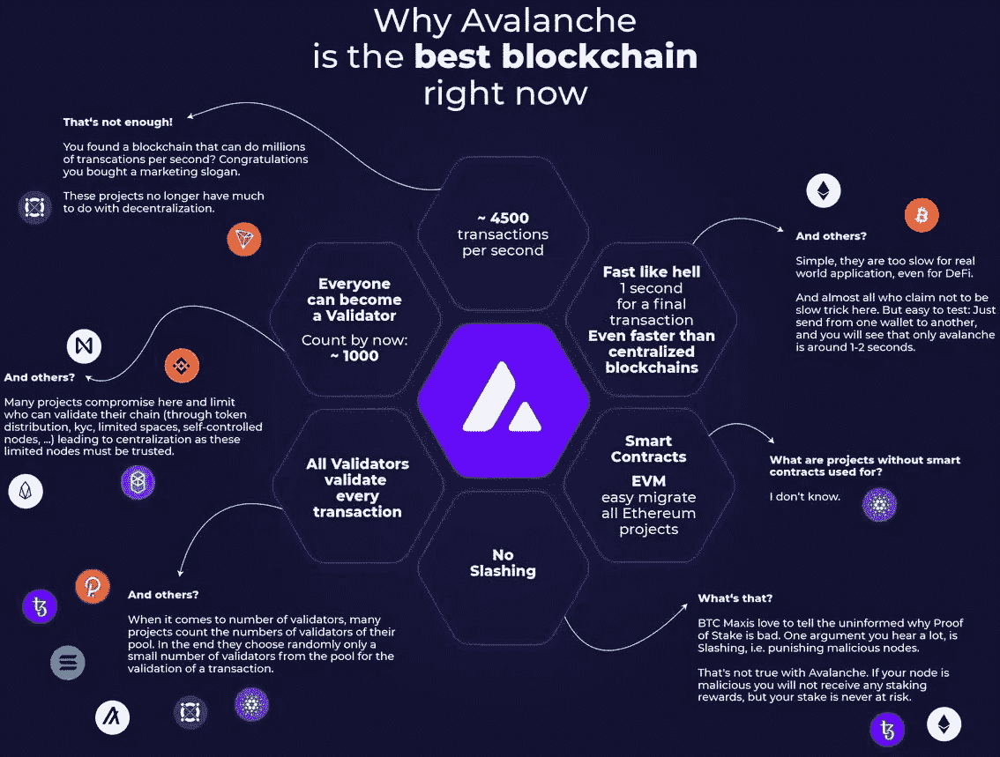

# OpenSea 为什么要在雪崩链上集成 NFTs？在雪崩上创建 NFT 市场

> 原文：<https://medium.com/coinmonks/why-opensea-makes-integration-of-nfts-on-avalanche-chain-creating-nft-marketplace-on-avalanche-430a3b57d871?source=collection_archive---------27----------------------->

web3 的目的是为互联网社区提供无中介的交易行为。传统的贸易和交易方式是由金融机构或任何组织在适当的中央机构进行的。这些 web3 的基础是区块链技术公司，它为市场上的各种项目提供了几个网络。

这些区块链通常是不可变的、分散的和安全的，并促进用户更快地进行交易结算。截至目前，销售声誉较好的区块链品牌有以太坊、索拉纳、NEAR 和 Avalanche。尽管有更多的选择，这个博客是专门为雪崩区块链 上的[**NFT 市场的特色以及 OpenSea 与它们的整合而定制的。**](https://www.appdupe.com/nft-marketplace-development)

# **雪崩-区块链三难困境**

Avalanche 是区块链的一个网络，它是所有区块链网络的先驱，以其三重困境而闻名:处理的可持续性、安全性和可扩展性。在平台中进行的每一笔其他交易都通过利益相关者共识机制进行验证。现在，这个 2022 年推出的区块链，如上所述，是一个具有多功能实用程序的开源平台。

区块链的本地加密货币是$AVAX，它们也受到智能合约效力的支持。此外，燃气费和$AVAX 创建率基于平台的治理模型。这种特殊的网络是为支持具有多种特性的分散式应用程序(dApps)而开发的。他们是，

*   硬币创造
*   气体供给结构
*   利益证明机制
*   奖励制度

在确立了以太坊这个更新版本的主要特征和三难困境之后，让我们对雪崩区块链的作品结构有一个了解。

## **雪崩网络的框架**

avalanche 的可用性确实是加密领域的福音，因为它们可以在不到 3 秒的时间内实现每秒 4500 次交易(TPS)。与以太坊相比，该技术在 1 小时内可处理 7 个 TPS 的比特币，事实证明这是一项巨大的发展。由于 NFT 市场建立在区块链之上，不可替代代币的交易是通过精英证券进行的。

即 PoS 的 [**共识机制集成到平台中。这成比例地有助于允许验证者通过重复的通信过程在他们之间达成协议，并获得最大的结果。因此，为了验证一个交易，验证者必须有大约 80%的令牌被下注。从而实现雪崩 NFT 市场开发的快速性和可扩展性。**](https://www.geeksforgeeks.org/proof-of-stake-pos-in-blockchain/)

与任何其他网络发展不同，它们有三重协作链:X 链、C 链和 P 链。这是因为 Avalanche 利用了丙烯酸图形(DAG)模型。这里需要注意的一点是，平台中的 C 链和 P 链是用 Snowman 链接在一起的，它为整个环境提供了精心编写的契约。

*   区块链中的交换链或 X 链基本上是一个为开发、维护和管理 NFT 奠定基础的交换链。
*   接触链或 C 链有助于平台实现智能合约，以太坊虚拟机(EVM)可以促进同一生态系统内的分散应用程序。
*   平台链或 P 链是为子网的开发者和平台中事务的验证者准备的。它们还支持市场所需的堆叠机制。

## **OpenSea 的 NFT 市场与雪崩区块链**

区块链会谈到此为止，让我们进入有趣的部分。NFT 市场是所有数字资产和密码的安全栖息地，让用户可以交易、购买和出售这些资产以获取金钱利益。OpenSea 是市场上的领先者，是一个拥有几个蓝筹收藏品的市场。

[**OpenSea 主办了 Avalanche 上的 NFT 市场**](https://techcrunch.com/2022/10/11/opensea-launches-nft-marketplace-on-avalanche/) 鼓励高速交易并拥有一个完整的 NFT 社区。由于 OpenSeas 与区块链的整合，2022 年第二季度，NFT 的销量增长了 180%。OpenSea 已经规划了 avalanche 的未来，它将更新论坛以创造收藏。众所周知，OpenSea 优先考虑这些无价资产的收集者和创造者。一种新的智能合约 SeaDrop 已经加入了这样的市场。

*   用户奖励结构
*   支持多个区块链项目
*   网络接入
*   个性化区块链网络
*   与固体相容的 dApp 的开发

## **推动雪崩式增长的 NFT 市场的主要原因**

添加到区块链的命令性属性使用户满足了他们所有的加密要求。然而，对于一个 NFT 市场来说，在发展 NFT 市场时，应该有一些强制性的特征不能被忽略。

*   向平台注册
*   店面/ NFT 图书馆
*   自动执行智能合同
*   可量测性
*   分散的
*   高端安全
*   彼此协作的
*   可控自主

## **雪崩的可能解决方案**

*   DeFi 应用程序开发
*   NFT 市场发展
*   加密钱包开发
*   基于可靠性的数字合同构思
*   可靠的 dApp 开发

## **NFT 集市上雪崩**

NFT 广泛分布在密码世界的各个平台上，有着不同的领域。据消息人士称，像 OpenSea 这样的市场已经以无与伦比的效率雪崩，这要归功于他们已证实的 96，928 美元的 NFT 销售额，这是 174.42%的增长，并且完成了 827 笔交易，这是图表上 66.40%的增长。随着购买者总数增加 112.50%，我怀疑是否有人会错过这样一个历史性的机会，将他们的市场种植在他们身上。如果你希望 [**在 avalanche**](https://www.appdupe.com/nft-marketplace-development) 开发一个 NFT 市场，下面给出的是要遵循的步骤。

*   根据对主题的清晰了解和对特定市场的研究，选择以 Avalancche 为基础的 NFT 市场领域。
*   为 NFT 市场的程序性发展准备白皮书，以便对市场的未来有一个路线图？
*   继续开发智能合约，具备平台的所有先决条件。集成智能合同有助于论坛更具功能性，更易于用户使用。
*   设计和开发一个具有用户界面/UX 的交互式用户界面。这种开发表现为用户和平台之间的交互工具，促进了方便和流畅的功能。
*   采取适当的开发，进行一尘不染的前端和后端开发。拥有一个完全以用户为导向的设置，在直观和交互的同时照顾到他们的每一个需求，比如添加交易网关等。
*   下一阶段需要深入的软件测试。这样做可以减少平台上出现任何错误的可能性。
*   最后一个阶段是在用户确认开发的项目后，在云上部署开发的市场。然后在必要时进行定期更新，作为白标 NFT 市场开发公司的发布后支持。

在 Avalanche network 的支持下，一些这样的发达市场成功运行，如 NFTrade、Kalao、YetiSwap、NFTStars、NFTKey、Snowflake 等。

## **关闭思想！**

虽然 Avalanche 是一个相当新的区块链，它对不断升级和富有成效的结果很感兴趣，但这似乎是投资 cryptos 的正确时机。一个[**OpenSea 就像雪崩**](https://www.appdupe.com/nft-marketplace-development) 上的 NFT 市场开发，导致 NFT 每天的总销售额为 988 万美元，平均每周高达 7453 万美元。这表明，即使最近市场下跌，很少资产流失，一些资产是新创造的，NFT 世界从未停止运转。

白色标签的 NFT 市场发展解决方案处理每一个项目时，都小心翼翼地考虑到他们商业理念的每一个细微差别。业内顶尖企业投入开发前所未有的 NFT 市场；使用白标开发服务在 Avalanche 上建立 NFT 市场的解决方案将会大受欢迎！想开发一个 100%定制的 NFT 市场吗？获得令人眼花缭乱的白色标签**雪崩 NFT 市场**。

> 交易新手？尝试[加密交易机器人](/coinmonks/crypto-trading-bot-c2ffce8acb2a)或[复制交易](/coinmonks/top-10-crypto-copy-trading-platforms-for-beginners-d0c37c7d698c)