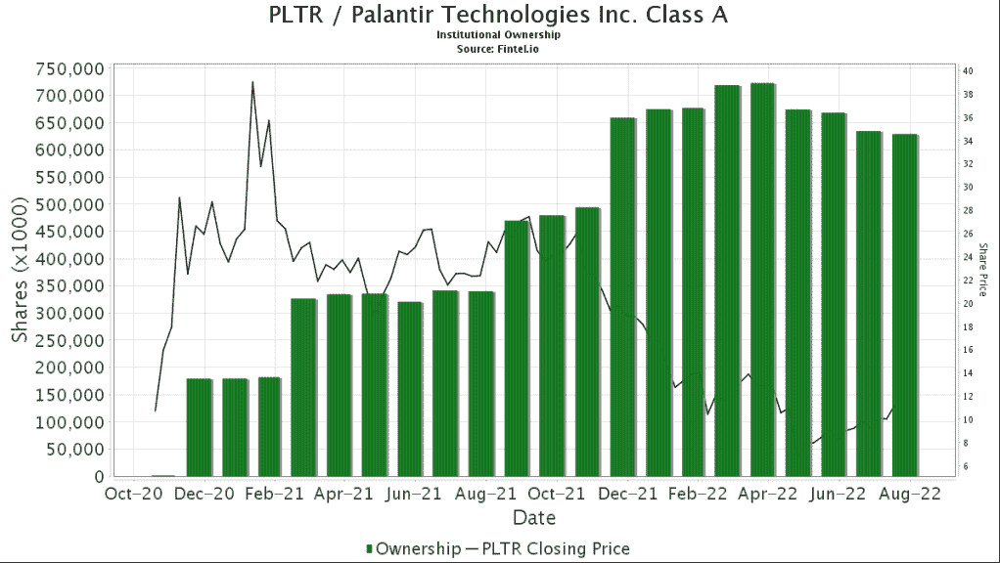
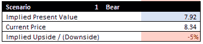

# 为什么 Palantir 的股票被摧毁——Q2 2022 年收益分析

> 原文：<https://medium.com/coinmonks/why-palantir-stock-got-destroyed-q2-2022-earnings-analysis-3fa807b78ed?source=collection_archive---------24----------------------->

如果你看过我以前的帖子，你可能已经获利/平仓了。像往常一样，Palantir 的股价在财报电话会议后大幅跳水。与上一季度类似，图表和信息被有意而巧妙地删除。你可以点击查看 Q2 2022 年盈利报告[。](https://investors.palantir.com/news-details/2022/Palantir-Reports-Revenue-Growth-of-26-YY-for-Q2-2022-US-Commercial-Revenue-Up-120-YY-in-Q2-2022)

# 金融

客户总数从 277 家增加到 304 家(与前一季度的+17%相比，本季度增长了 10%)。与上个季度的 40 家相比，PLTR 本季度只获得了 27 家新客户。由于他们一直在积极招聘和扩大销售团队，我预计新客户的获得率会更高。这里发生了什么？

本季度政府总收入增长也有所放缓(Q1 为+16%，Q2 为+13%)。政府部门占 PLTR 总收入的 56%，高于上个季度的 54%。如果 PLTR 想要扩大规模，我们应该看到商业收入占其总收入的更大部分。

总商业收入增长也同比放缓(上个季度增长 54%，本季度增长 46%)。在季度环比的基础上进行比较，结果更糟。与上一季度的+54%相比，本季度仅增长了+2%。

政府收入占总收入的百分比从季度环比的 54%上升至 56%，表明 PLTR 在获取商业客户方面有所放缓。

前 20 名客户的平均收入环比保持相对不变。他们的顶级客户没有增加支出。此外，美元净留存率从 Q1 2022 年的 124%降至 Q2 2022 年的 119%。他们现有的客户群本季度的支出减少了。

完成的交易从 208 笔增加到 234 笔，增幅为 67%，也显示出增长放缓的迹象。此外，账单收入仅同比增长 5%。事实上，Q2 2022 年的季度环比从 4.9 亿下降到 3.96 亿。

尽管本季度完成了更多交易，但剩余交易总额和剩余履约义务仍停滞不前。

Palantir 的资产负债表仍然强劲，手头有 24 亿美元现金，债务为零。他们还将未动用的信贷额度扩大至 9.5 亿美元。拥有强劲的资产负债表是好事，但它会在未来几个季度转化为更高的增长吗？

在 Q1 2022 年的收益电话会议上，PLTR 预计 H2 2022 年的政府收入将强劲增长。让我们看看这种情况是否会持续到 2022 年第三季度。

# 前向制导

## 2022 年第三季度指南

收入 4.75 亿英镑，同比仅增长 21%；季度环比增长 0%。上一季度的预期是同比增长 25%。

## 2022 财年指南

我们预计今年的收入为 19 亿英镑，同比仅增长 23%(2021 财年:15 亿英镑)，与他们之前 30%的同比指导相比大幅下降。
此外，他们提到他们目前没有 2022 财年以后的指导。我将很快修改我的模型，以解释这一指导方针的变化。

# 机构持股

机构持股的下降与宏观经济因素相一致。由于每股收益低于每股收益，股价持续走低。为了增加机构持股，我们需要看到公司开始持续盈利。因此，Palantir 的股价在零售交易中容易波动。

[https://fintel.io/so/us/pltr](https://fintel.io/so/us/pltr)

# 宏观因素

该公司的基本面是好的。然而，从短期来看，也存在潜在的危险信号。PLTR 本季度经济增长放缓，下个季度也有可能放缓。然而，部分原因可能是过去几个月的宏观经济因素。

上个月，我们看到欧元回到了与美元平价的水平，这增加了欧洲公司与 PLTR 打交道的成本。使用 PLTR 服务的成本已经很高，再加上不利的汇率，收入往往比预期的要差。

许多公司也在削减成本和支出。PLTR 服务是企业可自由支配的支出。它们不像石油和原材料那样是必需品。在经济衰退期间，预计 PLTR 的收入将受到打击，经济增长将会放缓。

随着全球通胀飙升，企业收入受到严重打击，许多企业没有盈利。在这次收入紧缩中，我们应该看到股票市场的价格下降。为了对抗通胀，美联储需要从经济中抽走资金。我们可能会看到利率在 2023 财年继续走高。PLTR 已经考虑到这一因素，因此预计 2022 年第三季度将出现低增长/停滞增长。

# 计划

在 Q1 2022，管理层表示，我们将在 H2 2022 看到政府收入的增加。我会留意这件事的。此外，SBC 一直停滞不前。我希望看到 SBC 继续走下坡路。我现在唯一担心的是，他们加大了招聘力度，扩大了销售团队。潜在的，我们可能会看到 SBC 增加，这是我不喜欢的。同样值得思考的是，如果我们看到销售人员数量在过去几个季度持续增长，我们会看到管理层做出如此停滞不前的指导吗？

我将修改我在 PLTR 的定价模式，如果有任何重大变化，我会通知您。

之前，使用熊市场景，我的 [DCF](https://2minutesliteracy.wordpress.com/2022/02/18/valuation-of-palantir/) 显示隐含 PV 为 8 美元，大约是当前股价。

现在，我正置身事外。我没有卖，也不打算买蘸酱。我对整个市场非常悲观，预计经济会重新调整，以降低通胀和房价。

如果我们能挣到 5 美元。我会开始在 PLTR 积累更多的头寸。

*免责声明:在我发表这篇文章的时候，我在 Palantir 有头寸。请注意，这篇文章不是买卖的信号，只能作为娱乐之用。写这篇文章的时候大概是喝醉了。投资时请做好自己的尽职调查。这是* ***而不是*** *的理财建议。*

*原载于 2022 年 8 月 9 日*[*http://2minutesliteracy.wordpress.com*](https://2minutesliteracy.wordpress.com/2022/08/09/why-palantir-stock-got-destroyed-q2-2022-earnings-analysis/)*。*

> *加入 Coinmonks* [*电报频道*](https://t.me/coincodecap) *和* [*Youtube 频道*](https://www.youtube.com/c/coinmonks/videos) *了解加密交易和投资*

# 另外，阅读

*   [Bookmap 评论](https://coincodecap.com/bookmap-review-2021-best-trading-software) | [美国 5 大最佳加密交易所](https://coincodecap.com/crypto-exchange-usa)
*   [加密交易机器人](/coinmonks/crypto-trading-bot-c2ffce8acb2a) | [造币评论](https://coincodecap.com/coingate-review)
*   最佳加密[硬件钱包](/coinmonks/hardware-wallets-dfa1211730c6) | [Bitbns 评论](/coinmonks/bitbns-review-38256a07e161)
*   [新加坡十大最佳加密交易所](https://coincodecap.com/crypto-exchange-in-singapore) | [购买 AXS](https://coincodecap.com/buy-axs-token)
*   [红狗赌场评论](https://coincodecap.com/red-dog-casino-review) | [Swyftx 评论](https://coincodecap.com/swyftx-review)