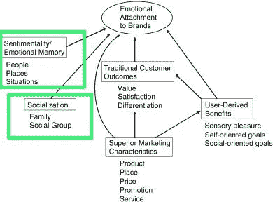
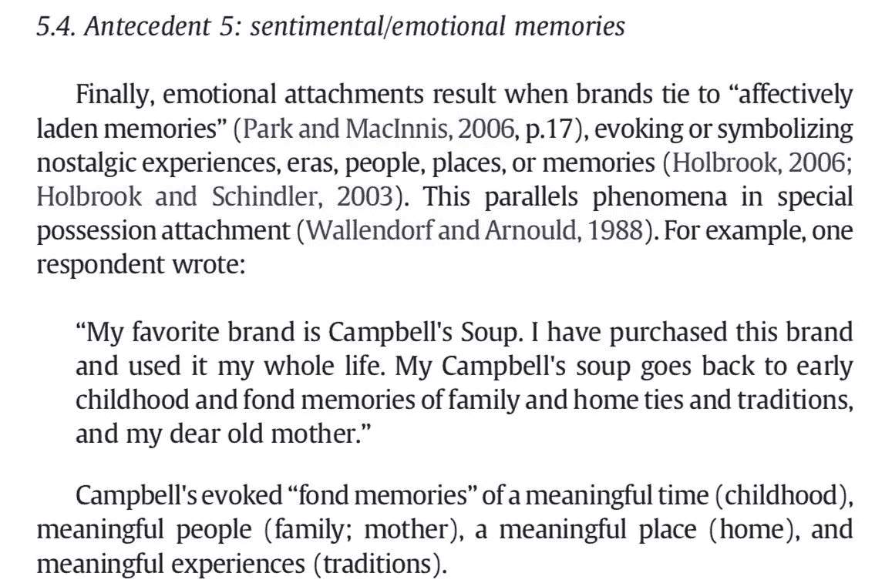

# 为什么人们会对非功能性思维产生情感依恋

> 原文：<https://medium.com/coinmonks/why-people-hold-nfts-inside-the-mind-of-an-nft-holder-587a76e0bc8d?source=collection_archive---------13----------------------->

***NFT 持有者的内心***

**品牌依恋理论和情绪记忆对
持有 NFTs 的影响:一篇文章+线索。**

人们持有 NFT 有三个主要原因:1)通常的:价值增值 2)品牌依恋 3)情感记忆

第二个和第三个是什么？

如果你曾经对你的非功能性测试产生感情，以至于很难卖掉它们，你可能正在经历。在下图中，你会注意到社交和多愁善感在 NFT 的空间里非常重要。

这涉及到艺术、社会团体和品牌。

所以…当然，不把情绪带进来可能有点困难。

品牌依恋是人与品牌之间的情感联系。
用户在体验到真正的联系或激起某种感情的瞬间时，会对品牌/(项目)产生喜爱。

NFT 将世界各地具有相似兴趣的个人聚集在一起，从而建立情感联系(朋友、聚会等)，并因此建立情感记忆。品牌情感记忆是我们至少经历过一次的东西，在 NFTs 之外。

一个很好的例子可能是麦当劳，许多人都有去那里的童年记忆，这使他们再次回到那里。或者你最喜欢的运动队，例如*“那是我父亲最喜欢的运动队！我们会一直一起看！”*

在一项关于这个话题的研究中，一个人描述了情感记忆是如何参与他们最喜欢的品牌的。品牌，在这种情况下，金宝汤唤起了那个人与人和经历的有意义的记忆。

基本上:品牌情感记忆是指品牌与情感记忆的联系，包括人、经历等。
NFTs 中的一个例子可以是“这是我第一次去 NFT。我很难释怀”。"这是我最喜欢的社区:我在这里遇到了最好的人！"。

“我的朋友向我介绍了这个项目”或“这个社区在我最困难的时候帮助了我”

足够有趣的是:这些影响也可能发生在股票市场，直到某一点。一些投资者表示，他们对一只股票有情感上的依恋，是因为对公司的依恋/回忆，或者是去世的亲人在去世前送给他们公司股票的例子。

*注意:*这篇文章+帖子只是为了解释 NFT 控股背后通常发生的事情，我不是说你应该在交易时极度情绪化。你当然能感觉到与一个项目的联系，但是你需要意识到你的感觉会如何影响你的判断。

**永远**小心，**获利，**不要变得太情绪化。

• • •

感谢阅读！如果你喜欢，可以考虑在我的推特上发一条回复和关注:

> 交易新手？试试[加密交易机器人](/coinmonks/crypto-trading-bot-c2ffce8acb2a)或者[复制交易](/coinmonks/top-10-crypto-copy-trading-platforms-for-beginners-d0c37c7d698c)