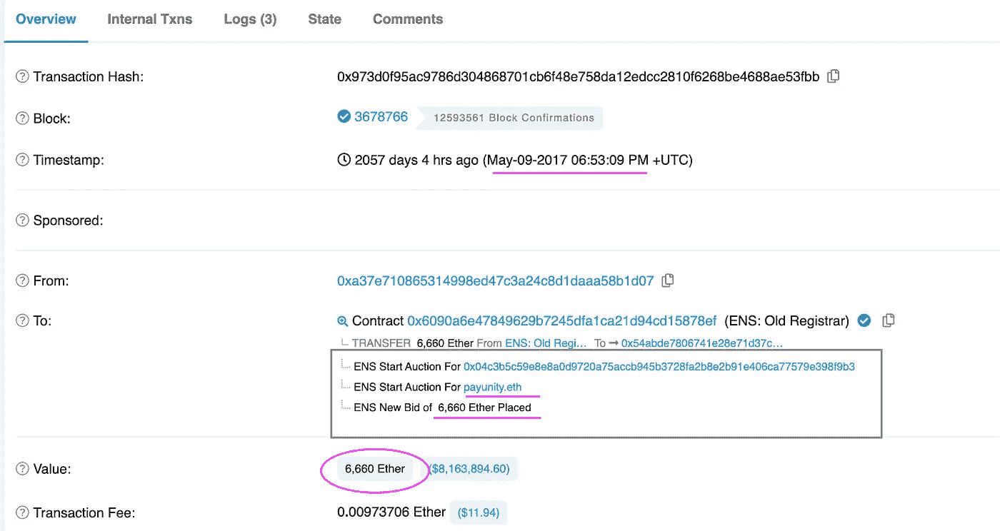

# 第 2 部分:这就是当你不关心你在 Twitter (Python)上的加密隐私时会发生的事情

> 原文：<https://medium.com/coinmonks/why-protecting-your-ethereum-name-service-ens-on-twitter-is-essential-3-use-cases-c1f8538de4b6?source=collection_archive---------15----------------------->


[Source](https://www.google.fr/url?sa=i&url=https%3A%2F%2Fwww.bbc.com%2Fnews%2Ftechnology-59011271&psig=AOvVaw1SVK1ctpcQfNd0JRjHSUBN&ust=1671751992694000&source=images&cd=vfe&ved=0CAwQjRxqFwoTCPj40NPvi_wCFQAAAAAdAAAAABAD)

2022 年 10 月有人创建了一个数据库，包含 10 万多个与加密地址相关的 Twitter 账户。这些地址可以在[的公共 Google Drive 数据库中找到。](https://drive.google.com/file/d/1ANOIptofc-G_PXIp0ShkLmG1FYheh5SD/view)在这一媒体中，我们将研究从这个庞大的数据集中可以收集到的**金融见解**。

> 不知道什么时候买卖，试试[复制交易](http://coincodecap.com/go/bityard)。

# 一、评估 ENS 净值

评估以太坊地址的净值可以为各种目的提供有价值的见解，包括:

*   **分析市场趋势**:通过跟踪高净值个人或组织的净值，或许可以识别加密货币市场的趋势和模式。这些信息可能对投资者和分析师有用，他们希望**做出明智的决定，将资金分配到哪里**。
*   **做出投资决策**:通过了解**资金如何在不同的加密基金或钱包中流动**，有可能发现投资机会。例如，如果个人或组织在某个特定的以太坊地址拥有相当高的净值，这可能表明他们持有大量特定资产或在市场上交易活跃。
*   **跟踪个人或组织的财务表现**:评估以太坊地址的净值也有助于跟踪个人或组织的财务表现。这些信息对财务规划者、分析师和其他有兴趣了解特定实体财务健康状况的人很有用。


[Source](https://www.livemint.com/money/personal-finance/when-the-wealthy-tiptoe-into-the-world-of-crypto-11633973684272.html)

*   **了解** **整体加密货币市场及其内部的财富分布**通过分析大量以太坊地址的净值，或许可以更好地了解整体加密货币市场及其内部的财富分布。这些信息对于研究人员、政策制定者和其他有兴趣了解加密货币市场动态的人来说可能是有用的。
*   **与美国国税局(IRS)** 有关，涉及到检测**逃税或洗钱**。例如，如果一个个人或组织在以太坊地址有相当高的净值，但没有在纳税申报单上报告这笔收入，这可能是逃税的迹象。同样，如果发现某个个人或组织在以太坊地址拥有高净值，并涉嫌参与洗钱活动，此信息可用作调查证据。

# 二。Python:加载净值列表

要评估以太坊地址的价值，您需要确定该地址拥有的所有资产的总价值。这通常包括以太网(ETH)的余额和该地址持有的任何其他令牌。

要确定地址的值，您可以按照下列步骤操作:

*   1) **确定地址持有的 ETH(ETH)**余额。您可以使用 web3.py 或区块链浏览器等工具来查询地址的余额。余额通常用威表示，你可以用它除以 10 ⁸.来换算成埃特


[https://docs.google.com/spreadsheets/d/1UPd-UYGRjWFaQjpVOAOOqIbCekWyePTAt1HygNMtY2Q/edit?usp=sharing](https://docs.google.com/spreadsheets/d/1UPd-UYGRjWFaQjpVOAOOqIbCekWyePTAt1HygNMtY2Q/edit?usp=sharing)

您可以使用 python 中的 [Infura](https://infura.io/) 连接到使用 web3.py 的以太坊节点，以获得 ETH 余额，如下所示:

[https://raw.githubusercontent.com/Eloise1988/TWITTER/main/web3_ETHbalance.py](https://raw.githubusercontent.com/Eloise1988/TWITTER/main/web3_ETHbalance.py)

*   2) **确定该地址持有的任何其他令牌**的值。这通常包括查找每个令牌的合同地址，并使用 web3.py 之类的工具查询该令牌的地址余额。
*   3) **将地址持有的所有资产**的值相加，得到地址的总值。

在以太坊区块链上轻松跟踪你的加密货币投资组合总价值的一种方法是使用 [Zapper.fi](https://zapper.fi/) API。要使用该工具，您需要有一个开发人员帐户并获得一个 API 密钥。下面的代码可以帮助你使用 [Zapper.fi API](https://api.zapper.fi/api/static/index.html) 接口检索你的净资产:

值得注意的是，以太坊地址的价值会随着时间的推移根据其持有资产的市场价格而波动。因此，定期更新地址的值以确保它反映当前的市场价格是很重要的。

# 三。对列表进行排序和排名

文件发布几天后，我计算了前 20，000 个账户的净值，并按净值排序。


Values as of mid-October 2022

为了保护个人隐私，我不会和所有的净值人士分享一份完整的文件。如果您希望看到完整的细节，您可以运行我上面提供的代码。尽管如此，我仍然会提供一些具体的例子来说明存在的隐私问题。但在我们这样做之前，让我们检查一下净值和一个有影响力的人拥有的追随者数量之间是否存在关联。

# 四。影响者的影响力和所展示的资金之间的关系

人们可能会认为，拥有大量 Twitter 追随者的加密影响者可能能够利用他们的社交媒体来推广他们的投资策略和专业知识，这可能会吸引更多的投资者，并增加他们公共地址下的资产。他们还可以利用他们的社交媒体关注，从其他行业专家和影响者那里获得有价值的信息和见解，这可以帮助他们做出更明智的投资决策。

为了测试可能存在**相关性**的假设，我计算了**的粉丝数量**和他们在公共 ENS 上的**净值之间的相关系数。**

```
import numpy
print(numpy.corrcoef(followers,networth)) 

[[1\.         0.00312019]
 [0.00312019 1\.        ]]
```

0.00312019 表示**没有内在联系**。**这并不奇怪……**许多有影响力的人使用他们的以太坊地址作为**捐赠地址**，但他们经常从他们的追随者那里收到很少或没有捐赠，这表明这些**有影响力的人没有向他们的追随者提供有价值的财务指导**。

# 动词 （verb 的缩写）可疑的财务违规行为

我现在将分析引起我注意的三个案例研究。

## A)人 A:骗子？

```
As of October 2022

0\. Address: '0xca86d57519dbfe34axxxxxxxxxxxxb71'
1\. ENS: 'ixxxxxxxm.eth'
2\. Twitter handle: ixxxxxxxxth
3\. Nb followers: 3396
4\. Net-worth: $10,008,420.67
```

我发现这个特殊的例子非常有趣，因为自从数据库发布以来，A 已经删除了他们之前有 3396 个追随者的 Twitter 账户。该账户现在只有 6 名关注者，许多帖子都是骗局。

关注者的显著下降、1000 万美元(现在是 400 万美元)的高余额以及社交媒体上行为的变化引起了我的注意，并促使我调查这些资金的分配情况。


https://twitter.com/incoometh

经进一步调查，我发现大部分资金是通过小型分散交易所贷出的。在其中一个账户 SudoSwap 上，个人 A 的存款占交易所锁定总价值的 15%以上。

在我检查的推文中，我发现大多数都在宣传描绘血腥或暴力图像的免费 NFT。这些推文似乎性质可疑，引起了我的关注。

个人为了获得用于购买不可替代代币(NFT)的资金而从事不道德或非法活动的情况并不少见。这可能包括创建和推广虚假项目，人为夸大其价值，并以高价出售，或窃取流动性。**非金融交易还可能被用于洗钱，洗钱是将非法活动的收益隐藏为合法资金的过程。**

洗钱者可能利用 NFT 转移非法资金。通过用脏钱购买非金融资产，他们可以将这些资金转化为看似合法的资产，很容易进行交易或出售。他们还可能利用 NFT 进行多笔交易，从而使当局更难追踪资金的流向。

## B)人 B:偷税漏税案？

```
As of October 2022
0\. Address: '0xd7d72811d5f4adc498XXXXXXXXXXXXXX'
1\. ENS: 'rXXXXXXXXXXXXXX.eth'
2\. Twitter handle: RoXXXXXXXXXXXXXX
3\. Nb followers: 8'275
4\. Net-worth: $9,025,089.54
```

看起来 B 已经采取措施保护他们的隐私，通过**从他们的 Twitter 个人资料**中删除他们的 ENS 地址。这可能是因为他们已经意识到包含他们地址的数据库已经被泄露，他们希望**避免引起对他们财务活动的不必要的关注**。


Person B does not appear to engage with posts about cryptocurrencies on their social media accounts.

对与他们的 ENS 地址相关的交易的审查表明，他们一直在**FTX/币安**和他们在**以太坊和币安智能连锁网络**上的 ENS 地址之间积极**转移**大笔资金，达**百万美元**。


Moving 7mio USDC to FTX (Ethereum)


Moving 7mio BUSD to Binance (Binance Smart Chain)

考虑到被转移的资金数额巨大，而且这些交易可能没有向金融当局申报，因此，B 可能试图逃避当局的审查。可以理解的是，他们**希望保持其财务活动的私密性，特别是如果他们不遵守税务和其他财务报告要求**。

然而，值得注意的是，转移大笔资金或私下进行金融交易不一定违法。只有当这些活动与非法或欺诈活动有关联时，它们才成为问题。在没有更多信息的情况下，很难确定 B 的行为背后的确切动机。

## C)人 C:洗钱的案子？

```
As of October 2022
0\. Address: '0xbb46be602xxxxxxxxxxxxxxxxf339'
1\. ENS: 'cxxxxxxxx.eth'
2\. Twitter handle: mxxxxxxxx
3\. Nb followers: 14'742
4\. Net-worth: $7,367,686.85
```

C 人也采取措施保护他们的隐私，从他们的 Twitter 个人资料中删除了他们的 ENS 地址。他分享的大多数推文都是即将到来的项目、空投和加密货币领域的最新消息的转发。


这个案例的一个有趣的方面是，自 2020 年 5 月以来，该地址持有的 ETH 数量一直保持相对稳定，当时大约有 6，000 个 ETH 被转移到该地址。当你调查这 6000 个 ETH 的来源时，你会发现**资金来自于【2017 年 5 月**收购的众多 ENS 地址。T4 很难追踪这些资金在被锁定之前的来源


Around 6'000 Ether previously locked in ENS domains

2017 年招标时，旧的 ENS 注册服务商采用了先到先得的注册流程，这意味着用户可以注册任何可用的名称，只要他们是第一个这样做的人。

## [域名拍卖如何运作](/the-ethereum-name-service/a-beginners-guide-to-buying-an-ens-domain-3ccac2bdc770)

使用基于**[**维克里拍卖**](https://en.wikipedia.org/wiki/Vickrey_auction)**的拍卖流程分配新域名。拍卖分三个阶段进行:****

1.  ****首先，有人开始拍卖他们想要购买的域名，并出价。这将启动一个 3 天的计时器，让其他人对该名称出价。在此期间，出价的细节是模糊的:没人能知道你出价多少，甚至没人知道你以什么名义出价。****
2.  ****为期三天的拍卖结束后，为期两天的“展示”期开始。在此期间，每个投标人都必须披露他们的投标细节——如果他们不这样做，他们将失去整个投标。如果您的出价不是最高的，您的出价将被退还，减去 0.5%的费用，这是烧毁。****
3.  ****在两天的展示期结束时，获胜者是展示最高出价的人，但他们只需支付第二高出价者的金额。只要中标者保留对该名称的控制权，这一金额就被锁定在一份合同中。获胜者必须发送“最终确定”交易，以获得任何额外资金的退款，并被分配对 ENS 中的名称的控制权。****

****本案中**引起怀疑**的一个方面是，C 人试图**对单个 ENS 域名**的所有 6000 个 ETH 进行投标【见下文】。然而，这是不可能的，所以他们不得不在多个域名上分发他们的出价。对于有兴趣收购多个域名的人来说，在一次 ENS 竞标中出价全部资金是不寻常的。****

********

****Bid of 6'660 ETH for an ENS is very suspicious****

****C 人有可能利用 ENS 拍卖流程**对域名进行投标，然后将注册域名转让给第三方，例如他们自己的另一个地址**，从而进行洗钱。这将使调查人员难以追踪资金的来源，并可能被用来掩盖资金的来源，使其看起来好像来自合法来源。****

****但是，需要注意的是，ENS 拍卖流程不是专门为洗钱而设计的，也不一定是一种有效的方式。****

## ****三。结论****

****社交媒体的广泛使用彻底改变了我们在 T2 交流和 T4 分享信息的方式，但也给个人隐私带来了巨大的风险。当我们使用 Twitter 这样的社交媒体平台时，我们不断产生大量的个人数据，这些数据很容易被他人访问和分析。这些数据可能包括我们的想法、观点和个人财务状况，以及我们的地理位置、与其他用户的联系，甚至我们的在线行为。****

****当这些数据被收集和组合时，它可以**提供我们是谁**和我们做什么的详细画面。这对于广告商和其他希望向我们提供个性化内容和优惠的公司来说是有价值的。它对金融机构也很有价值，如美国国税局(IRS ),因为他们可以使用此信息来跟踪和监控金融交易，以达到税收遵从和其他监管目的。****

********

****[https://www.sec.gov/news/press-release/2022-221](https://www.sec.gov/news/press-release/2022-221)****

****通过我对区块链地址上的金融活动的分析，我希望证明可以发现金融异常，如潜在的诈骗、洗钱和逃税。**我进行这一分析的目的不是揭露任何特定的人，而是说明调查资金来源的容易程度。通过检查区块链的资金流动，有可能发现可疑活动，并有可能揭露非法金融活动。**个人和组织必须意识到这些问题，并采取措施确保其财务活动透明且符合相关法律法规。****

*****我希望这一分析有所帮助并能提供信息。我很想在评论中听到你对这个话题的想法。请随时分享您的观点和任何见解。*****

*****感谢您的阅读。节日快乐！*****

> ****加入 Coinmonks [电报频道](https://t.me/coincodecap)和 [Youtube 频道](https://www.youtube.com/c/coinmonks/videos)了解加密交易和投资****

# ****另外，阅读****

*   ****[Bookmap 评论](https://coincodecap.com/bookmap-review-2021-best-trading-software) | [美国 5 大最佳加密交易所](https://coincodecap.com/crypto-exchange-usa)****
*   ****[加密交易机器人](/coinmonks/crypto-trading-bot-c2ffce8acb2a) | [造币评论](https://coincodecap.com/coingate-review)****
*   ****最佳加密[硬件钱包](/coinmonks/hardware-wallets-dfa1211730c6) | [Bitbns 评论](/coinmonks/bitbns-review-38256a07e161)****
*   ****[新加坡十大最佳加密交易所](https://coincodecap.com/crypto-exchange-in-singapore) | [购买 AXS](https://coincodecap.com/buy-axs-token)****
*   ****[红狗赌场评论](https://coincodecap.com/red-dog-casino-review) | [Swyftx 评论](https://coincodecap.com/swyftx-review)****