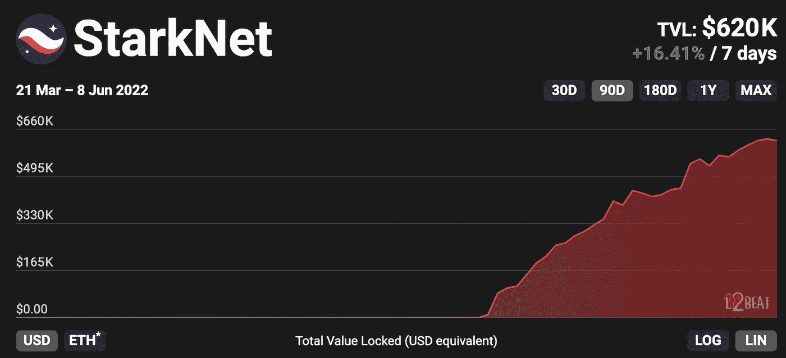

# 理解区块链权衡

> 原文：<https://medium.com/coinmonks/why-rollups-hit-the-sweet-spot-79b9f86916ed?source=collection_archive---------30----------------------->

## 在本文中，我使用位于折衷空间不同点的示例协议来分解区块链属性/折衷。

# 穿过噪音

第一层。2s 层。侧链。汇总。

Web3 充满了行话，所以让我们首先搭建舞台，并提供一个简单的方法来思考这个空间。

如果你浏览过 crypto-Twitter，你可能会听到人们提到像比特币/以太坊这样的第一层(L1)和像 Arbitrum /乐观主义这样的第二层(L2)。如果你听得更仔细一点，你可能会听到人们提到 Polygon PoS 这样的侧链和 StarkNet 这样的 rollups。如果你深入兔子洞，你可能会知道还有许多其他口味。

然而，在本文中，我们将忽略所有这些。

相反，我们将简单地把每个解决方案看作一个**区块链**。L2 和 rollups 在技术上是否是*区块链是一个深奥的话题，有待讨论，但是这样思考它们是有用的。*

# *评估区块链*

*现在我们有了一堆区块链——哪些是最好的？*

*每个区块链都可以基于不同的属性进行评估。以下是主要的几个:*

*   *表演*
*   *费用*
*   *安全性*
*   *分散*

*让我们从非技术性的最终用户的角度来解读它们。*

*性能是指带宽和吞吐量，即区块链一次可以处理多少事务以及处理事务的速度。这类似于一条高速公路有多少车道(带宽)和速度限制是多少(吞吐量)。对于最终用户来说，性能就是应用程序运行的速度——无论是给某人汇款，用一种资产交换另一种资产，还是在 web3 Twitter 上发布推文。*

*成本很简单——最终用户使用应用程序必须支付多少区块链费用。*

> *交易新手？尝试[加密交易机器人](/coinmonks/crypto-trading-bot-c2ffce8acb2a)或[复制交易](/coinmonks/top-10-crypto-copy-trading-platforms-for-beginners-d0c37c7d698c)*

*性能和成本是谈论的热点，并成为所有的头条新闻。*

**“新超音速 L1 以 10 亿 TPS 和 0 费用融资 10 亿美元！”**

*反过来，许多进入 web3 空间的人对这两个属性赋予了不成比例的巨大价值。有时人们只考虑两个中的一个——简单地看着一个区块链便宜，另一个昂贵。公平地说，这是我们大多数人习惯的评估技术产品的方式，但区块链的情况不止如此。*

*另外两个属性是安全性和分散性。*

*安全可能会令人困惑，因为人们用它来表示各种不同的事情，你经常看到区块链专家在讨论这个问题时互相谈论。在这篇 Twitter 帖子中，Polynya 很好地将安全性分成了三个部分。两个很难建立:*

*   *经济安全:在区块链，如果用户拥有大部分“赌注”硬币，他们就获得了对网络的有效控制。由于该体系依赖于不断增值的硬币(硬币越贵，就越难买到大部分硬币)，因此对区块链来说，重要的是要有一个健全的货币政策，并随着时间的推移建立其货币的可信度。*
*   *协议稳定性:协议是在软件中实现的，而软件存在缺陷的风险。在软件开发中，有一些最佳实践可以最大限度地减少错误，比如保持软件简单(代码行越少，出错的空间就越小)和保持升级过程保守(测试时间越长)。区块链环境中的示例包括协议决定不添加链上治理功能，并且随着锁定的总价值(TVL)的增长，升级需要更长的时间。*

*权力下放是一个热门话题，就像安全一样，它可能意味着很多事情。*

*巴拉吉写了一篇关于这个话题的[综合文章](https://news.earn.com/quantifying-decentralization-e39db233c28e)，将区块链分解成子系统。然而，他承认“一些分散的子系统可能比其他的更重要”，为了简单起见，我们将只关注节点和所有权。波吕尼娅[也写了一篇文章](https://polynya.medium.com/security-layers-or-qualifying-security-decentralization-7a5c93a36ba3)强调这两个关键方面。*

*   *节点去中心化:对于普通人来说，运行区块链软件(成为网络“节点”并验证交易)有多容易，有多少人实际上在这么做？如果你运行一个节点，没有人能改变你身上的协议规则，因为你的计算机会拒绝无效的事务。如果该软件可以在笔记本电脑或手机的后台运行，更多的人会运行它(它甚至可以与设备集成在一起)。如果该软件需要在云中安装昂贵的服务器，运行它的人会更少。*
*   *所有权去中心化:之前我们说过，在股权证明区块链中，如果一个人拥有大部分的赌注硬币，他们就获得了对网络的有意义的控制。如果一个人或几个团体拥有接近大多数的赌注硬币，那就不好了，所以广泛分发代币很重要。*

# *几个例子*

*既然知道了评价标准，就可以看例子了。*

*   *Solana:卓越的性能和成本*
*   *以太坊:擅长安全和去中心化*
*   *StarkNet:在性能、成本、安全性和分散化方面表现出色*

*索拉纳围绕速度打造了一个强大的品牌——它不负众望。当使用 Solana 时，你会觉得你在使用一个典型的 web2 应用程序。当然，你仍然必须支付交易费，但这些费用可以忽略不计。*

*缺点是这是通过[需要非常强大和昂贵的计算机](https://cdn.sanity.io/images/2bt0j8lu/production/9c03a17498241c9fe137ceb9eaa693b80dddcf1b-1920x1080.jpg?w=800&auto=format)来运行节点(随着时间的推移导致不良的去中心化)和[不可持续的令牌经济学](https://twitter.com/epolynya/status/1495831826749083649?s=12&t=v2EKwlyYirS4Ref4CUwoeQ)来补贴运行节点的成本(随着时间的推移导致不良的安全性)来实现的。作为一个两年前的项目，Solana 仍然有[次优令牌分发](https://preview.redd.it/j4ecadcmdrz61.png?width=1481&format=png&auto=webp&s=54ed0cc408ddbc7ca38fe609623c9891fe61bd99)和[协议稳定性](https://www.datacenterdynamics.com/en/news/solana-cryptocurrency-has-second-outage-in-a-month-causing-12-percent-dip-in-value/)。*

*以太坊做了相反的权衡。它是迄今为止最安全的可编程区块链，无论是当前的工作证明形式还是即将推出的利益证明形式。目前有[~ 230 亿美元押在](https://mainnet.beaconcha.in/)以太上，它的[稳健的货币资产](https://substackcdn.com/image/fetch/w_1456,c_limit,f_webp,q_auto:good,fl_progressive:steep/https%3A%2F%2Fbucketeer-e05bbc84-baa3-437e-9518-adb32be77984.s3.amazonaws.com%2Fpublic%2Fimages%2F84e0ec68-9794-49d0-9064-e30d188aafea_2908x1628.jpeg)，并且该协议在过去六年中被证明是稳定的。以太坊还保持运行节点的低硬件要求和促进行为的文化。*

*不利的一面是，稀缺、理想的块空间会导致拥塞和高昂的交易费用，极大地限制了可以利用网络的应用程序和用户的类型。在过去的几年里，以太坊在金融服务等高价值/低吞吐量的用例中表现良好，但在社交媒体等高价值/高吞吐量的用例中表现糟糕。*

*这两种权衡都可行吗？*

*不太可能。忽视安全和去中心化的链条在中长期内是不可持续的——这一观点得到了基础经济学和可预测硬件预测的支持。*

*输入汇总！*

*StarkNet 和其他类似的 rollups(区块链)解决了这个问题，并解锁了两个世界的最佳方案。他们这样做的方式是通过关注性能和成本，同时使用花哨的加密技术来继承另一个区块链的安全性和去中心化。*

*我们不会进入[如何在技术上工作](https://blog.matter-labs.io/optimistic-vs-zk-rollup-deep-dive-ea141e71e075)，而是锤家的好处。如果您正在使用构建在 StarkNet 上的应用程序，您将受益于以太坊幕后的安全性和去中心化特性。举个例子，即使 StarkNet 运营商腐败了，数学上也不可能让他们偷你的资金，除非他们也腐败了以太坊网络。*

*由于加密保证，汇总可以集中精力优化性能和成本，以支持高价值和低价值的应用程序。举一个相关的例子，开发人员可以派生 Solana 并将其调整为以太坊汇总。更好的是，一群开发人员可以部署一群 Solanas，全部并行运行，并继承以太坊的安全性和去中心化。*

*回到 StarkNet——开发者也可以从头开始设计比 Solana 更快更便宜的易拉宝，这当然是许多人正在做的。设计空间大开！*

# *怎么回事？*

*很可能你现在在想:“这听起来很棒，但是有什么问题呢？索拉纳随处可见，这是我第一次听说 StarkNet。为什么人们会选择劣质的解决方案？”*

*事实上，大多数易拉宝还处于早期阶段，只是在过去几年才开始流行起来。在此之前，风投更倾向于资助“以太坊杀手”，而不是建立在以太坊基础上的解决方案。即使是已经[承诺 10 亿美元用于累计开发](https://blog.polygon.technology/the-polygon-thesis-strategic-focus-on-zk-technology-as-the-next-major-chapter-for-polygon-1b-treasury-allocation/)的 Polygon，也不得不在某种程度上接受竞争对手 L1 的叙事才能起步。*

*更重要的是要指出，汇总背后的魔力是基于最先进的加密技术。这很难[月球数学](https://open.spotify.com/episode/2QBWHHsyJcrs3SXliD7ZKo?si=nMI4QwLYR06fFfwEBxC-gA)并且比简单地复制现有区块链的代码需要更长的部署时间。*

*尽管存在上述挑战，但有些 rollups 是 [live，带有](https://l2beat.com/)上的训练轮(例如，集中式序列发生器)，而其他 rollups 即将推出。*

# *早期信号*

*开发人员和用户不可能坐以待毙，因此应用程序和支持基础设施(例如钱包和菲亚特入口)自然是围绕可用的解决方案构建的。幸运的是，一些汇总与现有的区块链兼容，这使得开发人员很容易移植应用程序。同样，从以太坊转移到雪崩也是小事一桩，当雪崩成熟时，从雪崩转移到 EVM 也是小事一桩。*

*那么，今天有什么总结吗？*

*是啊！实际上，相当多。例如:*

*   *dYdX 在它的分散交易汇总中有[到 10 亿美元的 TVL](https://www.defipulse.com/projects/dydx) 。*
*   *[不可变 X](https://www.immutable.com/) ，一个 NFT 特有的汇总，正在与一些令人印象深刻的名字合作，如[万事达卡](https://www.mastercard.com/news/perspectives/2022/simple-nft-purchasing-on-nft-marketplaces/)和 Gamestop，这是[建立一个 NFT 市场](https://www.theblockcrypto.com/linked/132903/gamestop-immutable-x-nft-marketplace-ethereum-layer-2)。*

*StarkNet 最近在以太坊主网上推出了他们的 alpha 产品，已经显示出令人印象深刻的采用率。*

**

*如果早期的活动是任何迹象，未来看起来一片光明。*

# *为什么它很重要*

*在处理有价值的资产时，对强大的安全性和分散化的需求是很直观的，但在玩游戏或浏览社交媒体时就不那么直观了。*

*当您认识到与中长期应用可持续性的联系时，它就变得更有意义了。如果你知道社交媒体平台 A 将在 2-3 年内倒闭，而社交媒体平台 B 将持续几十年，你可能会开始在社交媒体平台 B 上发帖并建立自己的声誉。*

*希望这篇文章有助于引导您的思维，无论您是在寻找构建还是使用区块链应用程序。*

*感谢阅读！🦖🥚*

*欢迎在推特上联系:[twitter.com/0xDinoEggs](https://twitter.com/0xDinoEggs)*