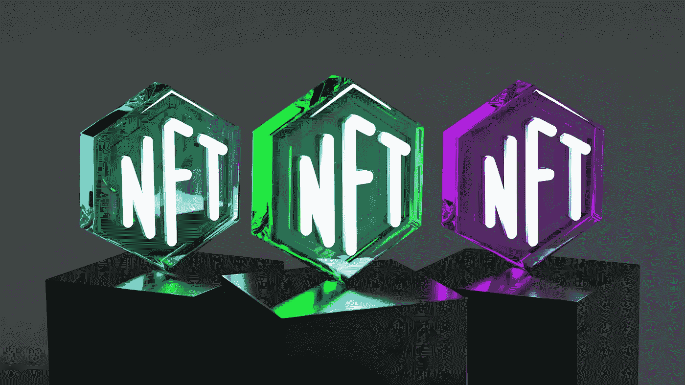
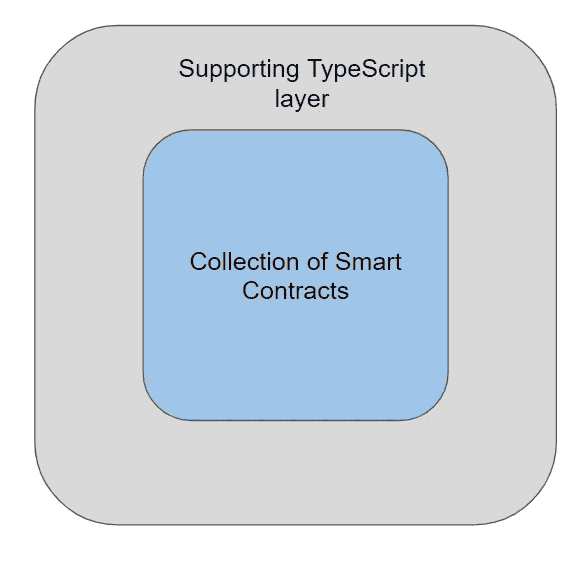

# 为什么海港协议将成为 NFT 市场的下一个标准

> 原文：<https://medium.com/coinmonks/why-seaport-protocol-will-be-the-next-standard-for-nft-marketplaces-c56360c21b94?source=collection_archive---------2----------------------->

## 海港协议简介

不可替代代币市场或简称 NFT 市场，是一个数字资产的在线市场。非功能性交易可以与其他非功能性交易进行交易，或者通过 NFT 市场进行买卖，这是一个分散的平台。NFT 市场与亚马逊或易贝等电子商务平台非常相似，卖家列出不同的产品，买家可以购买。

Photo by [Choong Deng Xiang](https://unsplash.com/@dengxiangs?utm_source=unsplash&utm_medium=referral&utm_content=creditCopyText) on [Unsplash](https://unsplash.com/s/photos/nft?utm_source=unsplash&utm_medium=referral&utm_content=creditCopyText)

在过去的几年里，数字资产已经成为加密世界的下一个大事件。因此，这些年来，非森林交易急剧增加。随着数字资产的普及，世界各地出现了越来越多的 NFT 市场。Opensea 、 [Rarible](https://rarible.com/) 是你能找到的一些最著名的 NFT 市场。

最近有越来越多的 NFT 市场出现的明显迹象，因此对这一领域的专业知识的需求正在增加。然而，建立一个成熟的 NFT 市场不是一朝一夕可以完成的，它需要大量的规划和跨领域的技能。

目前，一些 NFT 市场平台不支持来自其他平台的 NFTs，许多平台有不同的燃气费，需要由用户支付，一些平台只有有限的功能。

因此，很明显需要一个通用标准来简化平台开发者和用户的生活。这就是海港协议的用武之地。现在让我们详细看看什么是海港协议。

## 1.什么是海港

海港协议是由世界领先的 NFT 市场 Opensea 推出的。这个协议已经被开源，可以在[这里](https://github.com/ProjectOpenSea/seaport)找到。自 2022 年 7 月以来，Opensea 一直在他们的市场中使用这一新标准。他们还鼓励其他 NFT 市场开发者也使用他们的协议。

在我们研究海港协议由什么组成之前，让我们看看为什么 Opensea 决定为 NFT 市场发明一个新的协议。在进行大转变之前，Opensea 在他们的市场上使用了一种叫做[双足飞龙协议](https://wyvernprotocol.com/)的东西。Wyvern protocol 也是一个开源项目，由 Opensea 自己出资。但随着时间的推移，他们的代码库呈指数级增长，很难管理，而且使用该平台的用户的天然气费用太高。因此，Opensea 决定在他们的市场上实施一个新的协议。这就是《海港议定书》的诞生。

## 2.海港包括什么

海港协议实际上是智能合同的集合，它们共同充当 NFT 市场的主要逻辑。它还附带了一层 typescript 代码，可用于与智能合同进行交互。

作为一名开发人员，在理解海港协议的过程中，有三个概念需要理解。它们是“区域”、“市场”和“管道”。这些都是执行不同任务的智能合约的集合。市场契约或海港契约是所有执行/匹配逻辑发生的地方。这种智能合同是不可拥有的，不可升级的，并且已经部署到许多位于 EVM 的区块链，地址为`0x00000000006c3852cbEf3e08E8dF289169EdE581\.` 更多信息可以从海港 GitHub 页面[这里](https://github.com/ProjectOpenSea/seaport)找到。

管道的概念由两种类型的智能合约组成。“导管控制器”和“导管”。像海港合同一样，导管控制器合同也预先部署到地址为`0x00000000F9490004C11Cef243f5400493c00Ad63\.` 的大多数 EVM 连锁店。它也是一个无主和不可升级的合同，这保证了市场的分散性。

用户可以通过导管控制器部署导管。它们也是一个智能合同，用户向这些管道提供其数字资产的转移批准，以便在该市场中发生的任何交易中进行转移。如果用户不信任市场并且他们不愿意给予市场对他们的数字资产的转移批准，这是非常有用的。此外，管道所有者可以禁用管道，这样，即使订单已经提交，如果他们感到可疑，市场合同也不会转移他们的资产。

区域的概念也由两个智能合约组成。“暂停区域控制器”和“暂停区域”。与海港合同和管道控制器不同，可暂停区域控制器不是预先部署的。事实上，海港协议的创建者已经邀请我们编辑这两个智能合同的功能并自行部署，以便为协议增加一层灵活性。除此之外,《海港协议》中还有一个被称为“限制订单”的概念。这些订单只能通过相关区域执行。在下面的文章中会有更多的介绍。

## 为什么海港协议更好？

1.  *交易的原子结算* —通常在 NFT 市场中有两种物品转手(即 NFT 从卖方到买方，密码从买方到卖方)。从开发商的角度来看，这是一个关键问题，因为要么两个交易都应该发生，要么都不应该发生。在版税和平台费也需要在交易中转移的情况下，问题变得更糟。但是《海港协议》引入了“贸易的原子结算”的概念，在这种情况下，所有的项目或者不交换任何项目。如果你是一个程序员，这可以减少 1/3 的复杂性。
2.  *通过区域和管道提供额外的安全性和灵活性。—* 如上所述。将在下面的文章中进行更详细的讨论
3.  *少交油费。(与 wyvern 协议相比减少 30%)—*使用汇编语言和冷气体减少技术，海港协议的开发者已经成功地大幅减少了气体费用。
4.  *与使用 seaport 协议的其他平台交叉兼容。*
5.  *安全性经过审核，完善的智能合同。*

## 接下来是什么…

本文是对 seaport 协议的介绍，强调了它为开发人员和用户带来的好处。在接下来的文章中，我将描述这些独特的特性并深入研究代码，这样任何希望使用 seaport 协议构建 NFT 市场的开发人员都会发现它非常有用。

到时候见！！！

## 资源

1.  海港 GitHub 页面—[https://github.com/ProjectOpenSea/seaport](https://github.com/ProjectOpenSea/seaport)
2.  双足飞龙协议—[https://wyvernprotocol.com/](https://wyvernprotocol.com/)

> 交易新手？尝试[加密交易机器人](/coinmonks/crypto-trading-bot-c2ffce8acb2a)或[复制交易](/coinmonks/top-10-crypto-copy-trading-platforms-for-beginners-d0c37c7d698c)