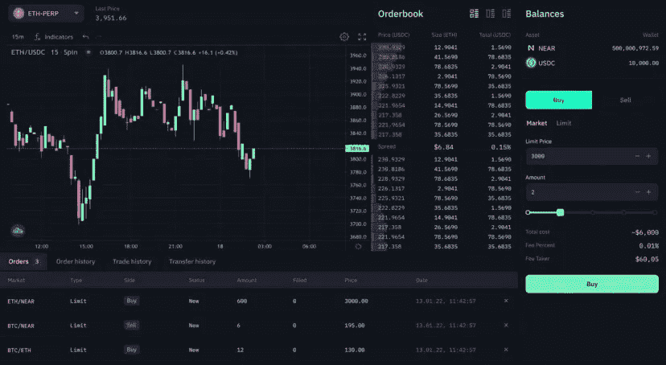

# 为什么 Sei 会给 DeFi 的发展带来新的推动力？内置链上订单簿。

> 原文：<https://medium.com/coinmonks/why-sei-will-give-a-new-impuls-to-the-development-of-defi-built-in-on-chain-orderbook-610bf955a8d6?source=collection_archive---------20----------------------->

大家好！[早前](/@elnazik/is-sei-the-dark-horse-of-the-next-bullrun-373b93613369)我们遇到了 [Sei](/@seinetwork) ，一个去中心化金融和交易的一级区块链。

在本文中，我们将进一步了解什么是订单簿，它的优势，链外交易和链内交易的主要区别，以及为什么 Sei 是目前开发和扩展 DeFi 产品的最佳解决方案。

**秩序册简介。**
买卖指令簿(orderbook)是在集中和分散交易所买卖金融工具的指令簿，按价格水平组织。在这种技术的帮助下，交易以各种方式进行，包括限价和市价单。它可以让交易变得快捷方便。自从 30 年前纳斯达克采用电子订单簿以来，订单簿已经成为组织和构建订单的黄金标准。

经典的订单簿模型是所有最大的集中式交易所的主要交易技术范式，不仅在密码领域，而且在很长一段时间内也在传统金融市场中。它一次又一次被证明是投资和交易的可靠、快速和高效的工具。

**什么是链外和链内交易？**

什么是链上/链下交易？链外交易是在加密货币网络上进行的交易，将资产价值从区块链转移出去。反过来，链上交易直接发生在链本身。历史上，在币安、FTX、比特币基地和许多其他交易所，场外订单一直主导着永久和现货交易。得益于此，CEXes 几乎实现了零交易成本和即时订单执行。非连锁订单簿的主要缺点是它们的集中性质和增加的监管风险。同时，on-chain sphere 在其发展的相当早期阶段，经常存在相当多的问题:流动性不足、高佣金(汽油价格)、各种各样的延迟和黑客攻击。这给在这个领域工作和开发的开发人员和用户都带来了使用上的不适。总的来说，有些事情是需要努力和工作的。

Sei 是一个分散化和现代化 DeFi 世界的工具。

那么 Sei 作为第一层交易解决方案提供了什么呢？首先，你需要理解 Sei 是建立在 Cosmos SDK 和 Tendermint Core 之上的，后者是区块链最常用的框架。Sei 有一个订单簿基础设施，内置于网络的基础层，存储在区块链上，这使得团队能够优化工作的速度和随机性。由于高流动性、快速订单执行速度、良好的吞吐量和可靠性，它还为建立在 Sei 基础上的新 DeFi 项目带来了巨大的前期投入。

Sei 和他的在线订单簿。

正如您已经了解的那样，Sei 有一个内置的订单簿，它将与所有基于它构建的应用程序架构完美同步。这实际上可以解决开发人员和用户在使用链上产品时面临的大部分问题。高流动性、难以置信的快速执行速度、同时处理大量交易、透明和分散化是该项目的明显优势，这在未来可能是吸引机构和扩大 DeFi 交易的关键。

**总结:** Sei 的架构及其内置的链上订单簿将为去中心化的金融世界带来新鲜空气，并将帮助许多强大的开发团队扩展视野。它将从集中交易所吸引新的流动性。如果 Sei 团队实现了他们的想法，那么通过找到 bug 和添加新的小细节就可以取得巨大的成功——这真的是朝着这个游戏的重大变化迈出的重要一步。

更多信息你可以在 Sei 社交媒体上找到-【https://linktr.ee/seinetwork 

感谢大家的关注，再见:)

> 交易新手？尝试[加密交易机器人](/coinmonks/crypto-trading-bot-c2ffce8acb2a)或[复制交易](/coinmonks/top-10-crypto-copy-trading-platforms-for-beginners-d0c37c7d698c)