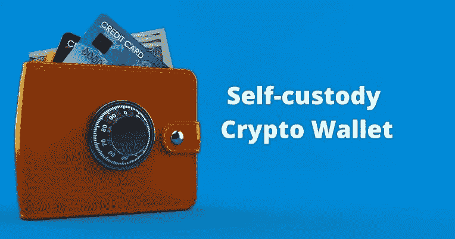

# 为什么独自保管不足以在 DeFi 中保护您的资产。

> 原文：<https://medium.com/coinmonks/why-self-custody-alone-is-not-enough-to-protect-your-assets-in-defi-10ee7893f78?source=collection_archive---------34----------------------->

Image credit: Technext

近年来，分散融资(DeFi)作为一种不需要传统中介就能获得金融服务的新方式，受到了广泛关注。虽然 DeFi 有可能彻底改变金融行业，但它也有自己的一系列风险，用户应该意识到这些风险。

在这篇博文中，我们将探讨与 DeFi 相关的不同风险，并讨论如何最大限度地减少这些风险。

**智能合约漏洞:**

智能合同是自动执行的合同，买卖双方之间的协议条款直接写入代码行。虽然智能合约在 DeFi 中是一个强大的工具，但它们也容易受到错误或恶意攻击。

> 交易新手？在[最佳加密交易](/coinmonks/crypto-exchange-dd2f9d6f3769)上尝试[加密交易机器人](/coinmonks/crypto-trading-bot-c2ffce8acb2a)或[复制交易](/coinmonks/top-10-crypto-copy-trading-platforms-for-beginners-d0c37c7d698c)

2022 年，Terra 项目的崩溃凸显了智能合约漏洞的危险。Terra 的整个生态系统依赖 LUNA 维持其价格，或者至少不遭受严重的价格贬值。深知这一弱点，卢娜基金会卫队(LFG)开始在卢娜的支持下，用比特币支持 UST 盯住美元。

该模型的弱点在 2022 年 2 月已经显现。一个昵称为“N3m0”的 Anchor 社区成员请求 LFG 提供 4 . 5 亿美元来支持 Anchor 储备，以支撑不断下降的收入。Anchor 稳定的硬币收益率如此之高(高达 20%)，以至于没有金字塔底部的不断扩大，它就变得不可持续。

批评者称这种商业模式是典型的庞氏骗局。在 Terra 的治理论坛上，N3m0 预测 Anchor 将在 11 月耗尽稳定的 coin 收益。事实证明，秋天来得更早。

当 LUNA 在春季的熊市中开始下跌时，许多投资者从 Terra 生态系统中撤出了资金，以 Anchor 为首。这引发了一场经典的银行挤兑，加深了整个加密领域的抛售。

在不到一周的时间里，从 5 月 5 日到 5 月 11 日，LUNA 的价格从 65 美元跌到了 0.25 美元。露娜崩溃了。

**流动性风险:**

流动性是指以稳定的价格快速购买或出售资产的能力。DeFi 协议通常依赖于流动性池，用户可以提供流动性，以换取该池产生的部分费用。虽然流动性池可以提供赚取被动收入的机会，但它们也伴随着流动性风险。如果资产池中的资产价值大幅下降，流动性提供者可能无法在不遭受重大损失的情况下退出头寸。

"*为了最大限度地降低您的流动性风险，重要的是分散您的投资组合，并且只向已经建立并享有良好声誉的流动性池提供流动性。*

**市场波动:**

像任何资产类别一样，加密货币和 DeFi 生态系统中的其他资产的价值可能会大幅波动。虽然市场波动可能带来机遇和风险，但也可能难以预测。为了最大限度地减少市场波动对你的影响，重要的是分散你的投资组合，不要投资超过你能承受的损失。

**其他风险:**

除了智能合约漏洞、流动性风险和市场波动之外，在 DeFi 生态系统中运营时还需要考虑许多其他风险。这些风险可能包括但不限于:

*   网络安全威胁，如黑客攻击或网络钓鱼攻击
*   运营风险，如底层基础设施问题或服务中断
*   监管风险，因为 DeFi 生态系统仍处于早期阶段，监管框架仍在制定中

**自我保管在防范违约风险方面的局限性**

为了确保您在分散金融(DeFi)生态系统中的资产安全，遵循资产保护的最佳实践非常重要。这些可能包括:

*   研究和了解与每个 DeFi 协议或平台相关的风险
*   只使用有信誉的和经过严格审查的协议
*   跨多种协议和资产分散您的投资组合
*   将资产存放在安全的自我保管钱包中
*   使用强而唯一的密码并启用双因素身份验证

**总之**

总之，自我保管，或在个人钱包中持有自己的资产而不是依赖第三方持有资产的行为，是分散金融(DeFi)生态系统中资产保护的重要组成部分。通过自行保管您的资产，您可以降低第三方盗窃或损失的风险。然而，独自保管不足以在 DeFi 中保护你的资产。还有许多其他与 DeFi 相关的风险，包括智能合约漏洞、流动性风险和市场波动，这些都是自我托管无法防范的。

为了最大限度地提高您在 DeFi 中资产的安全性，遵循资产保护的最佳实践非常重要，例如研究和了解与每个 DeFi 协议或平台相关的风险，使用声誉良好且经过严格审查的协议，使您的投资组合多样化，以及使用强大、独特的密码和双因素身份验证。通过了解风险并遵循最佳实践，您可以最大限度地降低 DeFi 中的风险，并最大限度地提高资产的安全性。

然而，需要注意的是，没有一种风险管理策略是万无一失的，任何投资都存在一定程度的风险。因此，重要的是只投资你能承受的损失。

**参考:**

https://t.co/gfS5RBsJKt

**关于作者**

嗨，我是 Innocent，一个 Web3 内容作者，有计算机工程和分布式系统的背景。在过去的几年里，我一直在写关于区块链技术和去中心化应用的文章，我热衷于帮助人们理解 Web3 的潜力以及它如何塑造互联网的未来。

我拥有 Olabisi Onabanjo 大学的计算机工程学位，并参与了许多 Web3 项目。作为一名作家，我的重点是帮助人们了解 Web3 的技术和哲学基础，以及探索这一新兴技术的实际应用和意义。

你可以在我的网站 [Medium page](/@eluferedonatus) 上找到更多我写的东西，或者在 [LinkedIn](https://www.linkedin.com/in/innocent-elufere-935117221?lipi=urn%3Ali%3Apage%3Ad_flagship3_profile_view_base_contact_details%3BABgffhr7RxeFVORha6YBgA%3D%3D) 上与我联系。如有任何问题，请随时联系。