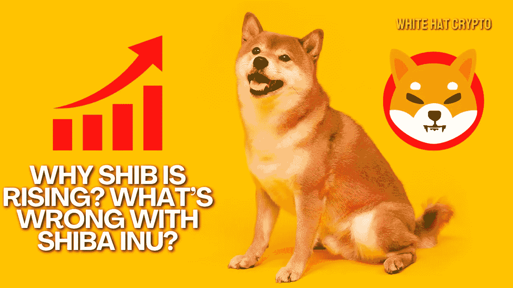

# SHIB 为什么崛起？柴犬怎么了？

> 原文：<https://medium.com/coinmonks/why-shib-is-rising-whats-wrong-with-shiba-inu-3bfd2d677348?source=collection_archive---------12----------------------->

柴犬硬币在过去一周一直在运行，尽管事实上整个加密市场已经下跌，由于一波清算。

虽然经过本周的抛售后，整体加密市场仍处于低迷状态，但某些加密货币正在拒绝这种负面趋势。

根据 CoinMarketCap 的数据，SHIB 柴犬(Shiba Inu)当日上涨超过 4.5%，本周上涨超过 7%，并稳步攀升至 0.0000135 美元。

SHIB 的价格上涨是在本周早些时候令牌的燃烧率提高之后。根据 [Shib Burn Tracker](https://shiba-burn-tracker.com/) 的数据，持有者在 8 月 17 日烧掉了略低于 1500 万 Shib，而在 8 月 18 日这一数字跃升至超过 1.8 亿，峰值超过 1.100%。

但是，这种增长似乎是短暂的；据 [ShibBurn](https://www.shibburn.com/) 报道，在过去的 24 小时内，代币燃烧率已经恢复了 90%以上。

为了降低代币的发行量，4 月建立了 SHIB 代币焚烧机制；SHIB 持有者燃烧他们的代币可以获得一个产生收益的代币，burntSHIB，它以 RYOSHI 支付奖励，这是另一个 ERC-20 代币。

在上周，我们报道了柴犬元宇宙，它让 SHIB 成为社交媒体上的热门话题。

根据 Shiba Inu 社区主要成员 Shytoshi Kusama 最近的暗示，期待已久的著名加密货币 Shiba Inu 的 Shibarium 元宇宙越来越接近向 Shibarium 加密社区透露。

他预计《元宇宙》将在夏末秋初发布，可能在 8 月到 10 月之间。

这表明在 SHIB 社区有很多事情正在发生，这导致了 SHIB 对一般市场趋势的蔑视！

这篇文章中提供的内容不是赞助的，据我所知是正确的。这篇文章不是金融建议，我们不对针对这篇文章采取的任何行动负责！

请随时查看我们的社交平台，了解每日加密更新，或通过以下渠道联系我们:

[YouTube](https://www.youtube.com/channel/UCjfinzatswbVaRd89zn5kJQ/featured)

[推特](https://twitter.com/whitehatcrypto)

[Instagram](https://instagram.com/white.hatcrypto?igshid=YmMyMTA2M2Y=)

[Gmail](http://cryptowhitehat@gmail.com/)

信息来源:解密，硬币市场资本

> 交易新手？试试[密码交易机器人](/coinmonks/crypto-trading-bot-c2ffce8acb2a)或者[复制交易](/coinmonks/top-10-crypto-copy-trading-platforms-for-beginners-d0c37c7d698c)