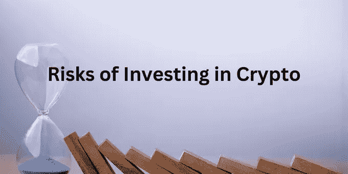

# 为什么每个人都应该拥有加密货币？

> 原文：<https://medium.com/coinmonks/why-should-everyone-own-cryptocurrency-d9fae4851a2?source=collection_archive---------19----------------------->

在过去的几年里，加密货币像野火一样流行起来。投资者见证了 2021 年的创富机会。然而，极度的波动也动摇了普通大众的信念。

考虑到意外的波动，你可能会问为什么人们仍然喜欢投资加密货币。在这篇文章中，你会得到这个问题的答案。

# **投资加密货币的优势**

## **价值储存——对冲通胀**

比特币等加密货币可以很好地对冲通胀。通货膨胀意味着商品和服务价格的上涨以及货币购买力的下降。以前，黄金作为一种价值储存手段曾是首选的投资选择。通过投资加密货币，你不仅可以储存你的钱的价值，而且它可以跑赢通货膨胀，随着时间的推移增加你的财富。

## **优秀的多元化**

分散你的投资组合意味着把你的投资分散到不同的篮子里，有不同的风险回报比率。股票和债券等传统投资可以帮助你创造高收益。然而，加密市场可以给你意想不到的回报。尽管 FTX 事件后市场呈现出下滑趋势，但它已经证明了它能增长多少。如果看数据，比特币和以太坊分别给出了 60%和 404.2%的回报。

## **大玩家采用区块链**

大约 40%的美国前 100 名公司正在以某种方式使用区块链技术。尽管遇到了所有的挫折和监管的不确定性，大公司意识到这项技术的潜力，正在将区块链融入生态系统。随着区块链技术的广泛采用，相关加密货币的价格预计也会上涨。

## **轻松跨境支付**

目前，根据世界银行的报告，跨境支付的平均成本约为 6.75%。费用比 2009 年的时候少多了，也就是 9.67%。但是，对于一个属于中产家庭的人来说，还是一笔不小的数目。而加密货币作为一种支付方式，解决了这个问题。

加密货币可以在没有任何第三方干扰的情况下从一个钱包发送到另一个钱包，这将交易成本降低到了一个显著的水平。虽然乌克兰的银行机构因战争而关闭，但资金正通过加密货币转移到该国。

## **赚取被动收入**

交易并不是通过加密货币赚钱的唯一选择。有多种方式赚钱，通过加密，你不必投资你的时间，钱会为你工作。其中一些例子包括赌注和出借你的密码。选择这个选项可以从闲置的数字资产中获得高收益。 [NavExM 还为 NavC 的早期投资者提供了下注机会](/@NavExM/cryptocurrency-staking-aa13f78ef72c),在这里你可以在交易所获得难以置信的收益。此外，由于[价格膨胀](/@NavExM/what-is-value-variance-inflationary-cryptocurrency-bba702d5d2a5)，预计 NavC 将呈指数增长。

# **投资密码的风险**

尽管投资加密货币有多种好处，但它也有自己的缺点。

## **加密规则的不确定性**

如果出了问题，在股票市场或银行方面，你会得到政府的支持。然而，如果你陷入一个秘密的骗局，没有保证你能从政府那里得到任何帮助，因为在许多国家它还没有被监管。进一步的匿名使得追踪故障点变得困难。然而，考虑到区块链技术的潜力和加密货币的大规模采用，各国政府正在采取措施制定该领域的法规。

## **高波动性**

加密市场因其惊人的起伏而闻名。与股票不同，加密市场非常不稳定。事实上，这是获得巨额财富的一条途径。然而，这种波动造成了数十亿美元的损失。此外，在加密市场中，没有预先定义的方法来得出资产的实际价值，这使得风险更大。因此，在完成尽职调查后，投资虚拟资产是非常重要的。

## **高税率**

印度等国家已经对加密货币征收重税。你需要为交易量支付 1%的 TDS，并为你通过交易虚拟资产获得的利润支付 30%的税。这是一个巨大的数额，在实施税收政策后，国家目睹了每日交易量的大幅下降。然而，印度仍然是密码交易量最高的国家之一。

现在，你可能会想，投资加密货币安全吗？问题很明显。事实上，由于缺乏监管框架，存在一些风险。然而，如果你在分析了所有方面之后投资一个真正的项目，从长远来看，你很有可能会获得难以置信的回报。如果你更喜欢交易，可以先开始学习加密货币和技术分析。从长远来看，这将有助于你取得胜利。

*   这不是投资建议。请在投资前做好自己的研究。
*   *T & C 适用
*   加密产品不受监管，风险很高。对于此类交易的任何损失，可能没有监管追索权。

NavExM 社区成员可以在没有*交易费的情况下进行交易，并在每次交易中获得高达*0.10%的交易价值作为*返现奖励。

NavExM 测试版将很快发布。您可以加入 NavExM 蓬勃发展的社区。

**了解更多关于这个机会的信息，https://t.me/nav_exm******。
在 NavExM.com 上注册，获得 3 美元 NavC 代币作为欢迎红利。****

> **加入 Coinmonks [电报频道](https://t.me/coincodecap)和 [Youtube 频道](https://www.youtube.com/c/coinmonks/videos)了解加密交易和投资**

# **另外，阅读**

*   **[OKEx vs KuCoin](https://coincodecap.com/okex-kucoin) | [摄氏替代品](https://coincodecap.com/celsius-alternatives) | [如何购买 VeChain](https://coincodecap.com/buy-vechain)**
*   **[ProfitFarmers 点评](https://coincodecap.com/profitfarmers-review) | [如何使用 Cornix 交易机器人](https://coincodecap.com/cornix-trading-bot)**
*   **[如何匿名购买比特币](https://coincodecap.com/buy-bitcoin-anonymously) | [比特币现金钱包](https://coincodecap.com/bitcoin-cash-wallets)**
*   **[瓦济里克斯 NFT 评论](https://coincodecap.com/wazirx-nft-review)|[Bitsgap vs Pionex](https://coincodecap.com/bitsgap-vs-pionex)|[坦吉姆评论](https://coincodecap.com/tangem-wallet-review)**
*   **[如何使用 Solidity 在以太坊上创建 DApp？](https://coincodecap.com/create-a-dapp-on-ethereum-using-solidity)**