# 为什么索拉纳比你想象的更分散

> 原文：<https://medium.com/coinmonks/why-solana-is-more-decentralized-than-you-think-d3710249a92?source=collection_archive---------2----------------------->

*作者:Max Sherwood，Ultimate
@wholegrainmax* 的增长经理

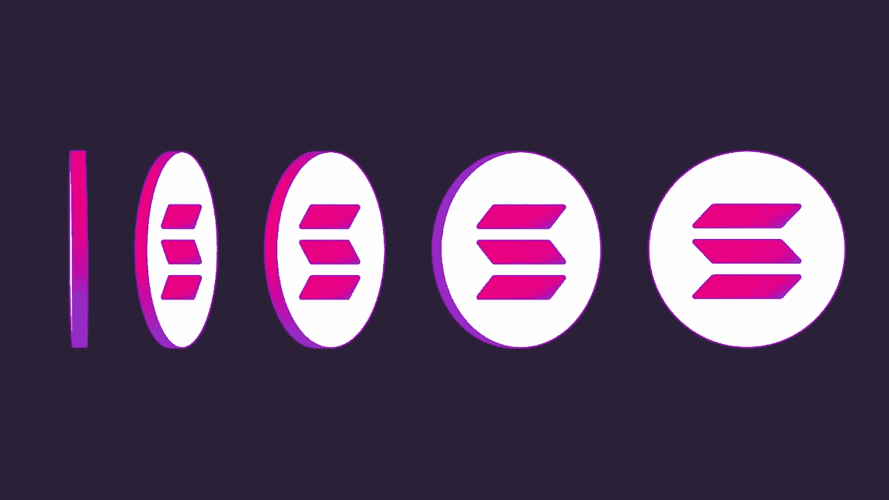

**索拉纳的活跃验证机数量接近 2000 台，远远高于其他连锁店**

自从索拉纳基金会在一条[推特上宣布活跃验证者的数量超过 1000 以来，已经过去了 12 个月，现在索拉纳有 1875 个活跃验证者。](https://twitter.com/SolanaFndn/status/1442523925276241932/photo/1)

Solana’s validator count has grown steadily since the launch of mainnet beta

这给了索拉纳最积极的验证者，几乎可以证明区块链的利害关系。(以太坊有 8417 个[节点](https://www.nodewatch.io/)和 409k 个[验证器](https://beaconcha.in/)，但是一些节点操作符会运行[多个验证器](https://www.rated.network/)，所以不确定有多少节点操作符……)

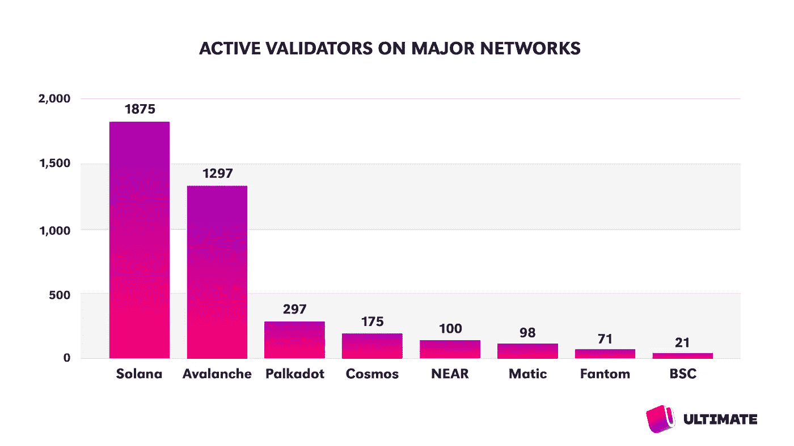

Solana now has more active validators than most Proof of Stake blockchains

**大多数验证者在美国和德国，这不是索拉纳独有的**

使用 [validators.app](https://www.validators.app/data-centers?locale=en&network=mainnet&sort_by=data_center) 查看索拉纳验证器的位置，我们看到几乎一半位于美国和德国。这是有问题的，不幸的是，这不是索拉纳独有的:如果我们看看以太坊节点的位置(并非所有节点都是验证器)，分布同样由美国主导，占 46%的份额，德国以近 12%的份额位居第二。Avalanche 是唯一一家拥有超过 1000 个验证器的网络，它的验证器有超过 75%在美国和德国。

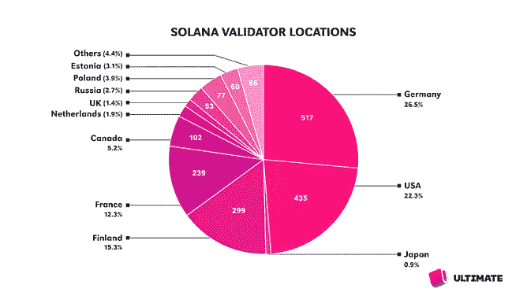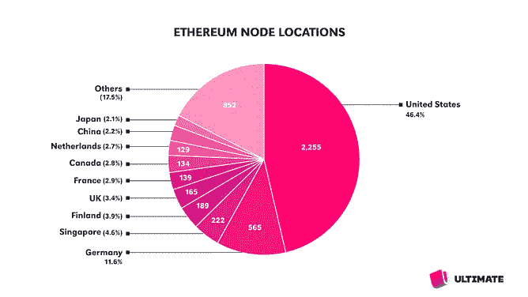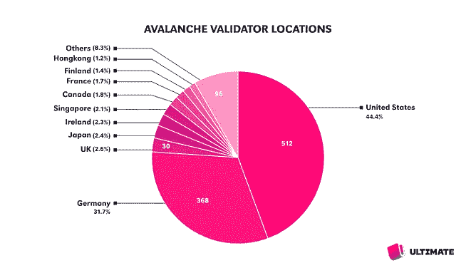

Solana, Ethereum, and Avalanche have the majority of their validators in the US and Germany

**验证地理多样性很重要**

如果太多的验证者集中在同一个地方，区块链的健康将依赖于这些国家的监管制度。专业验证者是企业，使用银行账户和加密交换，与托管提供商或数据中心建立合同关系，执行工资和人力资源职能，并纳税。不断变化的法规使这些商业活动受到质疑。最极端的例子是中国[在 2021 年 5 月禁止](https://www.aljazeera.com/economy/2021/5/24/china-crackdown-forces-crypto-mining-operators-to-end-operations)开采比特币，这迫使矿工[迅速](https://www.vice.com/en/article/7kb3aa/how-bitcoin-mines-were-airlifted-from-china-to-the-us)搬迁，并导致比特币的哈希值在两周内大幅下跌 50%。

不断变化的法规并不是寻求地理多样性的唯一原因。2011 年，日本致命的地震和海啸严重考验了数据中心和整个电网的恢复能力。Everstake，目前是[最大的索拉纳验证机](https://www.validators.app/validators/EvnRmnMrd69kFdbLMxWkTn1icZ7DCceRhvmb2SJXqDo4?locale=en&network=mainnet&order=&refresh=)，恰好是一家乌克兰公司。谢天谢地，他们的首席执行官声称已经为战争做好了准备，[解释说](https://cointelegraph.com/news/ukraine-based-blockchain-firm-announces-we-re-still-hiring-amid-market-downturn-war)“做生意的一个重要部分就是评估和解决所有潜在的风险。”

虽然我们可以讨论“去中心化”的确切定义，但让验证者遍布全球是最理想的——索拉纳和其他区块链在这方面还有改进的空间。

大多数验证器都托管在 AWS 和 Hetzner 上，这并不是 Solana 独有的

云计算的出现使得建立区块链节点和验证器变得很容易。按月付费给亚马逊网络服务(AWS)，他们担心数据中心和硬件，你要做的就是运行客户端。虽然不是最便宜的选择，但它比在家里运行机器更容易和安全，在家里，互联网或电源中断可能会导致严厉的惩罚。

随着这些方便的主机提供商变得流行，区块链变得更加依赖他们。今天，超过三分之一的索拉纳验证程序在赫茨纳上运行，只有不到五分之一在 OVH 上运行。相比之下，Avalanche 有整整 45%的验证器在亚马逊上运行。在以太坊上，几乎三分之一的节点运行在亚马逊上，但值得称赞的是，另外 30%的节点运行在住宅(在家)互联网连接上。

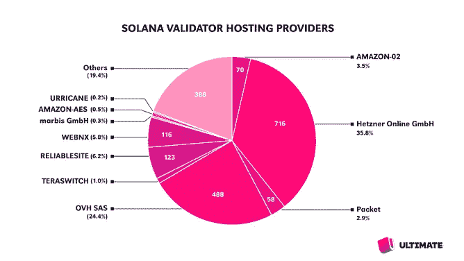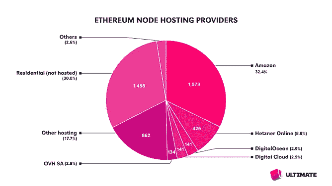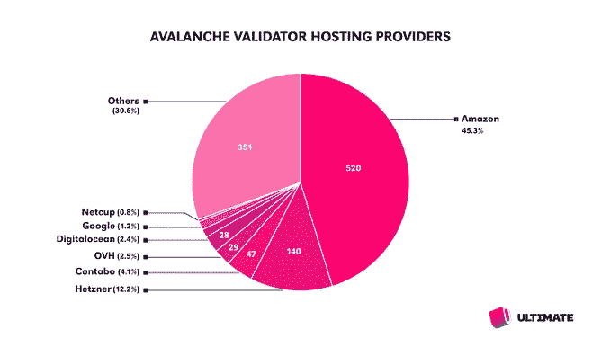

Many validators of Solana, Ethereum and Avalanche are hosted on Amazon, Hetzner, and OVH

这一点很重要，因为即使是最大的主机提供商也不能幸免于宕机——AWS 在 2021 年 12 月遭遇了三次宕机。对于区块链来说，过度依赖单一的主机服务提供商，尤其是单一的数据中心是非常危险的。如果大部分节点同时离线，网络达成共识的能力就会受到质疑，可能会导致大规模的攻击事件。

**缺乏验证器分散化不仅仅是索拉纳的问题**

上述数据令人惊讶，甚至令人担忧。诚然，索拉纳网络过于依赖美国和德国以及少数主机提供商。不幸的是，这不仅仅是索拉纳的问题，从验证者的角度来看，索拉纳可能是“最不集权”的区块链之一。

今天的主要区块链对特定国家和托管服务提供商的过度依赖大大降低了这些区块链网络的弹性。我们应该对我们的区块链有一个整体的看法，在指责任何一个链是“集中的”之前，思考如何提高它们的弹性。

像 Lido 这样的液体赌注池处于这一挑战的最前沿，因为它们负责组装一组不同的验证器。Lido 试图通过创建一个强大而多样的验证器集来消除网络连接问题、运营商妥协和监管捕获的风险，该验证器集在法律上和物理上是不相关的，在地理上和司法上是分布式的，并且具有各种内部基础设施和云提供商。

然而，在判断区块链的去中心化时，有更多的变量需要考虑，所以让我们回到 Solana，并检查验证器中标记的分布。

**中本聪系数:索拉纳社区关心分配股权**

但是，定义网络去中心化的关键不仅仅是验证器的数量，还有这些验证器之间的标记分布。一个网络可以有成千上万个验证器，但是如果 99%的令牌都由一个验证器控制，那么这个验证器将控制块生产和区块链。

“中本系数”是 Balaji Srinivasan 创造的一个指标，以比特币的创始人命名，被定义为累计持有该网络 33%赌注令牌的最小数量的验证者。理论上，根据网络的共识机制，这些验证者的勾结将能够审查网络的交易或完全停止它。因此，较高的 Nakamoto 系数代表较高的标记分布和较高的分散程度。

由于中本聪的系数为 27，索拉纳在验证者中的股份分布比 Cosmos 或 NEAR 等其他网络更好。虽然 Polkadot 的验证器数量只有 Solana 的 15%,但它的 Nakamoto 系数却是 Solana 的三倍，这是因为它的赌注机制要求在验证器之间平均分配股份。

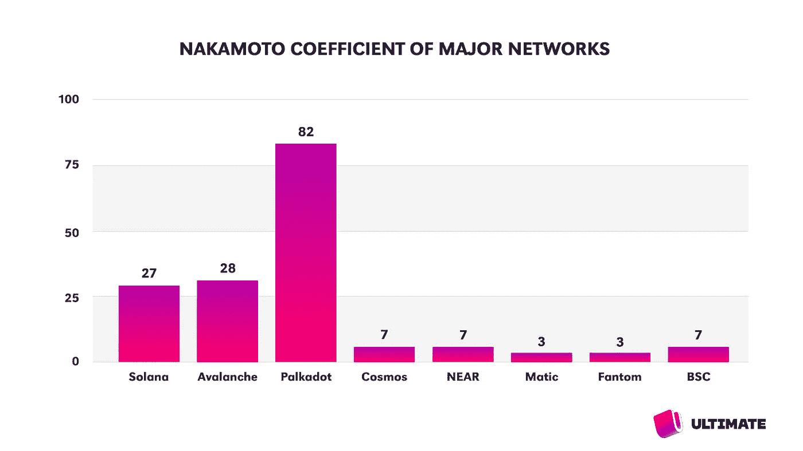

The Nakamoto coefficient is defined as the smallest number of validators who cumulatively stake 33% of the network’s staked tokens. A higher Nakamoto coefficient means a more even distribution of staked tokens.

索拉纳社区正在采取措施进一步提高中本系数。默认情况下，block explorer[Solana Beach](https://solanabeach.io/validators)的访问者只能看到构成 Nakamoto 系数的“超级少数”验证器之外的验证器。会显示一条消息:“上面的累积股份可以停止网络-改善分散化并委托给下面的验证者。”

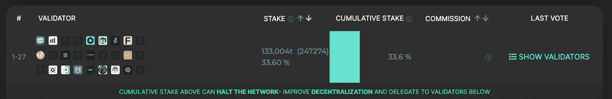

[solanabeach.io/validators](https://solanabeach.io/validators) encourages visitors to stake to smaller validators

Liquid staking pools 也明白这一点的重要性，T2 Lido T3 只接受来自这个超级少数群体之外的新节点操作者，T4 marina de T5 同样只委托给群体之外的验证者。索拉纳基金会的委托程序，我们将在后面更详细地讨论，也只将 stake 委托给超级少数集之外的验证者。

所有这些行为加在一起，不会惩罚或处罚具有最大股份的验证器，而是鼓励委托给较小的验证器，以便尽可能平均地分配有股份的令牌。索拉纳的中本系数在过去的几个月和几年里稳步提高，我们可以假设它在未来会继续提高。

**验证器硬件价格昂贵——索拉纳基金会提供支持**

为了实现去中心化，区块链需要让人们容易地运行节点和验证器，最好是低成本的。由于 Solana 的设计理念——能够随着硬件的不断改进而扩展区块链——Solana 验证器是严肃的机器，具有不便宜的高性能硬件。为了避免验证者不得不投资昂贵的硬件，Solana 基金会与数据中心公司 Edgevana、Equinix、Lumen 和 Stackpath 合作创建了一个[服务器租赁计划](https://solana.org/server-program)。索拉纳基金会通过大宗采购协议启动了这个项目，并且不从销售中获利。

**没有进入激活集的最小赌注**

许多网络可以在廉价的硬件上运行，但需要大量的标记才能进入验证者的“活动集”，这些验证者对网络共识做出了贡献。我们研究的网络中，超过一半的网络需要超过 10 万美元的令牌来支持验证器进入活动集。Solana 验证器可以用 1 个 SOL 令牌开始，但是还有其他障碍，我们将在下一节讨论。

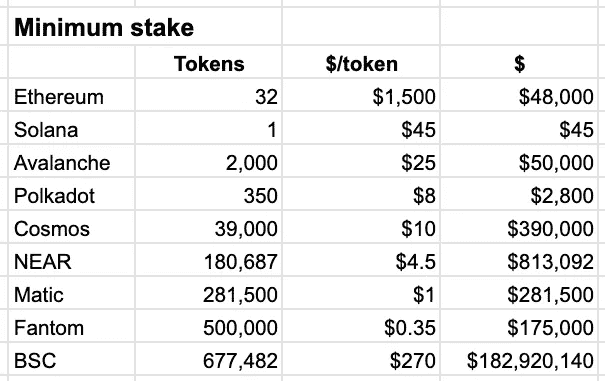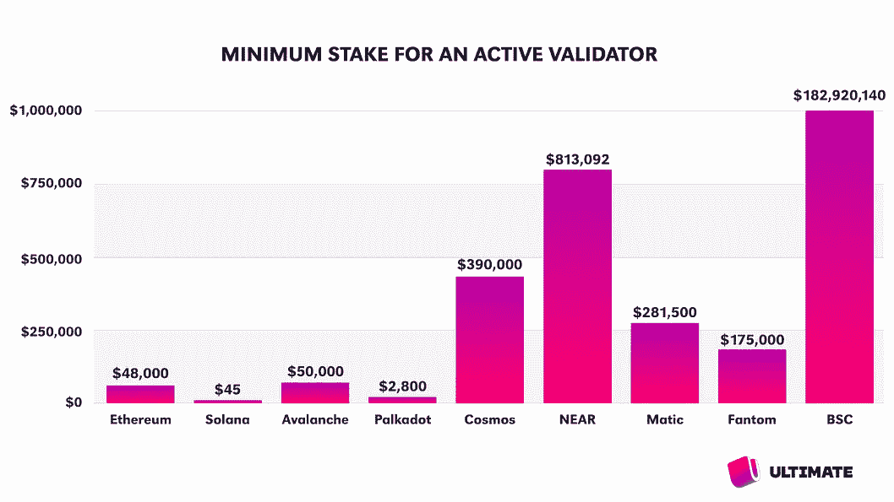

**投票成本很高——索拉纳基金会的代表可以提供帮助**

索拉纳验证者可以用 1 索尔令牌开始促成网络共识，但他们面临着一个经济挑战:验证者必须不断参与投票交易，交易费用每天约为 1.1 索尔。(目前约为 50 美元/天)因此，对于一个达到 10%佣金收支平衡的验证者来说，他们需要 45k 由第三方投资的 SOL(约 200 万美元)，或者 5k 自己投资的 SOL。目前，索拉纳的 1875 名验证者中有 1300 名持有足够的股份，可以在投票成本上实现收支平衡。

为了帮助验证者实现盈利，索拉纳基金会已经创建了[授权计划](/solana-labs/announcing-the-solana-foundation-delegation-strategy-5bcccf9104ab)，据此基金会 80%的资金(1 亿索尔)将由验证者持有。为了进一步分散网络，基金会的令牌被[专用于](https://solana.org/delegation-criteria)超少数集之外的较小验证者。

为了网络的健康和安全，重要的是流通中的索拉纳令牌被标记给验证者，并且验证者不依赖于由索拉纳基金会做出的委托或决定。但是，由于超过 75%的令牌被下注，索拉纳拥有区块链所有赌注证明中最高的赌注比率之一，确保了其共识的安全性和大量验证者的盈利能力。

**索拉纳的令牌组学以可能的分散化为代价实现了强大的基础和生态系统资助**

对索拉纳的一个普遍批评是，他们选择在私人轮次中向投资者出售许多代币，而在一次 ICO 中只向公众出售 1.6%。

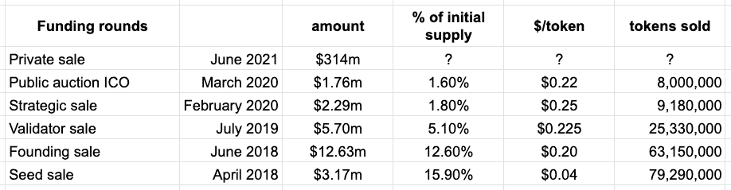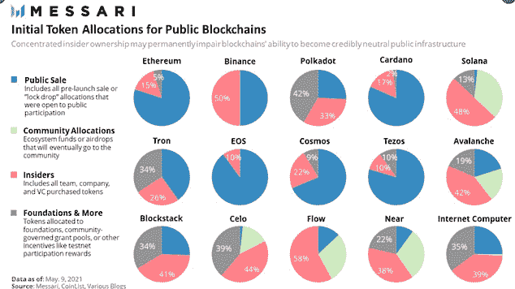

虽然索拉纳代币经济学在这方面不同寻常，但索拉纳基金会定期发布[透明度报告](https://solana.com/tokens)，概述代币的动向以及投资者代币解锁的日期。然而，在 2020 年 4 月，有一笔对做市商的贷款引起了争议，这笔贷款没有向公众公布，但被一个街区探索者发现了。(其中一些代币后来被烧掉了，但不管怎样，社区似乎对基金会失去了一些信任。)

2020 年 3 月公开发售后，Solana 推出 mainnet beta，SOL 于 4 月开始在公开交易所交易。现在，公众有机会在公开市场上购买代币，2020 年 4 月、5 月和 6 月的代币交易价格在 0.50 美元至 0.75 美元之间。这些价格比私下销售高出 2-3 倍，但远低于 SOL 在 2021 年最终攀升至的 200 美元。

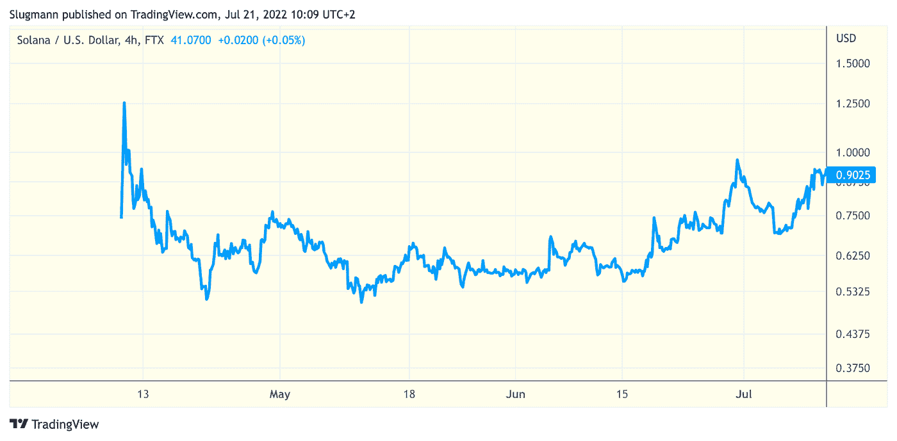

There was opportunity for the public to purchase tokens in the open market between $0.50 and $0.75 in April, May, and June of 2020\. The price of SOL would eventually climb beyond $200 in 2021.

仍然存在的普遍批评是索拉纳基金会决定将很大一部分代币置于他们的控制之下。最初代币供应量的 11%分配给基金会，另外 37%由他们通过社区储备基金控制。随着时间的推移，新创造的代币将被发放给代币持有人，代币供应总量将增加，基金会的份额将成为代币供应的一小部分。到 2027 年，基金会将分配 7.7%的代币供应，社区储备占代币的 25.5%。(使用 Messari 的交互式[图表可以更好地理解供应量)](http://messari.io/asset/solana/profile/supply-schedule)

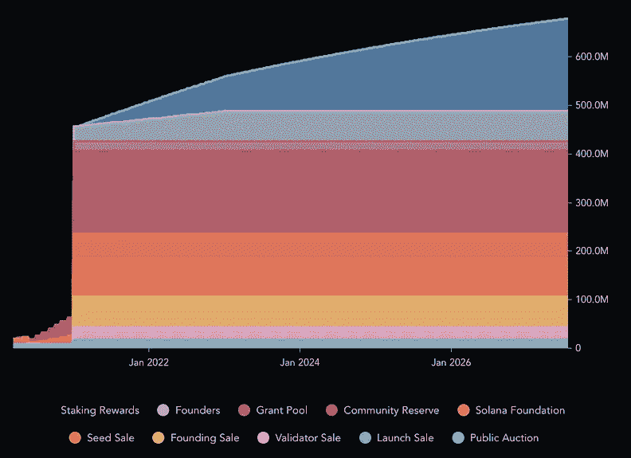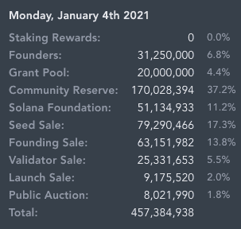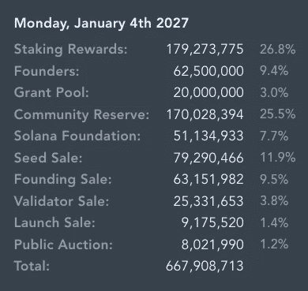

Source: [messari.io/asset/solana/profile/supply-schedule](https://messari.io/asset/solana/profile/supply-schedule)

索拉纳基金会利用他们的代币分配来支持对生态系统的投资，开展像之前讨论的服务器计划和授权计划这样的活动，以及对生态系统项目的资助——根据 Crunchbase 的说法，[索拉纳基金会](https://www.crunchbase.com/organization/solana-foundation/recent_investments)已经进行了 15 项投资，[索拉纳风险投资](https://www.crunchbase.com/organization/solana-capital/recent_investments),(索拉纳实验室的[风险投资部门](https://solana.com/news/solana-ventures-and-solana-foundation-establish-100-million-investment-and-grant-fund-for-korea-web3-startups))已经进行了 52 项投资。他们还资助了无数的现场活动，如世界各地的黑客之家和夏令营，将开发者聚集在一起，催生了新的生态系统项目。

批评者认为，索拉纳的决定巩固了索拉纳基金会、创始人和私人投资者的重要性，从而增加了区块链的中央集权。支持者认为，索拉纳的选择给了索拉纳基金会成功领导软件和生态系统开发工作所需的资金和权威，2020 年和 2021 年生态系统的爆炸式增长和相关的令牌价格发展证明了这些决定的成功。

索拉纳用户和投资者面临的问题是，他们是看重由一个强大、资金充足的发展基金会领导的区块链和代币，还是更喜欢权力更加分散、代币分配更加均衡的领导。

**索拉纳区块链是分散的，让我们关注 dApps 和用户**

Solana 网络拥有超过 1，800 个活跃的验证器，分布在全球各地，与其他链的分布程度相似，Nakamoto 系数为 27，是目前运行的更加分散的区块链网络之一。但是正如我们在[的博客文章](/@ultimatemoney/why-we-are-launching-our-multichain-defi-wallet-on-solana-first-d835ea8adf16)中解释的那样，我们选择在 Solana 上构建我们的 [DeFi wallet Ultimate](https://ultimate.money/) 的初始版本，因为可扩展性、低费用以及以创纪录速度增长的生态系统。

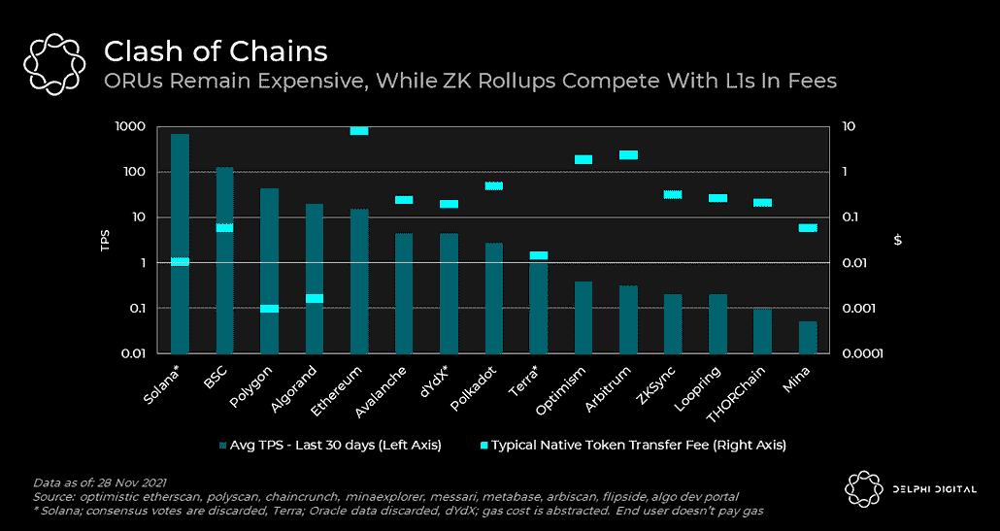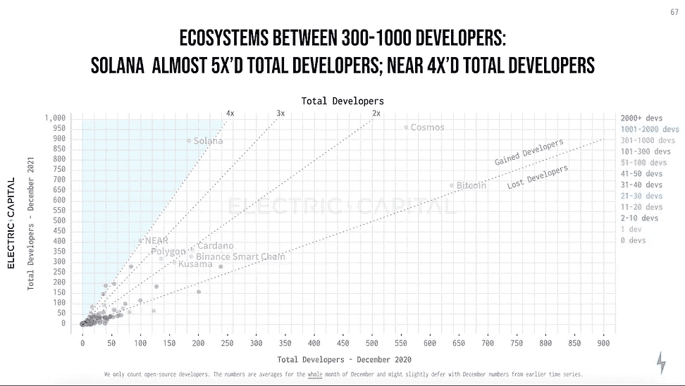

在 Unstoppable Finance，我们是建设者，专注于做出务实和公正的选择，为我们的用户带来最佳的 DeFi 用户体验。我们需要对区块链的权力下放充满信心，但我们承受不起“权力下放高于一切”的心态。

智能合同区块链的存在是为了支持应用程序和用例。我们对索拉纳区块链的权力下放程度非常满意，对其生态系统和社区的发展印象深刻。我们认识到索拉纳强大的[链上指标](https://dune.com/kroeger0x/Solana-Metrics)，它甚至优于[以太坊](https://etherscan.io/charts#blockchainData)。

我们也很高兴看到 Solana 分享我们对移动的愿景，渴望通过创造下一代用户体验来加入下一波加密用户。通过探索 xNFT 应用用例的“[背包](https://www.backpack.app/)”项目，或寻求满足用户需求的 [Saga 手机](https://solana.com/news/saga-reveal)，Solana 和我们一样相信区块链和 web3 的移动未来。

**我们的目标是成为多连锁店**

我们的终极钱包的最初版本运行在 Solana 上，但是以太坊集成是我们路线图的下一步。我们相信竞争，并且很高兴生活在一个多链条的世界里，在这里有如此多的团队探索区块链技术的极限。

如需更多类似的深度报道，请务必在 Twitter @ultimatemoney 上关注我们！

> 交易新手？试试[密码交易机器人](/coinmonks/crypto-trading-bot-c2ffce8acb2a)或者[复制交易](/coinmonks/top-10-crypto-copy-trading-platforms-for-beginners-d0c37c7d698c)