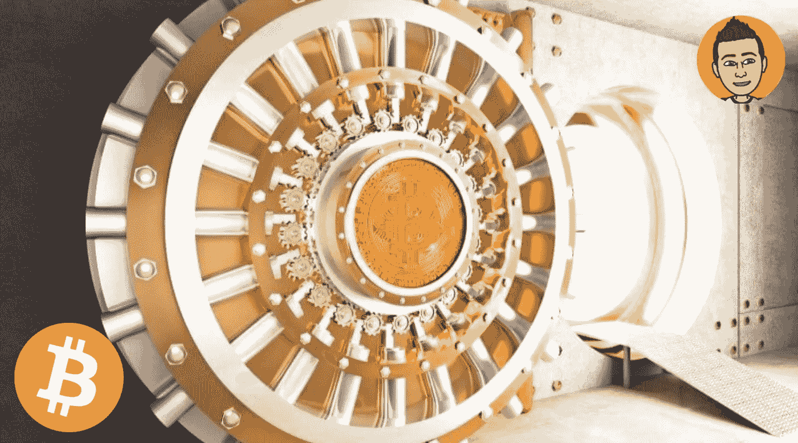

# 为什么自行保管比特币如此重要

> 原文：<https://medium.com/coinmonks/why-taking-self-custody-of-bitcoin-is-so-important-28a47c458736?source=collection_archive---------8----------------------->

自行保管你的比特币；是比特币创造者的灵魂和哲学。这是比特币被创造出来的关键原因之一。你很可能听过这句名言，“不是你的钥匙，也不是你的硬币。”但你有没有真正停下来思考过，人们为什么这么说，这意味着什么？除了最显而易见的答案之外，还有更多原因导致…