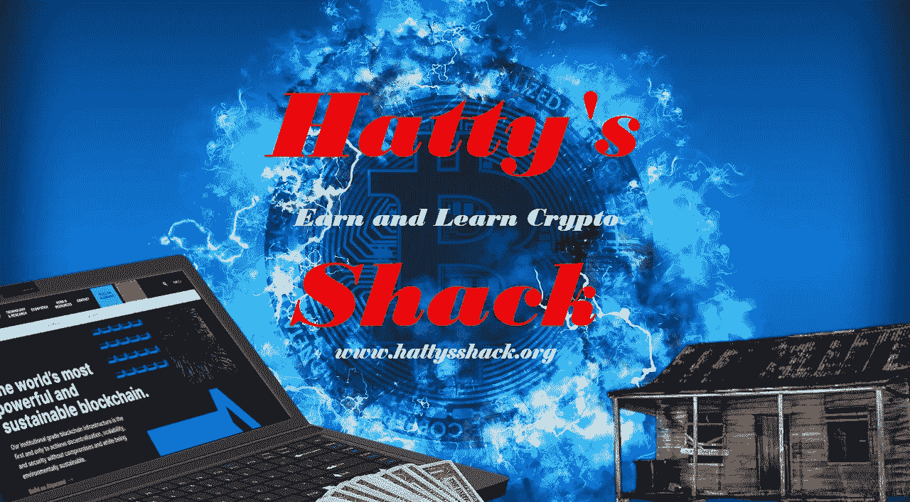
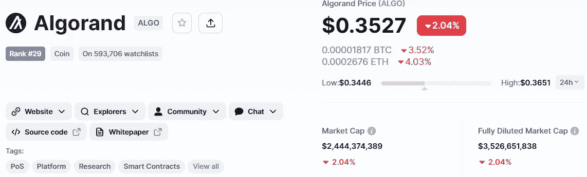
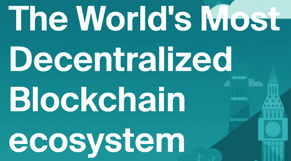
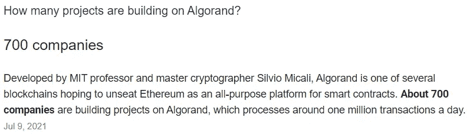
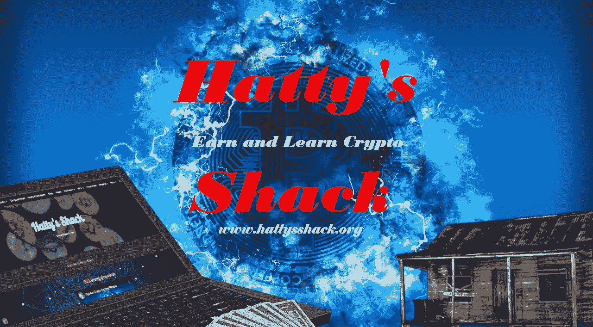

# 为什么 Algorand 区块链可能是去中心化应用的未来

> 原文：<https://medium.com/coinmonks/why-the-algorand-blockchain-could-be-the-future-of-decentralized-applications-47f9ffc573c7?source=collection_archive---------6----------------------->

我一直有某种东西吸引我去阿尔格兰德。阿尔格兰德有着闪电般的交易速度，几乎是零汽油费，并且是气候友好型的。我认为 Algorand 被低估了，它可以在世界上有很多不同的用途。我相信 Algorand 是未来。

我将解释为什么我认为 Algorand 是分散应用的未来，为什么我认为它是目前最好的项目之一。目前阿尔格兰的价格是 0.35 美元，最高曾达到 2.37 美元。我觉得这跟它的价值和它能走多高比起来不算什么。

分散式应用正在缓慢但肯定地获得主流的关注。以太坊、EOS 和 TRON 等平台在这方面处于领先地位，但还有许多其他平台值得考虑。一个这样的平台是 Algorand。

在本文中，我们将了解为什么阿尔格兰德区块链会成为分散式应用的未来。我们还将介绍让 Algorand 如此独特和令人激动的一些关键特性。所以，事不宜迟，我们开始吧！

什么是阿尔格兰德·区块链？

阿尔格兰德区块链是一个分散的账本，使用户能够安全地转移资产和共享数据，而不需要可信的第三方。它基于一种独特的共识算法，确保所有用户能够以公平透明的方式就分类账的状态达成一致。Algorand 还提供了许多功能，使其非常适合各种应用，包括快速交易时间、低费用和可扩展性。

“阿尔格兰德从一开始就以环保为重点，打造绿色区块链。我们的创始人希尔维奥·米卡利[早在 2018 年](https://www.cnbc.com/2018/02/23/bitcoin-blockchain-consumes-a-lot-of-energy-engineers-changing-that.html)就解释了他对利用下一代技术实现地球可持续发展的关注。凭借其独特的共识机制，Algorand 比其他区块链更节能，并通过与 ClimateTrade 合作抵消其小碳足迹，走得更远。”——【https://www.algorand.com/about/sustainability 

**为什么我认为阿尔格兰区块链是时髦人士的理想选择？**

阿尔格兰德区块链是 dApps 的理想平台，原因有很多。首先，它非常快，可伸缩，这对于需要处理大量流量的 dApps 来说非常重要。其次，它非常安全，这对于处理敏感数据的 dApps 来说至关重要。第三，它支持智能合约，这对许多 dApps 来说是必不可少的。

因此，如果你正在寻找建立一个 dApp，阿尔格兰德区块链是一个伟大的选择。它拥有让您的 dApp 成功所需的速度、安全性和可扩展性。

**阿尔格兰德基金会**

阿尔格兰德是一个动态的、包容的、无国界的全球生态系统。阿尔格兰德区块链基金会是一个独立的组织，致力于建设一个更加安全、分布式和数字化的世界。他们是学者、研究人员、软件开发人员、设计师和企业家的组合，他们有一个共同的目标:为大众构建最好的智能合同平台。

他们也是一个旨在传播智能合同和区块链技术价值的组织。为了做到这一点，他们正在帮助建立新的标准，并通过制定一个名为 Algorand Project 的智能合同开发开放框架来推广最佳实践。

Algorand 的使命是建立世界上最先进的分散式账本，可用于存储数字身份、金融资产和增值服务，如点对点(P2P)市场交易或忠诚度奖励。

**阿尔格兰德生态系统**

全球经济日益数字化，互联网在经济增长中发挥着核心作用。互联网也给我们的工作和生活方式留下了印记。在数字时代，公司正在努力建立数字价值链，将他们的产品和服务与客户联系起来。这些价值链通常涉及使用算法，根据从各种来源收到的数据来改进他们的产品。

在区块链世界，人工智能在金融服务中发挥着重要作用。基于区块链的人工智能平台可以为非金融应用程序提供更好的认知，并使它们更容易为用户所用。其中一些总部位于区块链的人工智能平台已经存在，例如 Enigma，它通过其基于以太坊的区块链平台提供金融服务。其他一些程序目前正在开发中，如 Algorand，它使通用计算机程序可用于不同类型的人工智能应用程序。algrand 生态系统包括几个组件，使公司能够使用 algrand 的编程语言 ALGOL 68 构建 dApps(分散式应用程序)和最终用户应用程序。

**分散应用的未来**

流行的说法是，哪里有用户，哪里就有软件。即使随着比特币和以太坊等去中心化应用(DApp)的日益普及，对去中心化 web 应用的需求也在持续增长。随着智能合约和基于区块链的 dApps 平台的兴起，我们看到了一个新的去中心化经济的出现。这种数字经济需要既了解公共和私人区块链又了解智能合同的开发人员。

**结论**

阿尔格兰德还非常年轻。它的测试 next 于 2019 年 4 月向公众发布，它还有很长的路要走，但在我看来，Algorand 是不可阻挡的，每天都在增长。有超过 700 家公司在阿尔格兰德区块链上建设项目。

阿尔格兰德有多少项目正在建设中？

这是在 2021 年 7 月，所以我相信现在可用的项目数量甚至比那还要多。Algorands 的价格非常低，以这个项目的方式，天空是极限。我不确定它是否会取代以太坊，但如果以太坊不调整其天然气价格，那么像阿尔格兰德这样的项目将会把它们从地图上抹去。

**我最喜欢的运行在阿尔格兰德区块链上的项目**

[远大](https://www.lofty.ai/refer?grsf=0143ph)——房地产投资的未来

屈服了——阿尔格兰德最高的 DeFi 奖励。体验阿尔格兰德最有价值的 DeFi 套房。

[Algofi](https://www.algofi.org/) — Algofi 正在建设 Algorand 的 DeFi 枢纽。

[Meld](https://meld.gold/) —数字黄金证书:授权行业&投资者，以降低的风险促进黄金所有权&提高效率

[共和国](https://republic.com/)——获得初创企业、房地产、视频游戏和加密领域经过审查的投资机会
。

[planet Watch](https://www.planetwatch.us/)—将空气质量监测游戏化，为组织提供准确的数据来对抗空气污染

[ANote Music](https://www.anotemusic.com/) —加入发展最快的音乐投资平台，让投资者和音乐迷与他们喜欢的唱片公司、出版商和艺术家一起赚取版税。

这些只是 Algorand 区块链上的几个伟大项目。查看 [Algorands 网站](https://ecosystem.algorand.com/)了解项目的完整列表。你也可以在他们的网站上找到新闻和更多信息。看看吧，在评论里告诉我你的想法。

我希望每个人都喜欢这篇文章。请喜欢并关注，这样我下次发布时您会收到通知。

查看我的网站，了解获得 Crypto 的不同方式、我最新的视频/文章等等。[哈蒂小屋](https://www.hattysshack.org/)

[上的原创文章 read.cash](https://read.cash/@HattyHats/why-the-algorand-blockchain-could-be-the-future-of-decentralized-applications-37f07491)

> 交易新手？试试[密码交易机器人](/coinmonks/crypto-trading-bot-c2ffce8acb2a)或[复制交易](/coinmonks/top-10-crypto-copy-trading-platforms-for-beginners-d0c37c7d698c)