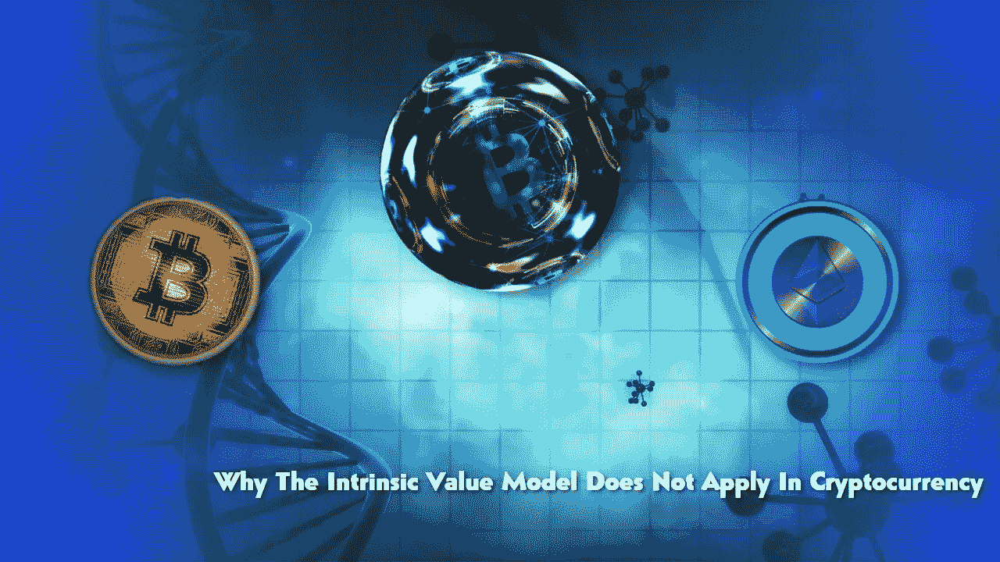

# 内在价值不适用于加密货币

> 原文：<https://medium.com/coinmonks/why-the-intrinsic-value-model-does-not-apply-in-cryptocurrency-4258550fba0f?source=collection_archive---------9----------------------->

## 为什么说“加密没有内在价值”是不正确的

价格和价值。我们经常使用和误用的术语。

货币是有价格的，尽管法定货币(国家货币)的价格永远在下降。