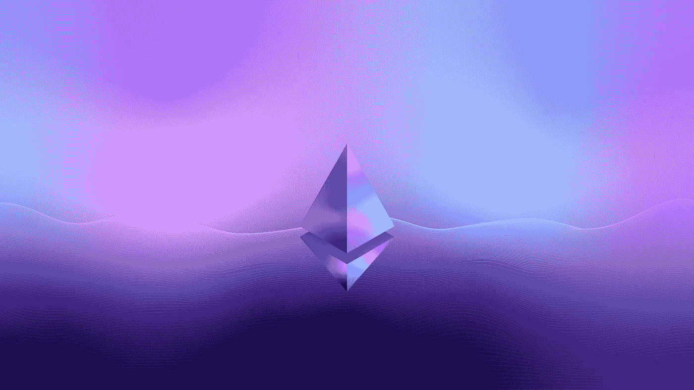

# 为什么合并是互联网历史上最重要的一天

> 原文：<https://medium.com/coinmonks/why-the-merge-is-the-most-important-day-in-the-history-of-the-internet-376a1cf82a95?source=collection_archive---------7----------------------->

Photo by [Nenad Novaković](https://unsplash.com/@dvlden?utm_source=medium&utm_medium=referral) on [Unsplash](https://unsplash.com?utm_source=medium&utm_medium=referral)

以太坊:“合并”即将在 9 月 14 日到来！以太坊走向股权证明的那一天，可能是互联网未来最重要的时刻。为什么？

# 以太坊&合并

多年来，合并一直是以太坊生态系统中的热门话题。在 2014 年，第三次修订的…