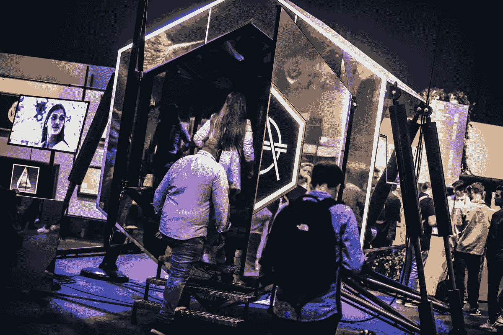

# 为什么“元宇宙”是一个笑话…

> 原文：<https://medium.com/coinmonks/why-the-metaverse-is-a-joke-1ebe630045ca?source=collection_archive---------9----------------------->

## 元宇宙和 NFT 热之我见

# 元宇宙…

我研究加密已经很长时间了，我已经看到场景中发生了一些疯狂的事情。从最大的股票交易所的下跌到 dApps 损失了近 100 亿美元的 1B 股票。然而，这些东西都比不上我迄今为止看到的元宇宙概念热潮。

在我们深入探讨我对元宇宙的看法之前，让我给你讲一下这个大胆声明的背景。今年早些时候，我参观了元宇宙阿姆斯特丹(MET AMS)大会，虽然我一直是一个伟大的加密爱好者，但我在这里看到的东西让我有点震惊。

在来到 METAMS 之前，我不知道会发生什么，但你会认为他们会把所有的精力放在使它成为一个创造性的地方，并创建一个展示最佳加密的大会。然而，令我惊讶的是，大会充斥着大部分垃圾……从说服我为什么他们的项目与众不同的 NFT 项目，到像 [CyberKongz](https://medium.com/u/ea706ca2dde1?source=post_page-----1ebe630045ca--------------------------------) 这样的粉丝俱乐部，到最糟糕的元宇宙实现。每个项目都很糟糕…

> **我看到的每个元宇宙项目看起来都像是《侠盗猎车手——我》的全球速卖通预算版**

我努力了，我真的努力去寻找有现实价值的项目，而不仅仅是一些攫取现金的机会主义者，但是我没有成功。我询问项目的效用，他们唯一的回应是给我看他们的 [OpenSea](https://medium.com/u/f0501554b76a?source=post_page-----1ebe630045ca--------------------------------) 页面，告诉我他们卖了 NFT 多少钱。我看着那些告诉我他们将创造元宇宙的项目，但向我展示他们的数字世界，看起来就像是从 Roblox 抄袭来的。

我的意思是，如果你能在互联网上以冷酷无情的价格卖出一张兰博基尼的照片，谁不会呢？但这是我在大都会医学科学院看到的一切的问题；一切看起来要么便宜，要么像抢钱。这是我对元宇宙的总体看法。每个人都认为自己很富有，拥有没有人等待的虚构概念，试图尽快推出概念，从中赚钱…

## 但这仅仅是坏事吗？

不一定。尽管我很难相信元宇宙会存在(当然是在区块链)，但我已经看到了 NFTs 可以提供的价值。我在 MET AMS 看到了一些美丽的艺术，我相信 NFTs 周围有艺术的空间。数字艺术和区块链是天生的一对，这使得数字艺术可以像传统艺术一样被处理、销售和发行。有一些伟大的头脑在推动这件事，我完全尊重他们的工作。

同时，我正在使用我自己的 OpenSea 账户作为我简历的一部分。对于我所做的一切工作，我得到了 NFT 奖作为我工作的证明。这是收集“工作证明”的好方法，以这种新方式补充我的简历。

在我看来，这个用例是元宇宙最好的例子；我不是在某个数字世界里收集假的古驰 t 恤衫或糟糕的兰博基尼模型，而是在区块链建立和聚集的数字人格。向我的朋友们展示的不是一些数字房子，而是我取得的、值得骄傲的成就，以及保存在区块链上的证据。那是元宇宙！

# 最后！

正如你现在已经读到的；我不喜欢现在的元宇宙。它在区块链生态系统中制造了很多噪音，我认为元宇宙不会像大多数项目希望你相信的那样。创造一个网上人物应该围绕实用性。在这里，你可以展示你的工作证明，展示你引以为豪的成就。不是一个卖太贵的猴子图片或廉价山寨 Habbo 的地方。阿门。

# 链接>

*   *想阅读* *媒体上的每一篇文章？使用我的链接在 medium 上注册，每月 5 美元！medium.com/@Igor.MD/membership*
*   考虑给我买杯咖啡吧！[ko-fi.com/igormd](https://ko-fi.com/igormd)
*   考虑用我推荐的库币！[www.kucoin.com/r/rf/1de5d](https://www.kucoin.com/r/rf/1de5d)
*   想成为页面上的特色吗？给我发邮件！

> 交易新手？尝试[加密交易机器人](/coinmonks/crypto-trading-bot-c2ffce8acb2a)或[复制交易](/coinmonks/top-10-crypto-copy-trading-platforms-for-beginners-d0c37c7d698c)