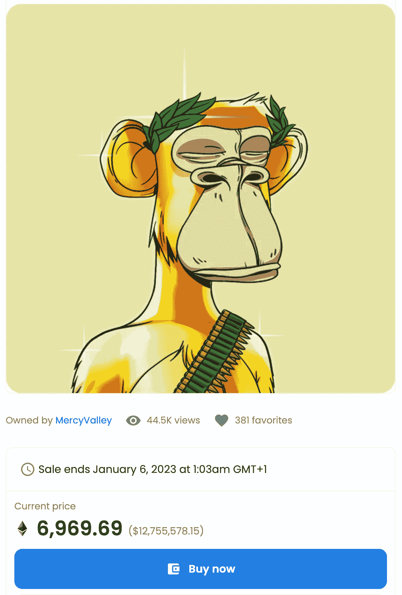

# 为什么 NFT 市场注定要崩溃，从贝茨开始。

> 原文：<https://medium.com/coinmonks/why-the-nft-market-is-bound-to-collapse-starting-with-bayc-11442b0848cc?source=collection_archive---------16----------------------->

## 以防不够明显

Photo Taken from Opensea.io

*免责声明:这是作者的个人观点，不被视为算命，以防未来发生。*

如果你至少在过去几年里一直是一个很好的加密场景的追随者。至此，您应该已经很好地理解了…