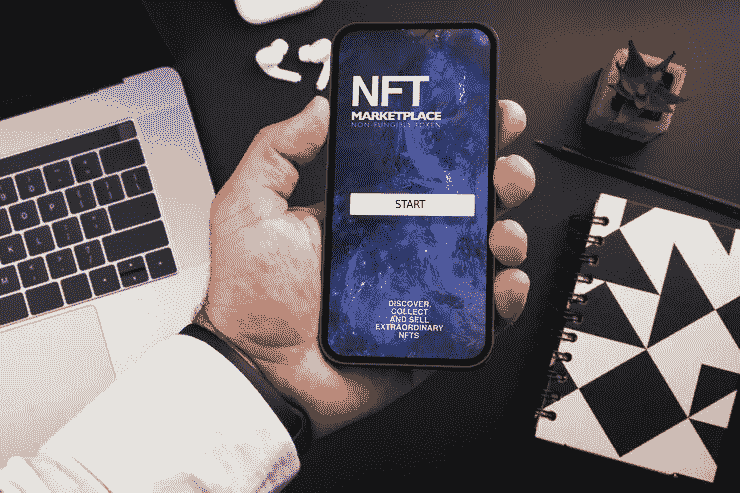
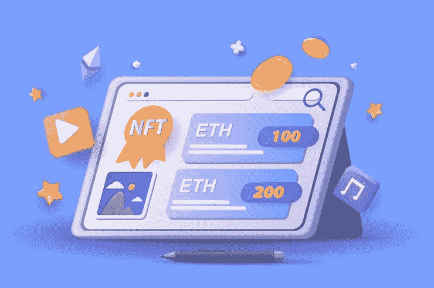

# 为什么白牌 NFT 市场是 NFT 地区商业繁荣的理想解决方案

> 原文：<https://medium.com/coinmonks/why-the-white-label-nft-marketplace-is-the-ideal-solution-for-a-prosperous-business-in-the-nft-2205bee80c0f?source=collection_archive---------31----------------------->

NFT 席卷了全世界。随着过去两年 NFT 的蓬勃发展，许多领先的公司，如脸书，最近在其平台上引入了 NFT。用户现在可以将他们的加密钱包连接到他们的帐户，并在他们的个人资料中显示他们的非加密钱包。更多的科技巨头已经开始利用 NFTs 探索 Web3 空间。甚至初创公司和小企业也开始通过发展自己的 NFT 市场，从 NFTs 中受益匪浅。但是怎么做呢？从零开始建一个 [***NFT 商场***](https://bit.ly/3rS5GQ6) 要多少钱？现成的白标解决方案比白标解决方案好吗？因此，可以有把握地说，在数字领域，非功能性测试的发展和成功已经不可避免。

## **白色标签 NFT 市场**

白标 NFT 市场是一个预先构建和预先测试的 NFT 市场，可以根据用户的需求完全定制。用户可以在这些平台上以 NFT 的形式列出和交易数字资产，就像从零开始建立的 NFT 市场一样。白标解决方案完全可根据客户的要求定制，以创造有机流量并为其品牌建立声誉。

 [## NFT 市场开发|不可替代代币市场|白标 NFT 市场|…

### NFT 市场的发展正在塑造即将到来的创业公司的未来，以在竞争中胜出。构建您自己的…

bit.ly](https://bit.ly/3rS5GQ6) 

## **白牌 NFT 市场开发**

开发人员在预先设计好的 NFT 市场上工作，并根据客户的需求对其进行定制。公司和企业家选择白标解决方案是因为它们的成本效益和最短的时间要求。白牌 NFT 市场发展的一些重要步骤是:

➤ **UI/UX:** 开发者构建了一个直观且有吸引力的主题来展示平台的特性。创建一个复杂的和用户友好的界面可以为你的平台带来有机的流量。

➤ **智能合约:** NFT 市场不受任何第三方或管理员的监控。因此，开发智能合约是为了在平台上执行交易，避免误导交易。智能合约监控平台上的所有功能。

➤ **存储:**平台的存储是为了存储平台上的货币、NFT 和交易而构建的。开发人员为 NFT 存储构建 IPFS 存储，为存储用户数据构建数据库。

➤ **开发过程:**在集成过程之前，开发人员获得客户对 UI 设计的认可。然后，在完成前后台开发流程后，开发人员通过设置按钮来整合前后台功能。

➤ **测试:**一旦平台开发完成，开发人员会和 QA 团队一起在平台上进行多次测试，找出错误。他们解决平台上发现的所有错误。

➤ **发布:**一旦平台准备就绪，开发者就可以在客户端的服务器上部署市场，全球用户都可以使用。

## **白牌 NFT 市场的好处**

*   [**白牌 NFT 市场**](https://bit.ly/3rS5GQ6) 与从零开始发展的市场相比，启动时间更短，成本效益更高。
*   有了白色 NFT 市场，你可以拥有每个 NFT 的数据历史和用户的历史。
*   白标市场是高度可扩展的。即使市场上有 50000 多名活跃用户，它也能无缝运行。市场已经通过智能合约进行了审核，平台上的所有错误和缺陷都已得到修复。

## **您的白色标签 NFT 市场的特点**

➤ **店面:**你所在商场的第一印象决定了你所在商场的整体成功。开发一个具有所有功能的吸引人的店面，为你的市场赢得流量。

➤ **拍卖:**NFT 市场的一个显著特征是拍卖和投标。如果创建者不希望以固定价格列出他们的 NFT，他们可以拍卖他们的 NFT，并可以长期保留用户。

➤ **安全性:**安全性是 NFT 市场发展最重要的部分之一。利用 DDOS、CSRF、SSRF 和更多功能开发一个安全的市场，以避免安全威胁并在您的市场中赢得信任。

➤ **仪表板:**为用户和管理员建立一个信息丰富的仪表板。在仪表板上，用户可以找到有关 NFT、列表和以前交易的信息。

## **最受欢迎的白色标签 NFT 市场**

部署像 Raresea 和 Rarible 这样受欢迎的市场一样的白色标签 NFT 市场可以帮助您为您的市场获得流量。由于其独特的功能，大多数企业家更喜欢定制他们的市场，如 NFT 市场。

➤ **类似 OpenSea 的 NFT 市场**类似 OpenSea 的市场建立在以太坊网络之上。它通过一个高度安全的平台促进了 NFT 的无障碍销售和交易。它的智能合约经过审计，并开发了多链功能。它可以运行在不同的区块链网络上，如 Polygon，Solana，BSC 等。

➤**rari ble like NFT market place**rari ble like market place 是一个基于以太坊的高度可定制的市场。它支持各种 NFT，如艺术，音乐，元宇宙，视频等。由于其巨大的受欢迎程度和独特的功能，它是另一个非常受欢迎的白色标签市场。

## **选择白标解决方案的标准**

*   确保解决方案为市场运营提供必要的基础元素。
*   确保您的问题得到解决，并且您的所有疑问在店内运营过程中得到解答。
*   该解决方案必须稳定，具有无缝性能
*   运行你的 NFT 市场的成本应该比其他白牌 NFT 市场更便宜。

**总之，**与从零开始发展的市场相比，白标解决方案花费的时间少得多，而且成本效益高；它已经成为寻求发展自己的 NFT 市场的企业家的首选。如果你正在寻找 [***推出你自己的 NFT 市场***](https://bit.ly/3rS5GQ6) ，那么建议你联系一家专业的 NFT 开发公司，为你的业务寻找一个白标解决方案。

> 交易新手？尝试[加密交易机器人](/coinmonks/crypto-trading-bot-c2ffce8acb2a)或[复制交易](/coinmonks/top-10-crypto-copy-trading-platforms-for-beginners-d0c37c7d698c)