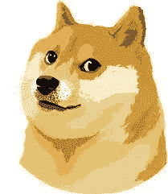
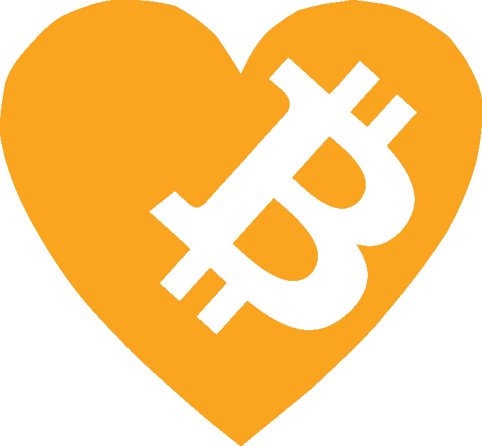

# 为什么世界需要 Dogecoin！

> 原文：<https://medium.com/coinmonks/why-the-world-needs-dogecoin-19c3194b90cc?source=collection_archive---------41----------------------->

它没有！但这将会简单、公平、平等得多，因为我们确实拥有它！

这是 Dogecoin 解决的问题。老实说，这要从比特币、区块链和所有加密货币说起。那为什么是 Dogecoin 呢？纯粹的数字！

让我们从什么让我们离开地面开始。比特币。大老爹 BTC！现在比特币对改善我们的生活有什么作用？它将我们从第三方中间人(也就是银行)中解放出来，让我们可以像发短信一样轻松地进行点对点汇款。没有银行在中间采取削减，也没有否认资金转移没有身份证，或其他证明，他们通常可能需要。(特别是在多个国家之间)因此，你可以从你所在的地方汇款，例如，几乎立即汇款到墨西哥，费用比“西联”或沃尔玛低得多。

> 交易新手？在[最佳密码交易所](/coinmonks/crypto-exchange-dd2f9d6f3769)上尝试[密码交易机器人](/coinmonks/crypto-trading-bot-c2ffce8acb2a)或[复制交易](/coinmonks/top-10-crypto-copy-trading-platforms-for-beginners-d0c37c7d698c)

像美元这样的典型政府货币的问题在于(除了他们向你收取转移资金的费用和限制你的能力之外)，由于通货膨胀，美元每年都在贬值。因此，由于通货膨胀，今天的 10，000 美元每年都在贬值。可以印刷的美元数量没有限制，所以通货膨胀失去了控制，尤其是最近。

比特币和 Dogecoin 是有限的。有限数量的硬币将被开采。所以 1 个比特币永远值 1 个比特币。doge 也是如此。

概括地说，比特币允许我们几乎即时地将资金点对点发送，费用低得多，并且没有边界和权限。随着越来越多的人开始理解稀有的价值，以及无可辩驳的区块链的价值——这一切都是建立在——的基础上的，总市值在增长，随着它的增长，它变得越来越稳定。

那为什么是 dogecoin 呢？纯粹的数字！最好的想法仍然需要获得大众的眼睛来注意到这个想法(比特币)。好吧，狗来救援了！Dogecoin 已经获得了一个被遗弃的失败者的名声，从一贫如洗到暴富！meme 硬币最初是作为一个绝对的笑话设计的，现在已经越来越受到重视，特别是随着技术大师埃隆·马斯克将 Dogecoin 命名为他最喜欢的硬币！有了这种认可，Dogecoin 获得了大众的关注，并开始以明显更快的速度团结共同目标加密爱好者！Dogecoin 的支持者很强大，吸引了前所未有的人群！随着所有人都在关注 Doge，Crypto 作为一个整体已经呈指数级增长，而这仅仅是增长的开始！Dogecoin 深受大多数加密爱好者的喜爱，当然也是加密世界中令人兴奋的催化剂！

> 如果你喜欢加密，请查看我们在 DogecoinCloset.com 的在线商店，购买以加密货币为主题的毛衣、帽衫、帽子等等！

> 加入 Coinmonks [电报频道](https://t.me/coincodecap)和 [Youtube 频道](https://www.youtube.com/c/coinmonks/videos)了解加密交易和投资

# 另外，阅读

*   [加密货币储蓄账户](/coinmonks/cryptocurrency-savings-accounts-be3bc0feffbf) | [YoBit 审核](/coinmonks/yobit-review-175464162c62)
*   [Botsfolio vs nap bots vs Mudrex](/coinmonks/botsfolio-vs-napbots-vs-mudrex-c81344970c02)|[gate . io 交流回顾](/coinmonks/gate-io-exchange-review-61bf87b7078f)
*   [CoinFLEX 评论](https://coincodecap.com/coinflex-review) | [AEX 交易所评论](https://coincodecap.com/aex-exchange-review) | [UPbit 评论](https://coincodecap.com/upbit-review)
*   [AscendEx 保证金交易](https://coincodecap.com/ascendex-margin-trading) | [Bitfinex 赌注](https://coincodecap.com/bitfinex-staking) | [bitFlyer 审核](https://coincodecap.com/bitflyer-review)
*   [Bitget 回顾](https://coincodecap.com/bitget-review)|[Gemini vs block fi](https://coincodecap.com/gemini-vs-blockfi)cmd |[OKEx 期货交易](https://coincodecap.com/okex-futures-trading)