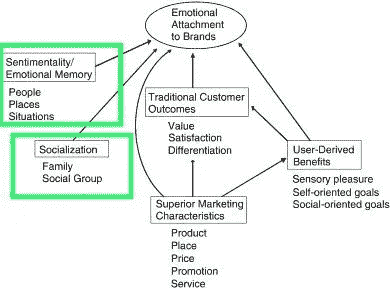
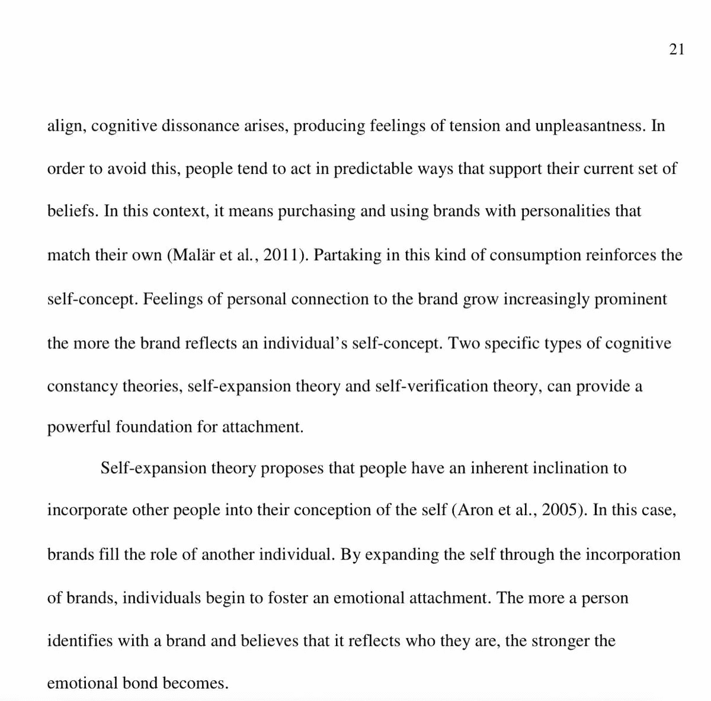
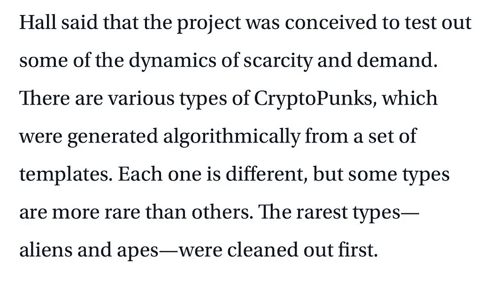
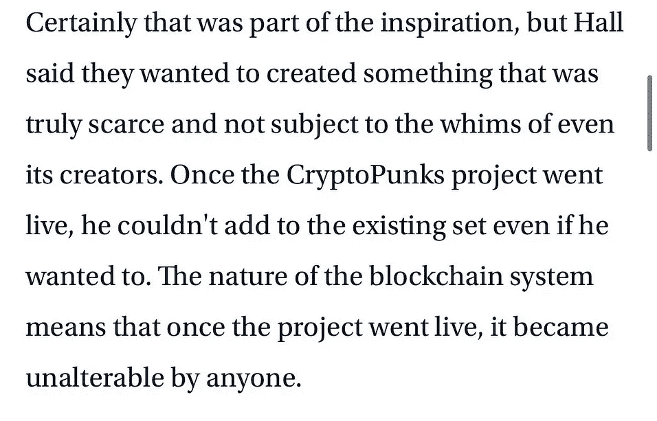

# 为什么这个密码朋克在熊市中卖了 50 万美元

> 原文：<https://medium.com/coinmonks/why-this-cryptopunk-sold-for-half-a-million-usd-amidst-a-bear-market-487f6febe590?source=collection_archive---------22----------------------->

在严峻的全球经济形势下，这幅 [@cryptopunksnfts](http://twitter.com/cryptopunksnfts) 卖到了 50 万美元。每天的朋克销售额仍然达到 10 万美元以上。

这就是为什么我认为朋克是相关的，并将继续是:

朋克相关的一些最大的原因中有两个:
1)排他性(稀缺性原则)
2)品牌依恋理论&情感记忆效应
我之前在另一篇文章中解释了后两种效应，链接如下👇

不过，还是再简单解释一下吧！

1.  排他性(稀缺性原则)
    稀缺性原则认为，一件物品的价值随着其稀有程度或获取难度的增加而增加，就像供求关系一样。只有一万个朋克存在，加上他们作为最早的 NFT 收藏的影响，增加了更多的价值。排他性已经存在了很长时间。我们每天都能看到它。

对用户的独家品牌折扣，稀有收藏卡(神奇宝贝，运动选手，…)，拥有稀有设计的鞋子(某些耐克型号等)。例如，一张勒布朗·詹姆斯的新秀卡在一次私人拍卖中以 520 万美元的价格售出，成为有史以来最贵的篮球卡。

当一项资产稀缺或有限时，它的好处也是如此。当你是少数几个能接触到他们的人之一时，一种强烈的团体感和归属感就会产生。在下图中，你会注意到多愁善感/社会化在 NFTs 中很重要，这就把我们带到了 n2。

2)对品牌的情感依恋
品牌依恋是人与品牌之间的情感联系。
在一项关于这个话题的研究中，一个人描述了情感记忆是如何参与他们最喜欢的品牌的。这种情况下的品牌是金宝汤👇

另一项类似的研究称:*“一个人越认同一个品牌，越相信它反映了他们是谁，情感纽带就变得越强。”*品牌依恋可以与情绪记忆(记住某个品牌/项目引起的某种感觉/记忆)有关。

下面这篇文章写于 2017 年。一个朋克卖 1 美元。偷看最后一句话:

买东西的想法只是为了“感觉”你来早了，是因为品牌*(项目)引发了某种情绪+排他性。*同一篇文章提到马特·霍尔(朋克的共同创造者)[@幼虫实验室](http://twitter.com/larvalabs)说他们想让
创造出*“真正稀缺”的东西，“甚至不受其创造者的奇思妙想影响”。*

大多数人倾向于购买他们熟悉的品牌。这就是为什么当 web2 品牌进入这个领域时，他们最常购买的是朋克或 BAYC。人们可能不知道什么是 NFT，但他们肯定见过朋克形象。

谢菲尔德(Visa 的加密负责人)说，收购后，朋克已经成为“加密社区的文化标志”。

这是真的。朋克现在是偶像了。

最近的一个案例是 [@TiffanyAndCo](http://twitter.com/TiffanyAndCo) ，发布了 [250 件只对朋克持有者开放的真实珠宝](https://edition.cnn.com/style/amp/tiffanys-cryptopunk-nft-pendants-trnd/index.html)。这些品牌不选择朋克“只是因为”。

以上只是一些例子:我喜欢朋克的是他们的价值是“独立的”，这意味着他们的价值不依赖于某个团队/品牌。

它们很有价值，因为它们是*隐朋克*:ETH 早期艺术场景的艺术图标。

简单。

感谢阅读！在 Twitter 上关注我，了解更多关于 NFTs 和 web3 的见解。看看我在下面这个话题上的帖子:

> 交易新手？尝试[加密交易机器人](/coinmonks/crypto-trading-bot-c2ffce8acb2a)或[复制交易](/coinmonks/top-10-crypto-copy-trading-platforms-for-beginners-d0c37c7d698c)