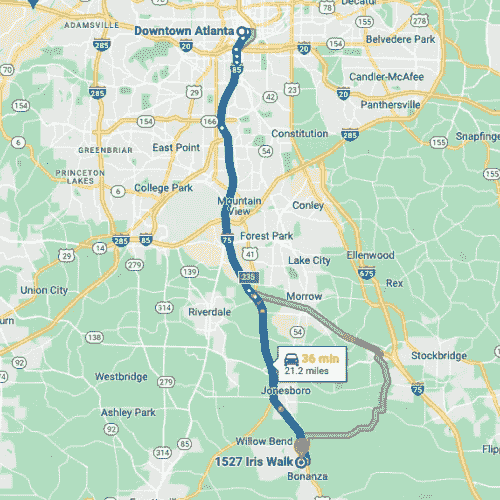
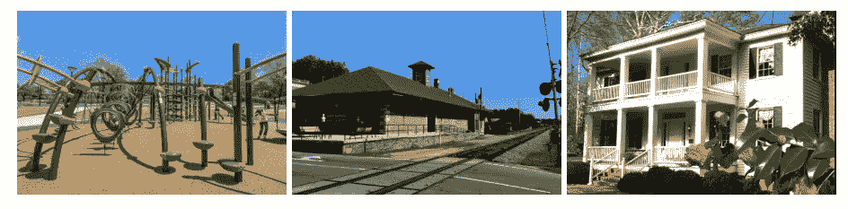
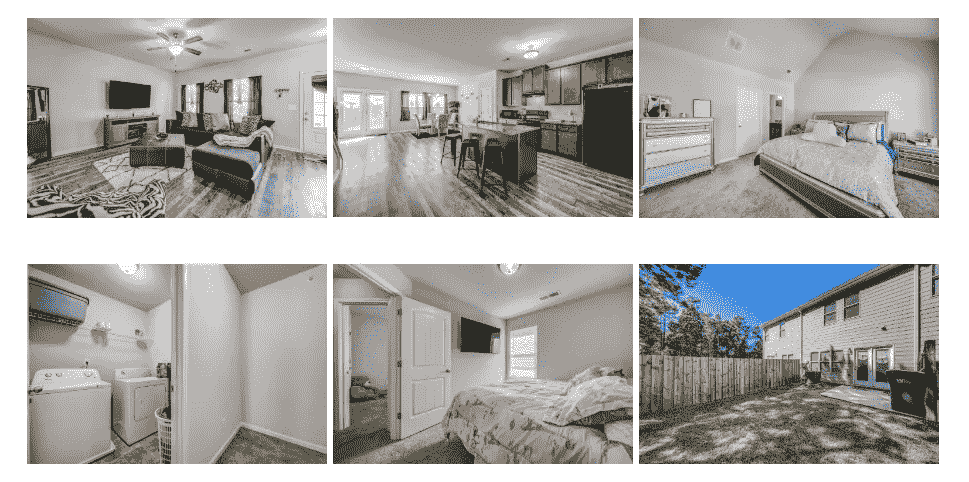
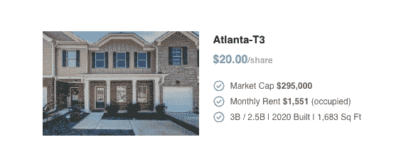

# 为什么这座靠近亚特兰大市中心的悠闲城市让房地产投资者兴奋不已

> 原文：<https://medium.com/coinmonks/why-this-laid-back-city-near-downtown-atlanta-is-getting-property-investors-excited-f268570a8927?source=collection_archive---------39----------------------->

佐治亚州琼斯博罗距离亚特兰大市中心只有 30 分钟的车程，亚特兰大是“大桃子”的核心这个安全安静的社区吸引了那些想要远离喧嚣、靠近顶级科技公司、文化机构和繁荣的音乐现场的租户。

# 进入亚特兰大繁荣的就业市场

亚特兰大是美国第八大都会区的金融和文化中心。作为苹果、微软、Airbnb 和 Visa 等顶级科技公司的所在地，亚特兰大拥有超过 600 万人口，是佐治亚州人口最多的城市。

From T3 to Downtown Atlanta

越来越多的人想住在亚特兰大，因为它有商业机会和作为一个全球城市的声誉，有繁荣的经济、美丽的自然风景、艺术和体育、世界级的食物和文化生活、著名的高速公路和最繁忙的国际机场之一。亚特兰大市区的人口已经从 2010 年的 530 万增长到 2020 年的 610 万，增长率为 15.2%。这是美国 7.4%平均增长率的两倍。

该地区具有高度的经济多样性，包括教育、医疗保健、金融、电影和电视制作、贸易和运输以及专业和商业服务。有 17 家财富 500 强公司的总部设在亚特兰大市区:家得宝、UPS、可口可乐和达美航空，仅举几例。许多顶级公司认识到亚特兰大特殊的商业友好环境，建立了新的业务或搬迁到亚特兰大。电动汽车制造商 Rivian 正在佐治亚州投资 50 亿美元建设一个具有碳意识的园区，这将创造大约 7500 个就业机会。金融巨头 Visa 正在市中心的一个新办公地点招聘 1000 名员工。通用电器公司的子公司罗珀公司投资 1 . 18 亿美元扩大其制造业务，并将在拉斐特创造额外的 600 个就业机会。

亚特兰大也因其一流的高等教育和蓬勃发展的医疗 IT 部门而闻名。埃默里大学和佐治亚理工学院欢迎来自世界各地的学生和学者，并为医疗 IT 行业的发展提供顶尖人才。它也是疾病预防控制中心总部和许多其他美国或世界卫生保健协会的所在地，如美国癌症协会和全球卫生工作队。该地区有超过 200 家公司致力于医疗 IT，创造了 30，000 个就业机会，而且这个数字还在增长。

琼斯博罗—在这里您可以找到我们最新的酒店 T3 —比住在亚特兰大市本身更便宜，当地人仍然可以通过 I-75 N 在大约 30 分钟内到达市中心。这为居民提供了两全其美的服务—住在更便宜的琼斯博罗酒店，同时仍然靠近所有活动的中心和亚特兰大蓬勃发展的就业市场。从 2021 年 8 月到 2022 年 8 月，亚特兰大大都市区的就业增长率为+5.3%，远高于+3.8%的全国平均水平。

琼斯博罗的居民也可以在周末探索亚特兰大的许多文化地标，这些文化地标吸引了来自世界各地的游客。这些地标包括可口可乐世界、亚特兰大植物园、佐治亚水族馆和马丁·路德·金国家公园。

# 一个安静、安全、有利可图的社区

琼斯博罗有自己独特的感觉。这个郊区社区拥有比亚特兰大市区其他地方相对较新的房子，并提供美丽的风景、干净的街道和负担得起的生活。

我们琼斯博罗 T3 酒店位于克莱顿县学区，这是一个公立学区，有 11 所好的公立学校和 52，149 名 PK 和 K-12 年级的学生。学生与教师的平均比例是 19 比 1。附近的埃默里大学和佐治亚理工学院为生活在琼斯博罗的人们提供了更高的教育机会。

T3 距离最近的杂货店和餐馆有一英里远。其他当地景点包括通往塔拉博物馆的道路、庄严的橡树和李街公园。拥有 146 英亩湿地的雷诺兹自然保护区距离琼斯博罗酒店只有很短的车程。

From left to right: Lee Street Park, Road to Tara Museum, Stately Oaks

投资者有可能从琼斯博罗的住宅中获得可观的利润。这个热门的租赁市场在 2022 年 8 月的房屋价值指数为 252，132 美元，高于 2021 年的 181，963 美元和 2014 年的 79，715 美元。(数据来自 Zillow。)同比百分比变化为 38.6%，复合历史升值率为 15.5%。琼斯博罗是一个卖方市场，平均财产停留在市场上 42 天。(数据来自 Realtor.com。)

# 终极家庭联排别墅

T3 是一栋建于 2020 年的两层现代联排别墅。它有 3 间卧室和 2.5 间浴室，还有一个相当大的后院。

租户喜欢它的开放式平面设计:高天花板、大窗户、现代厨房、瓷砖和工程木地板使整个家非常实用且易于维护。3 个大卧室为想要将 1 个甚至 2 个卧室改造成家庭办公室的年轻夫妇，或者需要更多私人空间的大家庭提供了充分的灵活性。其他设施包括中央空调、花岗岩台面、现代电器包括冰箱、炉子、洗碗机、洗衣机/烘干机和微波炉。

# 为什么这是如此好的投资？

亚特兰大-T3 是一个长期家庭租赁住宅，目前在首次发售时已被完全占用。它具有很高的升值潜力(过去 8 年的 CAGR(复合年增长率)为 12.83%)。年化现金收益率估计为 4.08%。这两个加起来给你提供了 16.91%的估计总回报率。

由于该州的低财产税和平均财产保险费率，整体维护成本较低。琼斯博罗也是一个地主友好的市场。没有租金控制或保证金限制。

该房产的市值为 295，000 美元，月租金为 1，551 美元。它的收购价是 22 万美元。

今天就将亚特兰大-T3 加入您的投资组合，开始赚取被动收入。

[获得股份](https://www.ark7.com?utm_source=Medium&utm_medium=Organic&utm_content=Why+invest+in+Atlanta&tc=2ONEZ)

> 交易新手？试试[密码交易机器人](/coinmonks/crypto-trading-bot-c2ffce8acb2a)或者[复制交易](/coinmonks/top-10-crypto-copy-trading-platforms-for-beginners-d0c37c7d698c)