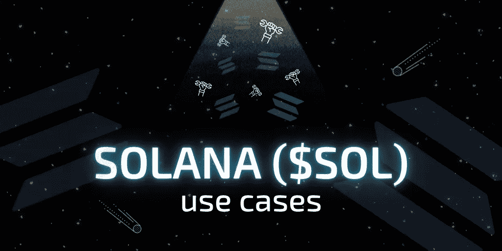

# 为什么要买索拉纳币？主要$SOL 用例

> 原文：<https://medium.com/coinmonks/why-to-buy-solana-coin-main-sol-use-cases-798ea87754ec?source=collection_archive---------10----------------------->



[Solana](https://swapzone.io/currencies/solana) 是一个第 1 层区块链平台，配备了智能合约功能。该平台旨在解决行业中区块链开发者和用户面临的许多可扩展性问题。这些问题已经存在好几年了，尽管许多人试图解决它们，但很少有人成功。迄今为止，提出的大多数解决方案往往损害区块链的分散性和安全性。这些功能对于区块链的正常运行至关重要。创建 Solana 是为了解决可伸缩性问题，同时保持其区块链的分散性和安全性。它采用了一项创新技术，在保持其他区块链功能的同时提高了吞吐量。

对于密码领域的大多数人来说，区块链的真正好处在于它能为他们做什么。区块链的用例与区块链本身一样重要，甚至更重要。这是因为区块链的用例允许用户探索加密生态系统的各个方面。索拉纳区块链的目标是为区块链开发者和用户提供几个用例。在本文中，我们将探索 Solana 的用例。


# 比以太坊还快

以太坊目前是市值第二大的加密货币。它仅次于比特币，最初是作为比特币区块链的增强版创建的。它通过整合智能合约和提供相对较高的每秒 15 笔交易(TPS)而成为第二好的加密工具。与每秒处理 4.6 次交易的比特币相比，这是相当令人印象深刻的。然而，随着以太坊网络的不断发展，每秒 15 个事务仍然不够可伸缩。这通常会导致燃气费增加和交易变慢，进而影响以太坊网络上运行的 DApps 的功能。

索拉纳区块链旨在通过允许用户处理比其他区块链多一千倍的交易来改善这一点。这一特点使它成为当今最快的区块链之一。速度是加密行业的重要组成部分。它影响到区块链的各个方面以及在其上运行的程序。有了 Solana，用户和开发者可以更便宜、更快速地处理交易。


# 分散式应用程序

索拉纳区块链具有智能合同功能，这意味着用户和开发人员可以在区块链上创建和执行智能合同。开发人员也可以使用这些智能合约来开发分散式应用程序(DApps)。该特性为区块链开启了一个全新的可能性和用例领域。DApps 有各种各样的用例，从金融到游戏，甚至房地产。Solana 的智能合约特性意味着开发人员可以创建广泛的分散式应用程序。然而，DeFi 和 NFT 平台的开发一直是大多数使用 Solana 网络的开发者的主要关注点。DeFi 平台的开发是为了通过以分散的方式提供金融服务来消除第三方干预的需要。

```
Read Further: [The Power Of DeFi: Exploring Decentralized Finance And Major DeFi Projects](https://swapzone.io/blog/decentralized-finance-defi-overview)
```

随着开发人员发现使用索拉纳区块链扩展其平台的新方法，该网络继续增长。索拉纳目前在其区块链主持了几个 DApps。

智能合约功能也可以在以太坊区块链上找到，但 Solana 的高吞吐量吸引了更多的开发人员。


# 不可替换令牌(NFT)

不可替代令牌(NFT)是一种加密创新，风靡全球。这项创新让人们可以创作他们作品的数字版本。作品可以是从艺术到音乐的任何东西。一些 NFT 甚至可能是视频剪辑。NFT 空间的可能性是无限的。

Solana 允许开发者创建 NFT 平台，作为 NFT 交易者的市场。这些平台允许用户创建、出售或购买 NFT。

这就产生了各种各样的用例。例如，用户可以创建新的 NFT 并在平台上列出它们。用户也可以购买一个 NFT，然后存起来，希望它会升值。

NFT 允许创意人员将他们的作品转化为可以存储数年的数字资产。

这些资产被称为“不可替代的”，因为它们是独一无二的，因此不能被复制。这意味着艺术家不必担心侵犯版权。

NFT 作为艺术家所有权的证明，保护他们不被盗窃。

```
Read Further: [How to make an NFT: All You Need To Know](https://swapzone.io/blog/how-to-make-nft)
```

# 交易和被动收入

相比盈利的可能性，吸引用户使用加密货币的事情更少。大多数用户采用新密码仅仅是因为他们可能会赚钱。与业内大多数加密货币一样，索拉纳创造了一种投资者和交易者可以从中获利的手段。使用索拉纳区块链的本地令牌，索尔，交易者和投资者可以赚钱。交易者可以将 SOL 兑换成其他加密货币，从中套利获利(差价)。

同样，投资者可以通过购买和持有 SOL 并等待其增值来赚钱。这为投资者提供了被动收入。SOL 主要用于支付 Solana 网络上的交易费用。它也可以用来成为网络中的验证器。


# 你为什么要投资 SOL？

每个投资者的需求因人而异。一些投资者和交易者追求眼前利益，而另一些人则准备玩长线游戏。因此，投资 SOL 是一个只能由你自己做出的决定。索拉纳有一长串的好处，继续吸引新的投资者。它有很高的增长潜力，许多可信的密码分析师认为它将在行业中取得巨大成就。它的扩展能力和多种多样的使用案例使其成为需要快速交易和低费用的开发者和用户的理想区块链网络。索拉纳的高吞吐量是一个功能，将始终吸引新的用户，因为许多区块链在这一领域缺乏。这意味着区块链有很大的概率在未来取得巨大的成功。

** swap zone . io 网站上的这些或任何其他文章中的任何信息都不应被视为投资建议。永远做你自己的研究。*


# 如何以及在哪里购买索拉纳

如果你决定投资索拉纳，下一步是选择一个可靠的加密交易所，你可以在那里购买令牌。根据您的偏好，您可能希望选择集中式或分散式交换。

swap zone——作为一个交换聚合器——允许您交换、购买和出售包括 SOL 在内的各种加密货币，在 15 个以上值得信赖的交换伙伴中进行选择。

以下是在 Swapzone 上购买 SOL 的一些简单步骤:

1.  选择[茄](https://swapzone.io/currencies/solana)互换对(例如 [ETH to SOL](https://swapzone.io/exchange/eth/sol) )。
2.  输入您要交换的 ETH 总量。
3.  选择最佳的 ETH 来解决掉期报价。
4.  点击交换按钮。
5.  输入你的钱包地址接收索拉纳到你的钱包。
6.  将您的 ETH 存款发送到生成的地址。
7.  等待你的 ETH-SOL 交换完成。
8.  将您的 SOL 收入您的钱包！

# 流行的空气转换索拉纳

[SOL 到 BTC](https://swapzone.io/exchange/sol/btc)
[SOL 到 ETH](https://swapzone.io/exchange/sol/eth)
[SOL 到 LTC](https://swapzone.io/exchange/sol/ltc)
[SOL 到 BNB](https://swapzone.io/exchange/sol/bnb)
[SOL 到 BCH](https://swapzone.io/exchange/sol/bch)
[SOL 到 USDT](https://swapzone.io/exchange/sol/usdt)
[SOL 到 THETA](https://swapzone.io/exchange/sol/theta)
[SOL 到 XMR](https://swapzone.io/exchange/sol/xmr)
[SOL 到 TRX](https://swapzone.io/exchange/sol/trx)
[SOL 到 BSV](https://swapzone.io/exchange/sol/bsv)

> 加入 Coinmonks [电报频道](https://t.me/coincodecap)和 [Youtube 频道](https://www.youtube.com/c/coinmonks/videos)了解加密交易和投资

# 另外，阅读

*   [加拿大最佳加密交易机器人](https://coincodecap.com/5-best-crypto-trading-bots-in-canada) | [库币评论](https://coincodecap.com/kucoin-review)
*   [用于 Huobi 的加密交易信号](https://coincodecap.com/huobi-crypto-trading-signals) | [HitBTC 审查](/coinmonks/hitbtc-review-c5143c5d53c2)
*   [TraderWagon 回顾](https://coincodecap.com/traderwagon-review) | [北海巨妖 vs 双子星 vs BitYard](https://coincodecap.com/kraken-vs-gemini-vs-bityard)
*   [如何在 FTX 交易所交易期货](https://coincodecap.com/ftx-futures-trading)
*   [OKEx vs KuCoin](https://coincodecap.com/okex-kucoin) | [摄氏替代度](https://coincodecap.com/celsius-alternatives) | [如何购买 VeChain](https://coincodecap.com/buy-vechain)