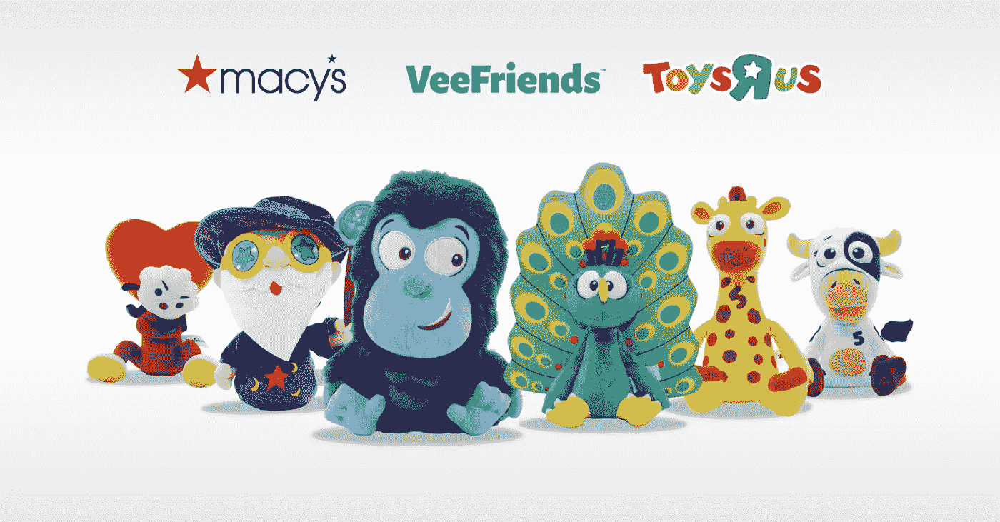

# 为什么 Veefriends 将成为 NFT 最大的项目之一

> 原文：<https://medium.com/coinmonks/why-veefriends-will-be-one-of-the-biggest-nft-projects-6495e86d45d4?source=collection_archive---------16----------------------->

这被严重误解了

我最近写了几篇看空当前一批 NFT 项目的文章，人们开始问我是否看好任何项目。有一些我认为从长远来看很有可能成功。Veefriends 对我来说是其中的佼佼者。这反映在我对这个项目的巨大投入上。我将把这个分成三个部分来解释我为什么下注。

1.  加里·维想和他的朋友们一起建立什么？
2.  他有能力做这件事吗？
3.  VF 持有者会从项目成功中获得价值吗？

加里·维曾多次表示，他将努力打造下一个迪士尼。那么，建造下一个迪斯尼意味着什么呢？这意味着创建一个组织，创造多个有意义的、非常受欢迎和有利可图的知识产权。当 NFT 空间的人们听到这个消息并看到来自 Veefriends 的动画时，他们会嘲笑这个大胆的目标。他们说这些动画太幼稚太业余了。但是他们注定是那样的！

他没有说他会尝试制作下一部《权力的游戏》。迪士尼在很大程度上是一家儿童知识产权公司。他正在努力建造它。并不是所有的 IP 都是为我们，也就是 18-32 岁的人创造的。事实上，我们并不构成消费市场的重要部分。我认为，我们也是最具竞争力的年龄段，因为大多数企业家也是这个年龄段的人，他们试图制造他们会使用的东西。追踪孩子和父母是非常明智的举动。如果你不相信我，那么我会告诉你去读读“椰子瓜”这是一个完全建立在 Youtube 上的儿童 IP，最近卖了 30 亿美元！

他不只是试图建立 VF 人物的创造性 IP，而是希望以巨大的规模用商业来增压他们。

现在，我们已经讨论了我认为他试图构建的东西，我将阐述为什么我认为他可以做到这一点。

这是他的四行简历。他一生都是企业家，在几年内将父亲的酒类业务从每年 300 万美元增加到 6000 万美元，是 FB、Twitter 和 Tumblr 的早期投资者，也是 VaynerX 的首席执行官，他在十年内将 VaynerX 的年收入从零增加到 3.5 亿美元，员工超过 1600 人。

我不是在那份简历上下赌注，而是在那份简历是如何完成的。他之所以能够做到这一切，是因为他是一个“注意力日交易者”。他比几乎任何人都更了解人类的行为和注意力。最重要的是，他有企业家的 DNA，这使他在看到注意力套利时能够迅速执行。这就是为什么他在 1997 年建立了一个电子商务网站，在谷歌 Adwords 问世的当天就购买了它，在所有人都认为它是一种时尚的时候在社交媒体上投入了全部，并建立了一个巨大的营销机构，因为他相信大多数品牌营销都在转向数字化。

没有一个活着的人比他更了解所有的社交媒体平台，这是世界关注的地方。他处于一个完美的位置来实现他的愿景，即在这些平台上创建巨大的知识产权，并利用它们打造价值数十亿美元的品牌。在过去的 20 年里，他也一直在“收集人物”。他收集了成百上千的文化名人，包括所有最大的社交媒体明星。如果你不认为 Gary Vee 在未来十年与世界野兽先生合作建立 Veefriends IP，那么你就没有看到完整的棋盘。这将是最高级别的影响者营销执行。我们从移情葡萄酒中看到了这一点，他在几年内从无到有，在只有影响者营销的支持下，实现了 9 位数的退出。

最重要的是，他在 Vaynermedia 建立了营销的“死亡之星”,当它大规模部署在 Veefriends 上时，将会破坏品牌的创建方式。看起来会很有趣，我已经对此非常兴奋了。我不是说这是必然的，但我觉得他比大多数人更有机会。

最后，最后一部分。让我们假设 Veefreinds 非常成功。代币持有者从中获得了任何价值吗？

这是个人信仰问题。除了 3 张 Veecon 票之外，他在法律上没有义务向代币持有者提供太多价值。但我跟随他多年，可以为自己说，我从未怀疑过他的意图。他多年来一直免费分享最高水平的营销知识，这让我基本上建立了一个职业生涯。所以，是的，当我说我完全相信他从长远来看会给股东带来回报时，我是有偏见的。

他和朋友们一起犯过错误吗？很明显！他不是上帝，在路上会犯更多的错误。重要的是意图和能力。我在这两件事上都下了赌注，并在 Veefriends 上下了大注。我不是来说服你买 Veefriends 的股票，而是来坚定地表明我的信念。然后，在 5 到 10 年后，我们可以回头看看谁是对的。

与此同时，你可以继续低估他，就像广告界的人那样，称他为“酒保”。

他不再是“酒保”了！

> 交易新手？试试[加密交易机器人](/coinmonks/crypto-trading-bot-c2ffce8acb2a)或者[复制交易](/coinmonks/top-10-crypto-copy-trading-platforms-for-beginners-d0c37c7d698c)