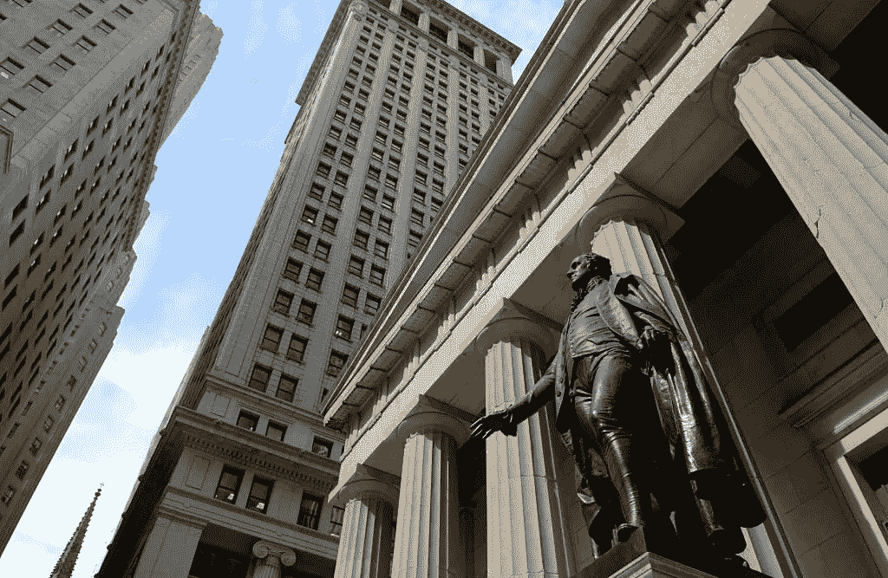

# 为什么华尔街在加密危机中幸存

> 原文：<https://medium.com/coinmonks/why-wall-street-survived-the-crypto-crash-e91a9e179415?source=collection_archive---------27----------------------->

Wall Street, New York

随着加密货币价格下跌和基金破产，华尔街公司能够通过对风险资产实施严格的规则来避免最坏的情况。散户投资者就没有这么幸运了。

# 数字资产

去年 11 月，在欣喜若狂的加密货币市场中，法国巴黎银行(BNP Paribas)的分析师编制了一份股票清单。这是他们认为定价过高的 50 只股票，包括许多与数字资产密切相关的股票。

这个集合被称为“卡布奇诺篮子”，指的是股票的波动性。该银行着手将这些股票转换成一种产品。这使得其最重要的客户——养老基金和对冲基金——可以押注于这些资产。

# 比特币的突然崩盘

过去一个月，围绕比特币和其他数字货币的泡沫已经消散。它搞垮了一些涌现出来帮助他们交易的加密货币公司，卡布奇诺篮子的价值缩水了一半。

BNP 的华尔街客户押注于这一结果，他们现在很富有。在零售交易繁荣时期涌入定价过高的加密资产和股票的小投资者，正在交易的另一边蹒跚而行。

加密领域的动向恰逢散户资金涌入美国股市。股票期权股票和衍生品策略组，他们将交易整合在一起。散户和机构定位有很大区别。华尔街在 2022 年的加密货币大屠杀中获胜。

这并不是说金融巨头们不想凑热闹。然而，华尔街银行被迫等待。或者，像 BNP 一样，他们需要谨慎对待加密。与此同时，大型基金管理公司使用策略来限制他们对加密货币的直接敞口。因此，当市场崩溃时，他们能够限制自己的损失。

你听说过机构投资者尝试投资的故事，但这只是他们投资组合的一小部分。

# 2008 年的教训

在金融危机中，由复杂证券支持的次级抵押贷款的失败拖垮了银行和普通人，导致了经济衰退，与此不同，这次华尔街和普通民众的命运出现了更大的分化。(上次纾困拯救了银行。)数字资产价格的暴跌和苦苦挣扎的加密初创企业并没有对最近的金融市场动荡产生重大影响，蔓延的风险也很低。

然而，虽然加密崩溃在华尔街只是一个脚注，但对于许多将资金投入加密货币市场的个人投资者来说，这是一个创伤性事件。

许多散户投资者被快速回报的承诺、天文数字的财富和不受金融机构控制的行业所吸引，他们购买新创造的数字货币或持有这些资产的基金股份。许多人是第一次投资者，他们在疫情期间呆在家里，投资了 GameStop 和 AMC Entertainment 等 meme 股票。

他们被来自加密货币初创企业的广告轰炸，比如向投资者承诺其加密资产将获得巨额回报的应用，或者让他们接触比特币的基金。这些投资者偶尔会在 Reddit 等在线讨论平台上相互怂恿，做出并非基于价值的投资决定。

# TerraUSD 解除标记

加密货币行业增长迅速，部分是受到狂热的推动。在巅峰时期，数字资产市场价值 3 万亿美元，这是一笔巨款，但还不及摩根大通的资产负债表。它存在于传统金融体系之外，存在于一个监管很少、态度随心所欲的空间。

崩溃始于 5 月，当时受另一种货币 Luna 崩溃的拖累，一种本应与美元挂钩的加密货币 TerraUSD 开始下跌，Luna 在算法上与 terra USD 挂钩。两枚硬币的死亡螺旋让更广泛的数字资产市场陷入低迷。

3 月份价值超过 47，000 美元的比特币在 6 月 18 日跌至 19，000 美元。提供高收益加密储蓄账户的加密货币贷款机构 Celsius Networks 在五天前暂停了取款。

马丁·罗伯特担心他再也见不到他的两个比特币了，因为它们被卡在了 Celsius 网络上。他打算用这些硬币来偿还债务。

# 小投资者

马丁·罗伯特(Martin Robert)是内华达州亨德森市的一名日内交易者，他正准备庆祝自己 31 岁的生日，就在那天，Celsius 冻结了取款。他曾向妻子保证，他会暂时离开市场观察。然后他看到了头条新闻。

35 岁的贝丝·惠特克拉夫特(Beth Wheatcraft)是密歇根州萨吉诺(Saginaw)三个孩子的母亲，她依靠占星术来指导自己的投资决策，她说，加密货币交易需要“钢铁般的胃”她的数字资产主要是比特币、以太币和莱特币，还有一些由于电脑硬盘损坏而无法恢复的 Dogecoins。

惠特克拉夫特避开了 Celsius 和其他提供类似计息账户的公司，因为她看到了危险信号。

受小投资者欢迎的比特币信托基金也陷入了混乱。该基金背后的加密货币投资公司 way 将其宣传为一种无风险的加密货币投资方式，因为投资者无需自己购买比特币。

然而，该基金的结构不允许以足够快的速度创建或淘汰新股，以跟上投资者需求的变化。当比特币的价格开始快速下跌时，这就成了一个问题。试图退出的投资者将该基金的股价推低至远低于比特币的价格。

gray 在 10 月份请求监管机构批准将该基金转换为交易所交易基金，这将有助于交易，从而使其股票与比特币的价格更加一致。美国证券交易委员会周三拒绝了这一请求。格雷立刻提交了一份请愿书，要求推翻这一决定。

# 监管的作用

当加密货币市场蓬勃发展时，华尔街银行寻求参与的方式，但监管机构拒绝了。去年，帮助为全球最大银行设定资本要求的巴塞尔银行监管委员会(Basel Committee on Banking Supervision)提议，给予比特币和以太等数字代币尽可能高的风险权重。为了抵消这种风险，如果银行想在资产负债表上包括这些硬币，就必须至少持有等值的现金。

美国的银行监管机构也警告银行避免将加密货币纳入其资产负债表的活动。这意味着没有比特币或其他数字代币担保的贷款，也没有银行承担风险确保特定市场保持开放的做市服务。

高盛(Goldman Sachs)在其客户门户网站上显示比特币价格，这样客户即使无法使用该银行的服务进行交易，也可以监控价格变动。高盛和摩根士丹利都开始向一些最富有的个人客户提供购买与数字资产挂钩的基金股票的选择，而不是直接购买代币。

> 交易新手？试试[加密交易机器人](/coinmonks/crypto-trading-bot-c2ffce8acb2a)或者[复制交易](/coinmonks/top-10-crypto-copy-trading-platforms-for-beginners-d0c37c7d698c)