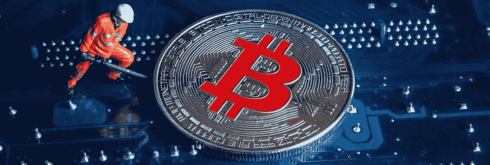
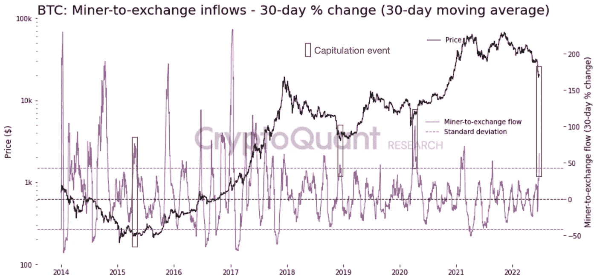

# 根据比特币矿工的说法，为什么我们可能还没有到达底部！

> 原文：<https://medium.com/coinmonks/why-we-might-not-have-reached-the-bottom-yet-according-to-bitcoin-miners-a00825ae5dab?source=collection_archive---------28----------------------->

加密投资者应该时刻关注比特币矿工的行动，以洞察市场走向。现在比特币价格正在努力再次上涨，鉴于这些玩家目前面临的时刻，市场可能会遇到新的底部(约 14，000 美元)。

**比特币挖矿和矿工投降**

比特币矿工通常是拥有高水平硬件和软件能力的机构玩家。他们的商业模式基本上是建造大规模的采矿钻机，开采 BTC 代币，支付运营费用，并从差价中获利。

在 crypto 中有一个概念叫做矿工投降:价格下降到与采矿相关的费用高于一些矿工从 BTC 采矿中获得的价值的水平。鉴于这种情况，他们将比特币转移到交易所，出售储备，导致价格继续下跌。

**当前场景**

今年 6 月，矿工们转移了约 23，000 BTC，并出售了价值超过 5 亿美元的代币。这是自 2021 年 5 月以来的最高月度流量，当时中国开始实施打破当地产业的行动。

一个 BTC 的平均“生产成本”——换句话说，开采一个 BTC 的成本——大约是 3 万美元。因此，只要 BTC 价格保持在这一区间之下，矿商很可能会继续出售他们的资产，以支付费用，并增加 BTC 的抛售压力。

> 交易新手？试试[密码交易机器人](/coinmonks/crypto-trading-bot-c2ffce8acb2a)或[复制交易](/coinmonks/top-10-crypto-copy-trading-platforms-for-beginners-d0c37c7d698c)

只要没有释放 BTC 价值的事件，我们就处于矿商持续抛售周期的活跃期。因此，BTC 可能面临新的底部，并回到 12，000 美元至 14，000 美元的范围。

**如何追踪矿工的动向？**

像 [CryptoQuant](https://cryptoquant.com/asset/btc/summary) 这样的平台收集数据并提供指标，让你更好地了解矿工的行动，如矿工的位置指数(MPI)。MPI 是矿工总流出量(美元)与其矿工总流出量(美元)的一年移动平均值的比率。

通过矿工持仓指数(MPI)，你可以看到矿工是否比平时向交易所发送更多的硬币，表明可能的抛售。此外，如果几家矿商同时发送部分储备，可能会引发价格下跌。

如果你不确定在你的投资组合中该做什么，就跟踪像这样的宏观指标。由此，你可能更有信心确定这是否是进入或退出头寸的正确时机。

[*乔·罗伯特*](https://joerobert.com/) *现任罗伯特风险投资公司首席执行官，拥有超过 20 年的资产管理经验。自创办以来，乔已经为投资者和合伙人创造了可预见的两位数回报。Joe 已经投资了股权和代币的种子轮，以及比特币、以太坊和其他顶级加密货币的投资组合。*

*如果您是合格投资者，并想了解更多关于我们产品的信息，请联系我们。*