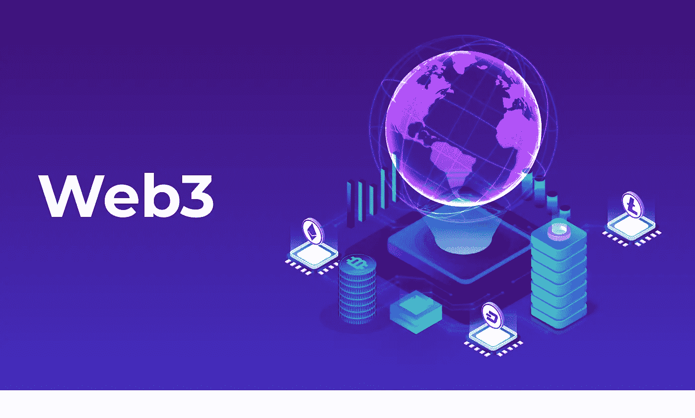

# 为什么 web3 是用户控制的互联网？

> 原文：<https://medium.com/coinmonks/why-web3-is-a-user-controlled-internet-4ee06d6dbd5d?source=collection_archive---------9----------------------->

Web3 代表了下一代互联网。在此之前，我们有两个版本，分别是 web1 和 web2。Web1 是互联网的只读模式，而 web2 是互联网的当前状态，处于读写模式。另一方面，Web3 是互联网的读写自有模式。web3 一词是以太坊的联合创始人兼首席执行官加文·伍德(Gavin Wood)创造的。在他看来，从社会长期来看，集权是不可持续的。Web3 去除了 web2 的中央权威的需求和功能，例如搜索引擎和社交媒体平台。Web 3——新版本的万维网建立在区块链技术的基础上，因此新的互联网解决了信任问题。它融合了去中心化、基于令牌的经济等概念。对于 web3，我们谈论数据的所有权。

[Web3](https://www.leewayhertz.com/web3-development-company/) 利用基于去中心化区块链的一系列技术，实现新的商业模式和社交网络。用户可以拥有协议令牌或加密货币，拥有自己的数据、身份、内容，并作为股东参与。这种所有权从政府和大型科技公司等网络“看门人”手中夺走了权力。

# Web3 功能

*   **信任模型—** Web3 是去中心化的。因为没有中央权威，所以没有单点故障。用户可以点对点通信。
*   **治理-** Web3 遵循分散自治组织(DAOs)模式。因此治理被分发给治理令牌持有者或利益相关者。
*   **商业模式—** 在 web3 中，区块链网络支付交易验证器的工作费用。这里应用博弈论来维护交易的完整性。
*   **内容—** 它与 web2 服务相分离，属于用户所有。
*   **用户参与模式—** 当用户拥有自己的内容和数据时，他们可以将其货币化。在这种情况下，直接向区块链交易验证器付款。
*   **用户界面—** 分散式应用程序(dApps)类似于集中式市场或服务的用户界面。
*   **用户身份验证方法—** 通过私钥解锁对区块链上所有者记录的访问。私钥可以在第三方或自己托管的钱包上。
*   **财务系统—** 在 web3 中，由智能合约和区块链协议运行的财务系统。这里没有集中控制，也没有支付中介。
*   **货币—** Web3 使用加密货币，内置于去中心化的区块链中。在这里，用户充当他们的银行，但他们有权进行集中交易。

# web3 是如何工作的？

Web3 互联网将是无许可的，这意味着任何人都可以使用它，而无需访问凭证或获得提供商的许可。数据将保存在网络上，而不是像现在的 web2 那样存储在服务器上。该数据的任何移动或变化都将被记录在区块链上。这将建立一个所有网络成员都可以检查的记录。因此，它将防止不良行为者使用数据，并提供数据去向的清晰记录。

一个以区块链为中心的互联网将使控制和操纵数据变得更加困难。因为数据在 web3 中是分散的，没有看门人可以访问它，这意味着任何人都可以访问互联网。

在区块链上运行的点对点支付应用程序就是 web3 应用程序的一个例子。用户可以使用分散式应用程序(d app)支付，而不是通过银行支付。此外，在任何交易最终完成之前，网络必须首先对其进行验证，然后将其编码到区块链的数字账本中。这种支付系统可以让那些无法开立银行账户、没有权限或被大型支付提供商禁止接受某些服务的人受益。

Web3 开发人员很少创建和部署在一台服务器上运行的应用程序，或者将他们的数据存储在一个数据库中。相反，web3 应用程序运行在由许多对等节点、区块链或两者结合而成的分散网络上。这形成了加密经济协议。

网络参与者被激励向使用该服务的每个人提供最佳质量的服务，以创建安全和稳定的分散网络。Web3 协议通常可以提供各种服务，如计算、存储、带宽、身份和托管。

代币引入了完全无摩擦、无边界的原生支付层。像 Stripe 和 Paypal 这样的公司在实现电子支付方面已经赚了数十亿美元。您可以使用加密钱包(如 MetaMask 或 Torus)将安全、匿名和简单的国际支付和交易集成到 web3 应用程序中。

# 身份在 web3 中是如何工作的？

身份在 web3 中的作用与我们今天所习惯的不同。Web3 应用将与使用该应用的用户的钱包地址绑定。与 OAuth 和 email plus password 等 web2 认证方法(几乎总是要求用户交出敏感和个人信息)不同，除非用户选择公开链接他们的身份，否则钱包地址将保持匿名。

在多个应用程序上使用同一个钱包的用户可以在所有应用程序之间无缝转移他们的身份，让他们随着时间的推移建立自己的声誉。开发人员可以使用陶瓷或 IDX 等工具和协议在他们的应用程序中创建自主身份，这是传统身份验证和身份层的替代方案。以太坊基金会有一个工作 RFP 来定义“用以太坊登录”的规范，这将有助于创建一个更有效的和文档化的过程。

# 最后的话

作为新的互联网，Web3 将提供个性化和定制化的浏览体验，更人性化的搜索引擎助手，以及其他有望帮助创建一个更加公平的网络的好处。由于接下来的许多创新，用户可以控制他们的数据并创造更丰富的体验。随着 web3 的出现，互联网将以指数级的方式融入我们的日常生活。

几乎所有今天离线工作的机器，从家用电器到所有类型的交通工具，都将成为[物联网](https://www.leewayhertz.com/iot-development-company/)经济的一部分。它们将与自主服务器和分散式应用程序进行交互，从而推进数字资产和区块链等新的数字领域，为 21 世纪的众多技术奇迹提供动力。

> 交易新手？试试[密码交易机器人](/coinmonks/crypto-trading-bot-c2ffce8acb2a)或[复制交易](/coinmonks/top-10-crypto-copy-trading-platforms-for-beginners-d0c37c7d698c)